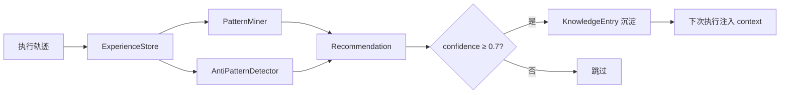

# learn — 学习引擎

> 模式挖掘、反模式检测、校准预估、轨迹查询

```bash
# 查看学习统计概览
harness learn stats

# 触发学习（挖掘模式 + 反模式检测）
harness learn recommendations

# 查看校准后的预估参数
harness learn estimates

# 查看已挖掘的模式
harness learn patterns

# 查看历史轨迹列表
harness learn traces

# JSON 格式输出
harness learn stats --output json
harness learn traces --limit 10 --output json
```

## 学习引擎闭环

学习引擎从执行轨迹中挖掘模式，高置信度推荐自动沉淀到知识库：



<details>
<summary>ASCII 版本</summary>

```
执行轨迹 → ExperienceStore → PatternMiner → Recommendation
                              AntiPatternDetector → Recommendation
                                                    ↓
                                              confidence ≥ 0.7?
                                           是 → KnowledgeEntry沉淀 → 下次执行注入context
                                           否 → 跳过
```
</details>

## 参数

| 参数 | 说明 |
|------|------|
| `action` | 操作类型: stats/recommendations/estimates/patterns/traces |
| `--project` | 项目名（默认 default） |
| `--limit / -n` | 显示条数（默认 20） |
| `--output / -o` | 输出格式: table/json |

---

← [knowledge](/cli/knowledge) · [命令总览](/cli/) · → [version](/cli/version)
