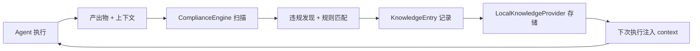

# 知识 / 规则 / 报告 Demo

> 本地知识库 + 规则市场 + 合规报告 + 语言识别 + 验证器类型——五大知识治理模块

**定位**：知识治理是 harness-cook 的「记忆和共享」层——10 种知识类型存储项目上下文、团队规则市场共享最佳实践、合规报告生成可追溯文档。

完整可运行脚本见项目 `examples/knowledge-rule-report/` 目录（`demo_knowledge_rule_report.py`）。

---

## Demo 1：本地知识提供者

```python
from harness.knowledge import KnowledgeType, LocalKnowledgeProvider, KnowledgeEntry

provider = LocalKnowledgeProvider(storage_dir=".harness/knowledge")

# 10 种知识类型
for kt in KnowledgeType:
    print(f"  {kt.value}")

# 创建知识条目
entry = KnowledgeEntry(
    type=KnowledgeType.ARCHITECTURE,
    title="项目架构概览",
    content="前后端分离，API Gateway 路由，微服务 12 个模块",
    tags=["架构", "微服务"],
)

provider.save(entry)

# 查询知识
results = provider.query(KnowledgeType.ARCHITECTURE, keyword="微服务")
for r in results:
    print(f"  {r.title}: {r.content[:50]}...")

# 语义搜索
search_results = provider.semantic_search("如何部署服务")
```

### 10 种知识类型

| KnowledgeType | 说明 | 适用场景 |
|---------------|------|---------|
| ARCHITECTURE | 项目架构 | 系统概览、模块关系 |
| CONVENTION | 代码约定 | 命名规则、代码风格 |
| DEPENDENCY | 依赖关系 | 包依赖、版本约束 |
| API | API 文档 | 接口契约、参数定义 |
| PATTERN | 设计模式 | 常用模式、最佳实践 |
| RISK | 风险记录 | 已知风险、修复建议 |
| DECISION | 架构决策 | ADR、技术选型理由 |
| TASK | 任务上下文 | 当前任务、进度 |
| TEST | 测试策略 | 测试方案、覆盖率 |
| GLOSSARY | 术语表 | 项目专有名词 |

---

## Demo 2：规则市场

```python
from harness.rule_market import RuleMarket, RuleEntry

market = RuleMarket()

# 发布团队规则
rule = RuleEntry(
    name="no-raw-sql",
    category="security",
    description="禁止直接拼接 SQL",
    severity="high",
    author="security-team",
)

market.publish(rule)

# 搜索规则
rules = market.search(category="security")
for r in rules:
    print(f"  [{r.severity}] {r.name}: {r.description}")

# 订阅规则
market.subscribe("no-raw-sql", team="backend-team")
```

### 预期输出

| 操作 | 说明 |
|------|------|
| `publish()` | 发布规则到市场，团队可见 |
| `search()` | 按类别/关键词搜索规则 |
| `subscribe()` | 团队订阅规则，自动加入合规检查 |

---

## Demo 3：合规报告生成

```python
from harness.report import ComplianceReportGenerator, generate_compliance_report

# 扫描结果 → 报告
scan_results = [
    {"file": "main.py", "violations": 3, "severity": "high"},
    {"file": "utils.py", "violations": 1, "severity": "medium"},
]

generator = ComplianceReportGenerator()
report = generator.generate(
    scan_results=scan_results,
    format="html",
    title="项目合规扫描报告",
)

print(f"报告格式: {report.format}")
print(f"报告路径: {report.output_path}")

# JSON 格式报告
json_report = generator.generate(scan_results=scan_results, format="json")
```

### 预期输出

| 格式 | 说明 |
|------|------|
| HTML | 可视化合规报告，含违规分布图 |
| JSON | 结构化数据，可集成到 CI/CD |
| Markdown | 文档格式，适合 PR review |

---

## Demo 4：语言自动识别

```python
from harness.language_registry import LanguageRegistry

registry = LanguageRegistry()

# 根据 import 语句识别语言
python_files = registry.detect("import os\nimport sys")
print(f"识别语言: Python")

# 多语言路由
registry.register("python", {"lint": "ruff", "test": "pytest"})
registry.register("javascript", {"lint": "eslint", "test": "npm test"})
registry.register("go", {"lint": "gofmt", "test": "go test"})

# 自动选择工具链
tools = registry.get_toolchain("main.py")
print(f"Python 工具链: lint={tools['lint']}, test={tools['test']}")
```

### 支持语言

| 语言 | lint 工具 | test 工具 |
|------|----------|----------|
| Python | ruff | pytest |
| JavaScript | eslint | npm test |
| TypeScript | eslint | npm test |
| Go | gofmt | go test |
| Java | checkstyle | mvn test |
| Rust | clippy | cargo test |

---

## Demo 5：验证器注册表

```python
from harness.validator_types import ValidatorRegistry, ValidatorType

# 注册验证器
registry = ValidatorRegistry()

# 内置验证器类型
for vt in ValidatorType:
    print(f"  {vt.value}: {vt.description}")

# 创建自定义验证器
registry.register(
    name="custom-pii-check",
    validator_type=ValidatorType.COMPLIANCE,
    handler=my_pii_check_handler,
)

# 执行验证
result = registry.validate("custom-pii-check", content="user data")
print(f"验证结果: {result.passed}")
```

### 验证器类型

| ValidatorType | 说明 |
|---------------|------|
| COMPLIANCE | 合规规则验证 |
| SECURITY | 安全扫描验证 |
| GUARDRAILS | 护栏检测验证 |
| GATE | 门禁审批验证 |
| QUALITY | 代码质量验证 |

---

## 相关导航

- 📖 原理 → [引擎总线](/guide/engine-bus) · [合规层](/guide/compliance-layer)
- 🏃 跑代码 → [examples/knowledge-rule-report/](../../examples/knowledge-rule-report/)
- 🎓 方法 → [合规扫描](/tutorial/compliance-scan)

---

## 🖥️ 终端体验：CLI 命令直操作

不用写代码，直接在终端体验知识库的完整 CRUD + 搜索流程：

```bash
# 查看 10 种知识类型 + 4 级作用域
harness knowledge types

# 查看知识统计概览
harness knowledge stats

# 添加一条架构知识
harness knowledge add --title "项目架构" --content "前后端分离+微服务" --type architecture --scope project --tags "架构,微服务"

# 添加一条风险知识
harness knowledge add --title "XSS风险" --content "login.tsx中用户输入未sanitize" --type risk --scope file --tags "安全,XSS" --source llm --confidence 0.85

# 列出所有知识条目
harness knowledge list

# 按类型过滤
harness knowledge list --type risk

# 关键词搜索
harness knowledge search "认证"

# TF-IDF 语义搜索
harness knowledge semantic "前端技术选型和安全防护"

# 查看单个条目详情
harness knowledge get <id>

# 删除条目
harness knowledge delete <id>
```

---

## 🏃 一键跑 Python Demo

```bash
python examples/knowledge-rule-report/demo_knowledge_rule_report.py
```

运行后你将看到：
- ✅ 10 种知识类型的 CRUD 完整流程
- ✅ 关键词搜索 + 类型过滤 + 标签过滤
- ✅ TF-IDF 语义搜索的三层策略
- ✅ 统计概览（条目数/类型分布/标签数）

---

## 🔄 知识管理闭环



<details>
<summary>ASCII 版本</summary>

```
Agent执行 → 产出物+上下文 → ComplianceEngine扫描 → 违规发现+规则匹配
                                                              ↓
                                                        KnowledgeEntry记录
                                                              ↓
                                                    LocalKnowledgeProvider存储
                                                              ↓
                                                    下次执行注入context → Agent执行(闭环)
```
</details>
