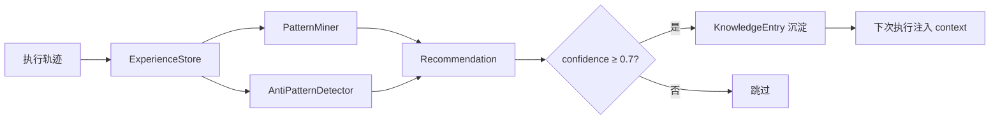

# 学习 + 调度 Demo

> 模式挖掘、反模式检测、智能调度——从历史轨迹中学习 + 并行分组 + Token 预估 + 关键路径

**定位**：学习引擎从 Agent 执行历史中挖掘成功/失败模式，智能调度器基于 DAG 拓扑生成最优并行执行计划。

完整可运行脚本见项目 `examples/learning-scheduler/` 目录（`demo_learning_scheduler.py`）。

---

## Demo 1：经验存储——记录执行轨迹

```python
from harness.learning import ExperienceStore
from harness.types import ExecutionTrace, TraceNode

store = ExperienceStore()

# 记录成功轨迹
trace = ExecutionTrace(
    workflow_id="wf-001",
    timestamp=None,
    duration_ms=5000,
    nodes=[
        TraceNode(node_id="coder", agent_type="coder", task="编写代码",
                  result_status="completed", duration_ms=3000,
                  files_modified=["main.py"], files_read=["req.md"], tokens_used=5000),
    ],
    gate_results=[],
    final_status="completed",
)

store.store(trace)
print(f"存储统计: {store.stats()}")
```

### 预期输出

| 观察项 | 期望值 |
|--------|--------|
| `store.stats()` | 包含轨迹总数、时间范围等 |
| 轨迹记录 | 成功/失败轨迹均可记录 |

---

## Demo 2：模式挖掘——发现成功/失败模式

```python
from harness.learning import ExperienceStore, PatternMiner

store = ExperienceStore()
# 存入足够多的轨迹（至少 5 条才能挖掘）
for i in range(8):
    # ... 存入多条轨迹
    pass

miner = PatternMiner(store)
recommendations = miner.mine()

for r in recommendations:
    print(f"类型: {r.type}, 置信度: {r.confidence:.2f}")
    print(f"描述: {r.description}")
    print(f"建议: {r.suggested_action}")
```

### 模式类型

| 模式 | 检测方法 | 推荐类型 |
|------|---------|---------|
| 频繁失败组合 | `_find_failure_patterns()` | `agent`——推荐换 Agent |
| 资源浪费 | `_find_resource_waste()` | `schedule`——推荐优化调度 |
| 频繁成功路径 | `_find_success_patterns()` | `architecture`——推荐复用 |

---

## Demo 3：智能调度——并行分组 + 关键路径

```python
from harness.scheduler import SmartScheduler, SmartSchedulerConfig
from harness.types import DAGWorkflow, WorkflowNode

scheduler = SmartScheduler(config=SmartSchedulerConfig(
    max_parallelism=4,
    token_budget=200000,
    checkpoint_on_gate_fail=True,
))

workflow = DAGWorkflow(
    id="demo-workflow",
    nodes=[
        WorkflowNode(id="analyst", agent_type="analyst", task="分析需求", dependencies=[], gate=None),
        WorkflowNode(id="coder-a", agent_type="coder", task="编写前端代码", dependencies=["analyst"], gate=None),
        WorkflowNode(id="coder-b", agent_type="coder", task="编写后端代码", dependencies=["analyst"], gate=None),
        WorkflowNode(id="validator", agent_type="validator", task="验证代码",
                     dependencies=["coder-a", "coder-b"],
                     gate={"mode": "strict", "checks": [{"id": "quality", "category": "quality", "severity": "high"}]}),
    ],
    edges=[
        ("analyst", "coder-a"), ("analyst", "coder-b"),
        ("coder-a", "validator"), ("coder-b", "validator"),
    ],
)

plan = scheduler.plan(workflow)
print(f"并行分组: {plan.parallel_groups}")
print(f"关键路径: {plan.critical_path}")
print(f"检查点: {plan.checkpoints}")
print(f"预估 Token: {plan.estimated_tokens}")
print(f"预估耗时: {plan.estimated_duration_ms}ms")
```

### 预期输出

| 观察项 | 期望值 |
|--------|--------|
| `parallel_groups` | `[["analyst"], ["coder-a", "coder-b"], ["validator"]]` |
| `critical_path` | analyst → coder-a → validator（最长链） |
| `checkpoints` | validator（有门禁的节点） |
| `estimated_tokens` | 基于 Agent 定义的 Token 预估 |

---

## Demo 4：资源管理——Token/RPM 跟踪 + 模式推荐

```python
scheduler = SmartScheduler(config=SmartSchedulerConfig(
    max_parallelism=4,
    llm_rate_limit_per_minute=60,
    token_budget=200000,
))

usage = scheduler.update_resource(tokens_used=50000, rpm_used=30, parallelism=2)
print(f"资源使用: tokens={usage.tokens_used}, rpm={usage.rpm_used}")

can_more = scheduler.can_execute_more()     # 是否可继续执行
mode = scheduler.recommend_mode()           # 推荐执行模式
```

### 执行模式

| 模式 | 触发条件 | 行为 |
|------|---------|------|
| aggressive | 资源充足（token < 50%预算） | 全力并行 |
| balanced | 资源适中（token 50%~80%预算） | 适度并行 |
| conservative | 资源紧张（token > 80%预算） | 限制并行，节省 token |

---

## Profile YAML 配置示例

```yaml
scheduler:
  max_parallelism: 4
  token_budget: 200000
  llm_rate_limit_per_minute: 60
  retry_strategy: adaptive
  checkpoint_on_gate_fail: true

learning:
  enabled: true
  interval: 3600              # 每小时挖掘一次模式
```

---

## 相关导航

- 📖 架构原理 → [学习引擎](/guide/learning-engine) · [调度引擎](/guide/scheduler-engine)
- 🎓 使用方法 → [模式挖掘](/tutorial/pattern-mining) · [智能调度](/tutorial/smart-scheduling)

---

## 🖥️ 终端体验：CLI 命令直操作

不用写代码，直接在终端体验学习引擎的统计、推荐、轨迹、模式挖掘：

```bash
# 查看学习统计概览
harness learn stats

# 触发学习（挖掘模式 + 反模式检测）
harness learn recommendations

# 查看校准后的预估参数
harness learn estimates

# 查看已挖掘的模式
harness learn patterns

# 查看历史轨迹列表
harness learn traces

# JSON 格式输出（可集成到 CI/CD）
harness learn stats --output json
harness learn traces --limit 10 --output json
```

---

## 🏃 一键跑 Python Demo

```bash
python playground/demo_basic.py
```

运行后你将看到 Step 7（学习引擎）的完整闭环：
- ✅ 执行轨迹记录（成功/失败/过度重试 3 条轨迹）
- ✅ 反模式检测（过度重试 → 推荐「增加超时或减少重试」）
- ✅ 学习引擎闭环（Learn → 高置信度推荐沉淀到知识库）
- ✅ 校准预估参数（token/耗时/标准差）

或运行专题 Demo：

```bash
python examples/learning-scheduler/demo_learning_scheduler.py
```

---

## 🔄 学习→知识闭环



<details>
<summary>ASCII 版本</summary>

```
执行轨迹 → ExperienceStore → PatternMiner → Recommendation
                              AntiPatternDetector → Recommendation
                                                    ↓
                                              confidence ≥ 0.7?
                                           是 → KnowledgeEntry沉淀 → 下次执行注入context
                                           否 → 跳过
```
</details>
