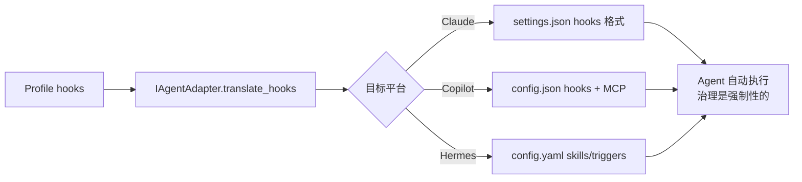

# 适配器架构与多 Agent 部署

> 5 个适配器的策略层级分析，无-hooks Agent 的治理增强方向

## 1. 适配器架构全景

harness-cook 使用适配器模式，5 个适配器覆盖了不同的策略层级：

| 适配器 | 目标平台 | **有 hooks？** | 部署策略 |
|--------|---------|--------------|---------|
| `ClaudeCodeAdapter` | Claude Code | ✅ 原生 hooks | 直接翻译 → 自动执行 |
| `CopilotCLIAdapter` | Copilot CLI | ✅ 有 hook 概念 | hooks + MCP 双通道 |
| `HermesAdapter` | Hermes | ❌ 无原生 hooks | hooks → skills 概念映射 |
| `CursorAdapter` | Cursor IDE | ❌ 无 hooks | 仅 MCP server + metadata |
| `OpenAIAdapter` | OpenAI/Codex | ❌ 无 hooks | hooks → function calling 定义 |

核心接口 `IAgentAdapter` 定义了四个翻译步骤：

```python
class IAgentAdapter(Protocol):
    name: str                          # 适配器标识
    supports_hooks: bool               # 目标平台是否原生支持 hook 自动触发
    translate_hooks(hooks_config, ...) # Profile hooks → 目标平台原生格式
    get_settings_path(project_dir)     # 目标平台配置文件路径
    merge_settings(existing, new_hooks, harness_root="") # 合并到现有配置
```

`supports_hooks` 属性是关键字段：
- `True` → hooks 在 Agent 执行时自动强制触发，gate prompt 使用 **mild** 强度
- `False` → hooks 降级为 metadata/建议性，gate prompt 使用 **mandatory** 强度

## 2. 三层部署策略

### 第一层：原生 Hook 翻译（自动强制执行）

**适用于**：Claude Code、Copilot CLI



**Claude Code**：hook 在 `SessionStart`、`PreToolUse` 等时机自动触发，Agent 无法绕过。这是最强的治理方式。

**Copilot CLI**：同时支持 hooks 配置和 MCP server 注册，形成双通道治理。

**Hermes**：把 `session_start` 映射为 `on_session_start` trigger，概念映射但治理非自动强制（经 MCP+prompt 实现）。

### 第二层：概念映射（转换为平台的等效概念）

**适用于**：Hermes（skills/triggers）、OpenAI/Codex（function calling）

- **Hermes**：hooks → skills + triggers，Hermes 会把治理作为 skill 自动执行
- **OpenAI/Codex**：hooks → function calling 定义。但 function calling 是 **Agent 可选调用** 的，不是自动触发的。这是从"强制"到"建议"的降级

### 第三层：MCP 工具 + System Prompt 注入（仅建议性治理）

**适用于**：Cursor、OpenAI/Codex

- **hooks 降级为 metadata** — 写进配置但不执行，只是供人参考
- **治理能力通过 MCP 工具提供** — Agent 可以调用 `harness_check`、`harness_guardrails_check` 等
- **gates 通过 system prompt 注入** — `_translate_gates_to_prompt` 写入 CLAUDE.md

**根本问题**：没有 hooks = 没有强制执行。Agent 可以选择不调用 MCP 工具。

## 3. 治理强度矩阵

| 治理强度 | 实现方式 | 适用平台 | 能否绕过？ |
|---------|---------|---------|----------|
| **强制性** | Hook 自动触发 | Claude Code、Copilot CLI | ❌ 无法绕过 |
| **强制性（事后）** | Git pre-commit hook | **所有 Agent** | ❌ commit 被拦截 |
| **建议性→接近强制** | Prompt-Driven mandatory + MCP 工具 | Hermes、Cursor、OpenAI/Codex | ⚠️ Agent 通常遵循但理论上可绕过 |

> **双保险策略**：强制性 Agent 有 hook 自动触发 + git hook 兜底；建议性 Agent 有 mandatory prompt 提示 + git hook 兜底。无论哪种 Agent，不合规代码都无法通过 git commit。

## 4. 当前适配器的具体翻译策略

### ClaudeCodeAdapter

```
输入: {"session_start": [{"type": "script", "command": "python3 packages/hooks/hook-session-init.py"}]}
输出: {
    "hooks": {
        "SessionStart": [
            {"matcher": "", "hooks": [{"type": "command", "command": "python3 /abs/path/to/harness-cook/packages/hooks/hook-session-init.py"}]}
        ]
    }
}
```

**路径处理**：`translate_hooks()` 通过 `resolve_hook_command()` 将内置路径转换为绝对路径。

### CopilotCLIAdapter

双通道：hooks 做自动拦截，MCP 做按需检查。

### HermesAdapter

概念映射：hooks → skills，triggers 做自动触发，approvals/security 做策略约束。

### CursorAdapter

hooks 降级为 metadata，治理完全靠 MCP 工具。

### OpenAIAdapter

hooks 变成 function calling 定义，Agent 需主动调用才能触发治理。

## 5. 无-hooks Agent 的治理增强方向

### 已实现的方案

| 方案 | 实现难度 | 治理强度 | 状态 |
|------|---------|---------|------|
| Prompt-Driven 强制调用 | 低 | 建议→接近强制 | ✅ 已实现 |
| Git Hook 补偿 | 低 | 强制（事后） | ✅ 已实现 |

### 待评估的方案

| 方案 | 实现难度 | 治理强度 | 依赖条件 |
|------|---------|---------|---------|
| Wrapper 脚本 | 中 | 强制（事前） | Agent CLI 管道 |
| SDK 嵌入 | 高 | 强制（事前） | Agent 沙箱拦截点 |

**Prompt-Driven 强提示**：对无-hooks Agent 生成更强的 prompt 指令：
- **mild 强度**（hook-capable Agent）："[harness] 建议在关键操作后运行 harness check 验证合规性"
- **mandatory 强度**（无-hooks Agent）："[MANDATORY] Before ANY file write, MUST call harness_check"

**Git Hook 补偿**：对无法事前拦截的 Agent，用 git hooks 做事后验证——适用于所有 Agent。

## 6. 架构评价

**当前架构是正确的**：适配器模式是正确的设计选择，每个适配器按平台能力选择翻译策略。

**局限性诚实承认**：对于没有 hooks 的 Agent（Cursor、Codex），治理从"强制"降级为"建议"。

**双保险策略已实现**：Prompt-Driven 强提示 + Git Hook 补偿 = "事前提示 + 事后拦截"。
