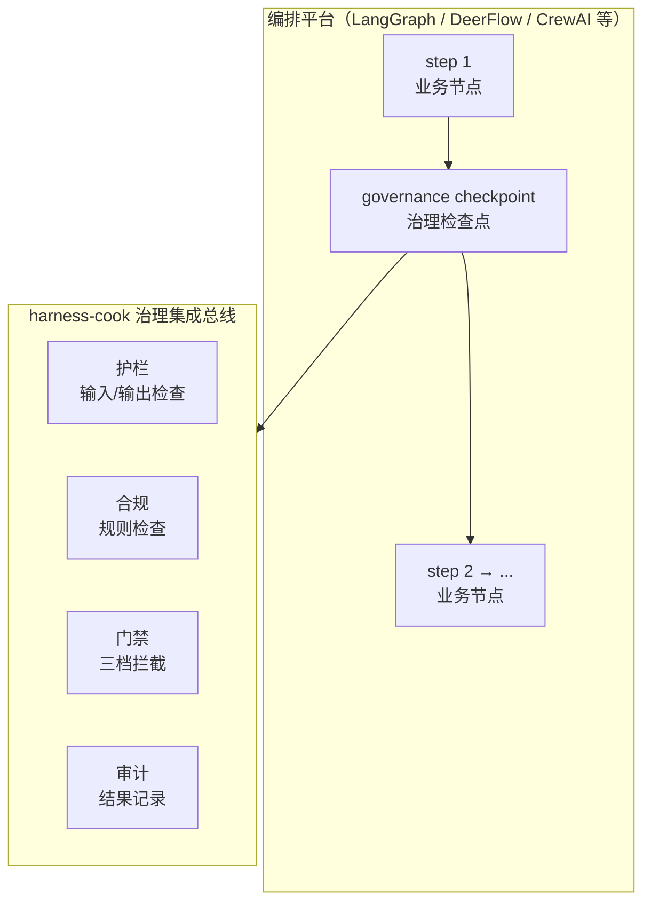
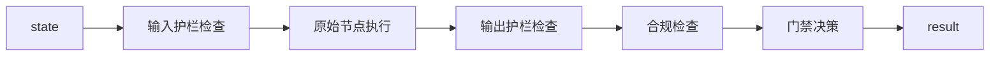
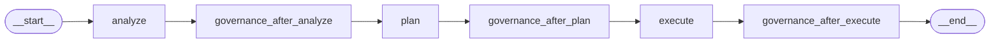

# 编排平台治理中间件

> harness-cook 从"独立 MCP 插件"进化到"编排框架治理中间件"——当 harness-cook 可以嵌入 LangGraph/DeerFlow 的 step 间做治理检查时，它不再是"某个编码助手的插件"，而是"任何编排框架的治理层"。
>
> 核心思路：不是替换编排框架的编排逻辑，而是在它们的 step 之间插入治理检查点。

---

## 一、架构定位



<details>
<summary>ASCII 原图</summary>

```
┌─────────────────────────────────────────────────────────────┐
│                编排平台（LangGraph / DeerFlow / CrewAI 等）    │
│                                                             │
│  ┌────────┐   ┌────────────┐   ┌────────┐                 │
│  │ step 1 │ → │ governance │ → │ step 2 │ → ...           │
│  │ (业务) │   │ checkpoint │   │ (业务) │                  │
│  └────────┘   └────────────┘   ┌────────┘                 │
│                     │                                       │
│                     ▼                                       │
│              ┌──────────────┐                               │
│              │ harness-cook │                               │
│              │  治理集成总线  │                               │
│              │              │                               │
│              │ 护栏(输入/输出)│                               │
│              │ 合规(规则检查) │                               │
│              │ 门禁(三档拦截) │                               │
│              │ 审计(结果记录) │                               │
│              └──────────────┘                               │
└─────────────────────────────────────────────────────────────┘
```
</details>

**关键设计**：治理检查点不是编排框架的功能，而是 harness-cook 作为中间件注入的功能。编排框架只负责 step 调度和状态管理，harness-cook 负责治理决策。

---

## 二、LangGraph 治理中间件

### 2.1 LangGraphGovernanceNode

LangGraph 兼容的治理节点，在工作流步骤间插入治理检查点。

```python
from harness.integrations.langgraph_middleware import LangGraphGovernanceNode

# 创建治理节点
governance_node = LangGraphGovernanceNode(config={
    "check_input_guardrails": True,   # 输入护栏检查
    "check_output_guardrails": True,  # 输出护栏检查
    "check_compliance": True,         # 合规检查
    "gate_mode": "hybrid",            # 门禁模式：strict/hybrid/loose
})

result = governance_node.execute(state)
# result 包含：
# - governance_passed: bool  — 治理是否通过
# - governance_blocked: bool — 是否被拦截
# - gate_decision: str      — 门禁决策
# - governance_results: list — 检查结果列表
```

### 2.2 wrap_node_with_governance

将治理检查包裹在现有 LangGraph 节点函数周围：

```python
from harness.integrations.langgraph_middleware import wrap_node_with_governance

def my_analyze_node(state):
    return {"output_text": f"分析完成: {state.get('input_text', '')}"}

# 包裹治理检查——wrapped 和原始节点签名完全一致
wrapped = wrap_node_with_governance(my_analyze_node, config={
    "gate_mode": "hybrid",
    "check_input_guardrails": True,
    "check_output_guardrails": True,
    "check_compliance": True,
})

result = wrapped(state)
```

**包裹流程**：



<details>
<summary>ASCII 原图</summary>

```
state → 输入护栏检查 → 原始节点执行 → 输出护栏检查 → 合规检查 → 门禁决策 → result
```
</details>

### 2.3 build_governance_graph

构建完整嵌入治理节点的 LangGraph StateGraph：

```python
from harness.integrations.langgraph_middleware import build_governance_graph

graph = build_governance_graph(
    workflow_config={...},
    governance_config={"gate_mode": "hybrid", ...},
)

compiled = graph.compile()
result = compiled.invoke({"input_text": "帮我写代码"})
```

**生成的 StateGraph 结构**：



### 2.4 三档门禁行为

| 门禁模式 | 通过 | 严重违规 | 轻微违规 |
|---|---|---|---|
| **strict** | allow | block | block |
| **hybrid** | allow | block + interrupt | warn |
| **loose** | allow | warn | warn |

---

## 三、DeerFlow 治理桥接

DeerFlowBridge 将 harness-cook 治理配置翻译为 DeerFlow workflow 定义：

```python
from harness.integrations.deerflow_bridge import DeerFlowBridge
bridge = DeerFlowBridge()

# Gate → DeerFlow 验证步骤
validation = bridge.translate_gate_to_validation(gate)

# Profile → DeerFlow workflow
workflow = bridge.translate_profile_to_workflow(profile)

# 注入治理检查点到现有 workflow
result = bridge.execute_with_governance(existing_workflow, config={"gate_mode": "hybrid"})
```

**三档门禁翻译规则**：

| gate_type | interrupt_on_failure |
|---|---|
| strict | True（任何失败都中断） |
| hybrid | True（严重失败中断，轻微 warn） |
| loose | False（所有失败仅记录） |

---

## 四、引擎对照表

| 层 | 引擎 | 安装方式 |
|---|---|---|
| 护栏 | 内置 PII/toxicity | 默认安装 |
| 护栏 | Guardrails AI | `pip install harness-cook[guardrails]` |
| 护栏 | NeMo Guardrails | `pip install harness-cook[nemo]` |
| 护栏 | Llama Guard | `pip install harness-cook[llama-guard]` |
| 合规 | 内置 regex/ast/dep_graph | 默认安装 |
| 合规 | SonarQube（引用模式） | `pip install harness-cook[sonarqube]` |
| 合规 | OPA/Rego | `pip install harness-cook[opa]` |
| 审计 | 本地 JSON | 默认安装 |
| 审计 | Langfuse | `pip install harness-cook[langfuse]` |
| 审计 | Arize AI | `pip install harness-cook[arize]` |
| 审计 | Datadog | `pip install harness-cook[datadog]` |

---

## 五、降级路径

所有外部引擎遵循统一降级策略：

```
外部引擎调用 → 失败 → 自动回退到内置 RegexChecker → 不阻塞主流程
```

| 引擎 | 降级目标 |
|---|---|
| Guardrails AI → RegexChecker | PII/毒性正则匹配 |
| NeMo Guardrails → RegexChecker | Colang 规则降级为正则 |
| SonarQube → RegexChecker | 引用模式降级为内置规则 |
| Langfuse → 本地 JSON | 双写失败后主存储仍可用 |

---

**示例代码**：
- LangGraph：`examples/langgraph-integration/demo_langgraph_governance.py`
- DeerFlow：`examples/deerflow-integration/demo_deerflow_bridge.py`
