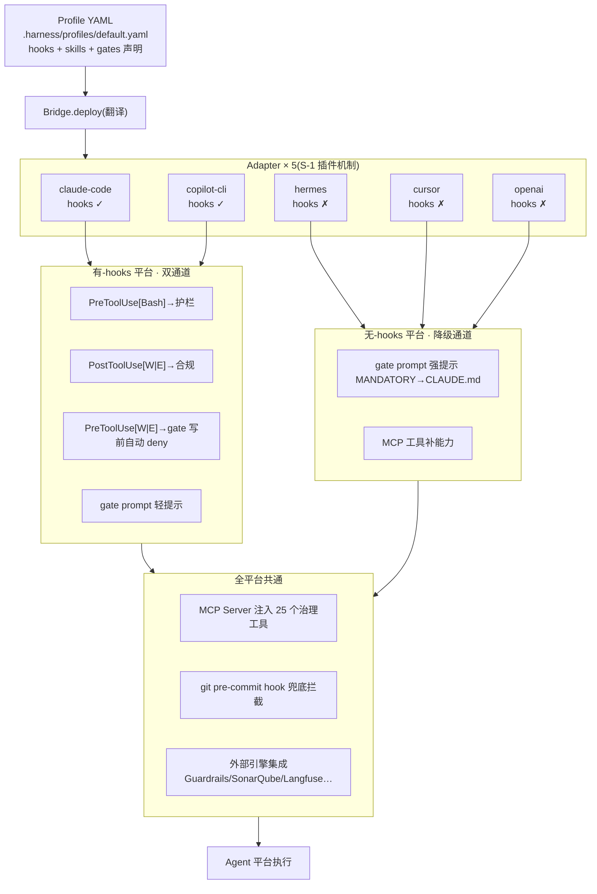

# harness-cook — Agent 治理集成总线：形态与 Agent 的关系

> harness-cook 的定位、K8s 类比与控制论闭环见 [什么是 Harness](/guide/what-is-harness)。本文聚焦它的形态与 Agent 的关系。
> 用法与安装见 [快速开始](/guide/quick-start)，治理层详解见 [什么是 Harness](/guide/what-is-harness)。

---

## 它和 Agent 的关系：约束层，不是决策层

这是 harness-cook 最核心的定位：**它是 Agent 的约束层，不是决策层。** 决策权始终归属于 Agent，harness 只定义边界与轨道。

harness-cook 采用治理集成总线架构（Profile 配置层 + 四大治理层 + 外部引擎委托），引擎委托给专业选手，自身只承载四类不可外包能力（Profile 声明式配置、三档门禁、引擎路由总线、MCP 注入 + 跨平台部署）。架构总览与四件不可委托表见 [什么是 Harness](/guide/what-is-harness)。

### 4.1 不替代 Agent 决策

Agent 是发动机，harness 是方向盘、仪表盘、刹车踏板。harness 不削弱 Agent 能力，只在其执行的全流程节点施加约束：写文件前拦截违规、调用工具前过滤危险输入、产出后审计留痕、不合规时回滚或升级人工。

### 4.2 多平台部署关系

harness-cook 通过 **Bridge + Adapter** 把一份 Profile 部署到不同 Agent 平台，而非要求用户更换 Agent：

```
Profile YAML ──Bridge.deploy──▶ Adapter 翻译 ──▶ 各平台原生配置
```

五个内置适配器，覆盖从"原生 hooks 强制执行"到"仅 MCP 建议性治理"的不同强度：

| 适配器 | 目标平台 | 原生 hooks | 治理强度 | 部署落点 |
|---|---|---|---|---|
| `claude-code` | Claude Code | ✅ | 强制性 | `.claude/settings.json` hooks 段 |
| `copilot-cli` | GitHub Copilot CLI | ✅ | 强制性 | `config.json` |
| `hermes` | Hermes | ❌ | 建议性→接近强制 | `~/.hermes/config.yaml`（YAML） |
| `cursor` | Cursor IDE | ❌ | 建议性→接近强制 | MCP 配置 |
| `openai` | OpenAI / Codex | ❌ | 建议性→接近强制 | function calling 定义 |

**S-1 适配器插件机制**：新平台只需在 `.harness/adapters/` 放一个 `.py` 文件实现 `IAgentAdapter` 协议（`name` 属性 + `translate_hooks` 方法），即被 `AdapterRegistry` 自动发现并接入，无需改核心代码。

### 4.3 双通道治理：按平台能力分流

Bridge.deploy 根据 adapter 是否支持原生 hooks，把同一份 Profile 翻译成两条治理通道：

**有-hooks 平台（claude-code / copilot-cli）**——hooks 自动强制执行：
- `PreToolUse[Bash]` → 输入护栏（危险命令拦截）
- `PostToolUse[Write|Edit]` → 合规扫描（产出物校验）
- `PreToolUse[Write|Edit]` → **gate 写前拦截**（违规自动 deny）
- 配以 gate prompt 轻提示（补充说明，不依赖）

**无-hooks 平台（hermes / cursor / openai）**——降级通道：
- gate prompt 升级为强提示（MANDATORY，注入 CLAUDE.md，是唯一事前治理手段）
- MCP 工具补能力（Agent 主动调用 `harness_check` 等工具）
- S-5 退让策略：FALLBACK 模式下 prompt 由 mild 升级为 mandatory

**全平台共通兜底**：
- MCP Server 注入 25 个治理工具（护栏检查 / 合规扫描 / 门禁审批 / 审计查询 / 知识管理 / 桥接部署等）
- git pre-commit hook（不合规代码无法 commit，双保险）

### 4.4 gate 写前双通道：单一声明源

门禁（gate）的写前拦截走**双通道**，二者均由 Bridge.deploy 从同一份 Profile 翻译而来：

- **自动拦截通道**——`PreToolUse[Write|Edit]` hook 调用 `hook-gate-pre-write.py`：运行时从项目 Profile 读 `gates.checks` 与 `default_gate_mode`，复用 `gates.py` 的 `check_fn`，按模式决策（strict→任何未通过 deny；hybrid→critical/high deny、medium/low 放行；loose→从不 deny 仅记录）。
- **提示通道**——gate 规则注入 CLAUDE.md，Agent 在生成时即知晓约束。

关键设计：**规则源单一**。gate 脚本不自带检测规则，运行时从 Profile 读取并复用框架的 `check_fn`，避免与 `gates.py` 漂移。这是"有-hooks 平台 gate 自动强制执行"原架构意图的兑现——通过 adapter 的 `translate_gates_to_hooks` 方法，把 Profile 的 `gates.checks` 翻译成 `PreToolUse` 拦截 hook；无-hooks adapter 不实现该方法，Bridge 用 `getattr` 探测并跳过，gate 退回 prompt + git 降级路径。

### 图：harness-cook ↔ Agent 平台关系总图

> 这是本文相对现有文档的差异化核心——一张图看清 harness 如何对接多个 Agent 平台、双通道如何分流。



<details>
<summary>ASCII 版本 — harness ↔ Agent 平台关系总图</summary>

```
┌─────────────────────────────────────────────────────────────┐
│  Profile YAML (.harness/profiles/default.yaml)              │
│  hooks + skills + gates 声明                                │
└──────────────────────────┬──────────────────────────────────┘
                           │ Bridge.deploy(翻译)
┌──────────────────────────▼──────────────────────────────────┐
│  Adapter × 5(S-1 插件机制)                                   │
│  ┌──────────┐ ┌──────────┐ ┌──────┐ ┌──────┐ ┌──────────┐  │
│  │claude-code│ │copilot-cli│ │hermes│ │cursor│ │  openai  │  │
│  │hooks ✓   │ │hooks ✓   │ │hooks✗│ │hooks✗│ │ hooks✗   │  │
│  └────┬─────┘ └────┬─────┘ └──┬───┘ └──┬───┘ └────┬─────┘  │
└───────┼────────────┼─────────┼────────┼───────────┼────────┘
        │ 双通道      │ 双通道   │ 降级    │ 降级       │ 降级
   ┌────▼──────────────▼───┐  ┌──▼────────▼───────────▼────┐
   │ 有-hooks 平台          │  │ 无-hooks 平台              │
   │ • PreToolUse[Bash]→护栏│  │ • gate prompt 强提示        │
   │ • PostToolUse[W|E]→合规│  │   (mandatory→CLAUDE.md)    │
   │ • PreToolUse[W|E]→gate │  │ • MCP 工具补能力            │
   │   写前自动 deny         │  │                             │
   │ • gate prompt 轻提示   │  │                             │
   └────────────────────────┘  └─────────────────────────────┘
        │                            │
   ┌────▼────────────────────────────▼─────┐
   │  全平台共通                            │
   │  • MCP Server 注入 25 个治理工具       │
   │  • git pre-commit hook 兜底拦截        │
   │  • 外部引擎集成(Guardrails/SonarQube/  │
   │    Langfuse…) 作为下游                │
   └───────────────────────────────────────┘
                           │
                           ▼
                    Agent 平台执行
```

</details>

---

## 运行时闭环与独特性

> 控制论视角的运行时治理闭环（编排→反馈采集→约束门控→修正动作）、与 Kubernetes 的对照、产品定位见 [什么是 Harness](/guide/what-is-harness)。
