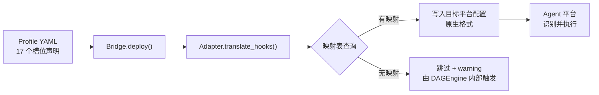

# Hook 槽位映射机制

> harness-cook 的 17 个自定义 hook 槽位如何映射到 Claude Code 原生 hook 事件，以及多平台映射的架构演进方向

## 1. 核心问题：harness-cook 的槽位 ≠ Agent 平台的原生 hooks

harness-cook 定义了 **17 个 SkillSlotName 槽位**，这是框架自己的抽象概念模型。不同 Agent 平台有自己的原生 hook 事件体系。两者之间需要**翻译层**才能桥接。

### harness-cook 的 17 个槽位

```python
class SkillSlotName(Enum):
    # 会话级 [实验性]
    SESSION_START = "session_start"
    SESSION_END = "session_end"

    # 任务级 [核心]
    PRE_EXECUTE = "pre_execute"
    POST_EXECUTE = "post_execute"
    ON_ERROR = "on_error"

    # 工具级 [实验性]
    PRE_TOOL_USE = "pre_tool_use"
    POST_TOOL_USE = "post_tool_use"

    # 门禁级 [核心]
    ON_GATE_PASS = "on_gate_pass"
    ON_GATE_FAIL = "on_gate_fail"

    # 文件级 [实验性]
    ON_FILE_CHANGE = "on_file_change"

    # 提交级 [实验性]
    PRE_COMMIT = "pre_commit"
    POST_COMMIT = "post_commit"

    # 协作级 [实验性]
    ON_DELEGATE = "on_delegate"
    ON_CONFLICT = "on_conflict"

    # 决策级 [核心/实验性]
    ON_DECISION = "on_decision"
    ON_ESCALATION = "on_escalation"

    # 交互级 [实验性]
    USER_PROMPT_SUBMIT = "user_prompt_submit"
```

### Claude Code 原生支持的 hook 事件（25 个）

Claude Code v2.1.177 支持的完整 hook 事件列表：

| 事件名 | 触发时机 | matcher 支持 |
|--------|---------|-------------|
| `PreToolUse` | 工具调用前 | ✅ |
| `PostToolUse` | 工具调用后 | ✅ |
| `PostToolUseFailure` | 工具调用失败后 | ✅ |
| `PostToolBatch` | 工具批次完成后 | ✅ |
| `UserPromptSubmit` | 用户提交提示时 | ❌ |
| `Notification` | 通知发送时 | ❌ |
| `Stop` | 主 agent 响应 turn 结束 | ❌ |
| `SubagentStop` | 子 agent turn 结束 | ❌ |
| `SubagentStart` | 子 agent 开始执行 | ❌ |
| `SessionStart` | 新会话开始 | ❌ |
| `SessionEnd` | 会话结束 | ❌ |
| `PreCompact` | 对话压缩前 | ❌ |
| `PostCompact` | 对话压缩后 | ❌ |
| `ConfigChange` | 配置文件变更 | ❌ |
| `WorktreeCreate` | 创建 git worktree | ❌ |
| `WorktreeRemove` | 删除 git worktree | ❌ |
| `MessageDisplay` | 助手消息流式输出 | ❌ |
| `TeammateIdle` | 协作队友空闲 | ❌ |
| `TaskAssign` | 任务分配给队友 | ❌ |
| `TaskCompleted` | 任务完成 | ❌ |
| `Maintenance` | 维护操作 | ❌ |

## 2. Claude Code 适配器的映射表

```python
HOOK_POINT_MAP = {
    # 会话级——直接对应
    "session_start":       "SessionStart",
    "session_end":         "Stop",

    # 工具级——直接对应
    "pre_tool_use":        "PreToolUse",
    "post_tool_use":       "PostToolUse",

    # 交互级——直接对应
    "user_prompt_submit":  "UserPromptSubmit",

    # 任务级——降级映射（Claude Code 无任务级 hook）
    "pre_execute":         "PreToolUse",
    "post_execute":        "PostToolUse",

    # 文件级——降级映射（通过 PostToolUse 的 matcher 过滤 Write/Edit）
    "on_file_change":      "PostToolUse",
}
```

### 映射策略分类

| 策略 | 说明 | 槽位示例 |
|------|------|---------|
| **直接对应** | harness 槽位有语义完全相同的 Claude Code 事件 | `session_start → SessionStart` |
| **语义降级** | Claude Code 无对应事件级，映射到最接近的低级事件 | `pre_execute → PreToolUse`（任务级→工具级） |
| **matcher 模拟** | 用 PostToolUse 的 matcher 过滤特定工具 | `on_file_change → PostToolUse` + matcher `Write|Edit` |

### 无法映射的 9 个槽位

以下槽位在 `HOOK_POINT_MAP` 中没有条目，`translate_hooks` 会跳过并打印 warning：

| 槽位 | 原因 | 执行路径 |
|------|------|---------|
| `on_error` | Claude Code 有 `PostToolUseFailure` 但语义不完全对齐 | DAGEngine 内部调用 |
| `on_gate_pass` | 无原生门禁概念 | DAGEngine 内部调用 |
| `on_gate_fail` | 无原生门禁概念 | DAGEngine 内部调用 |
| `pre_commit` | 无原生提交前 hook | Git Hook 兜底 + DAGEngine |
| `post_commit` | 无原生提交后 hook | Git Hook 兜底 |
| `on_delegate` | 有 `SubagentStart` 但语义差异大 | DAGEngine 内部调用 |
| `on_conflict` | 无原生冲突检测 hook | DAGEngine 内部调用 |
| `on_decision` | 无原生决策审计 hook | DAGEngine 内部调用 |
| `on_escalation` | 无原生升级 hook | DAGEngine 内部调用 |

## 3. Hermes 适配器的映射表（对比）

Hermes 支持任务级 hook（`before_task/after_task`），所以 `pre_execute/post_execute` 有**直接对应**而非降级映射。而且 Hermes 的 `on_error` 有原生对应。

## 4. 整体翻译流程



<details>
<summary>ASCII 原图</summary>

```
Profile YAML (17 槽位) → Bridge.deploy() → Adapter.translate_hooks() → 映射表查询
    → 有映射 → 写入目标平台配置 → Agent 执行
    → 无映射 → 跳过 + warning → DAGEngine 内部触发
```
</details>

## 5. 多平台映射表的架构演进方向

### 当前状态：映射表散落在各适配器中

| 适配器 | 映射表位置 | 形式 |
|--------|-----------|------|
| `ClaudeCodeAdapter` | 模块级常量 `HOOK_POINT_MAP` | dict |
| `HermesAdapter` | 方法级内部 | dict |
| `CursorAdapter` | 无映射（不支持 hooks） | — |
| `CopilotCLIAdapter` | 模块级常量 `HOOK_POINT_MAP` | dict |
| `OpenAIAdapter` | 无映射 | — |

### 不建议中央化合并

原因：
- 不同平台的事件名完全不同
- 映射策略不同（直接对应 vs 降级 vs matcher）
- 输出格式不同（JSON vs YAML vs metadata）

### 推荐方案：HookPointRegistry

新增 `HookPointRegistry`，各适配器注册自己的映射表，提供全局覆盖度视图：

```python
class HookPointRegistry:
    _mappings: Dict[str, Dict[str, str]] = {}

    @classmethod
    def register(cls, adapter_name: str, mapping: Dict[str, str]):
        cls._mappings[adapter_name] = mapping

    @classmethod
    def coverage_report(cls) -> Dict[str, Set[str]]:
        """每个槽位在各平台的覆盖情况"""
        ...
```

优点：
- 全局映射覆盖度一目了然
- 新适配器只需注册映射 + 实现 translate_hooks
- 测试可以验证所有注册映射的槽位名合法性

## 6. 潜在的新映射机会

| harness 槽位 | Claude Code 事件 | 映射可行性 |
|-------------|-----------------|-----------|
| `on_error` | `PostToolUseFailure` | ✅ 可映射——语义相近 |
| `on_delegate` | `SubagentStart` | ⚠️ 需评估——语义差异 |
| `session_end` | `SessionEnd` | ✅ **可改进**——当前映射到 `Stop`，应改为更精确的 `SessionEnd` |

### 特别注意：session_end 的映射问题

当前 `session_end → Stop` 语义不太准确：
- `Stop`：主 agent 的响应 turn 结束时触发（每次对话轮次都可能触发）
- `SessionEnd`：会话结束时触发（只触发一次）

**建议修正**为 `"session_end": "SessionEnd"`，更精确匹配语义。
