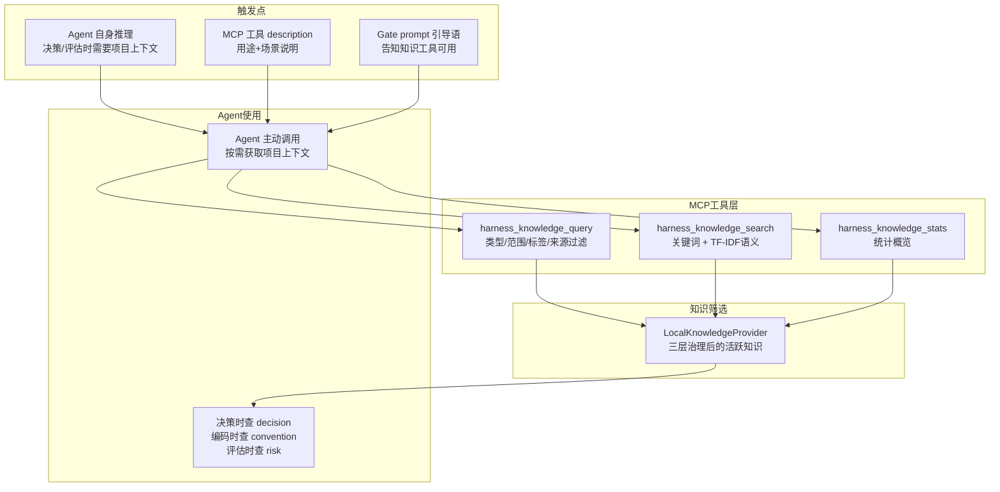

# 知识库与 Memory 互补关系

> 知识库管"项目发现了什么"，Memory 管"人怎么想"；MCP 工具主动查询而非注入

## 核心原则：不做 Agent 自身的事

**harness-cook 绝不替 Agent 做属于 Agent 自身的事**。

这意味着：
- ❌ **不做**：harness 主动写入 Agent 的 context 文件（如 CLAUDE.md、.cursorrules）
- ❌ **不做**：harness 主动注入知识到 Agent 的 system prompt
- ✅ **做**：harness 提供知识查询能力（MCP 工具），Agent 在需要时主动调用

## 知识库 vs Claude Code Memory：不重复，互补

| 维度 | harness 知识库 | Claude Code Memory |
|------|---------------|---------------------|
| **数据来源** | EventBus 自动沉淀 + `harness knowledge add` | 用户 `/remember` 或 session end 时 Claude 自主写 |
| **内容性质** | **项目治理发现** | **协作偏好** |
| **生命周期** | 三层治理自动淘汰（30天→归档，90天→删除） | 永久存储，不淘汰 |
| **ID 策略** | `SHA256(type:scope:title)[:12]` — 同类归同一条目 | 简短 kebab-case slug |
| **存储位置** | `~/.harness/knowledge/{project}/entries.json` | `.claude/projects/.../memory/*.md` |
| **淘汰机制** | 自动淘汰（evict_stale_entries） | 无淘汰 |

**两者互补而非重叠**：
- Memory 管"人怎么想"——偏好、习惯、规则
- 知识库管"项目发现了什么"——风险、决策、模式

举例：
- Memory：`用户偏好 pnpm，禁止 npm/yarn` → 协作偏好
- 知识库：`合规风险: no-hardcoded-secrets（累计触发 5 次）` → 项目治理发现

## 知识库的 3 个消费方

| 消费方 | 消费方式 | 消费时机 |
|--------|---------|---------|
| **AI Agent** | MCP 工具主动查询 | Agent 需要项目上下文时主动调用 |
| **harness 内部引擎** | 合规/护栏/门禁引擎查询 | 每次引擎执行检查时 |
| **Dashboard / CLI** | `harness knowledge list/search/stats` | 用户主动查询时 |

## MCP 方式：Agent 主动调用，而非 harness 主动注入

| 对比 | 直接注入方式（已否决） | MCP 主动查询方式（已实现） |
|------|---------------------|-------------------------|
| 主动方 | harness 主动写入 | Agent 主动调用 |
| 时效性 | 部署时一次性注入，过时不可更新 | 每次调用都是实时数据 |
| 选择权 | Agent 被强制接收全部注入 | Agent 按需查询，只取需要的 |
| context 压力 | 所有知识都占 context | 只在需要时查询，不占常驻 context |
| 职责边界 | 跨界：harness 替 Agent 做了 Agent 自身的事 | 清晰：harness 提供能力，Agent 决定使用方式 |

### 已实现的 5 个 MCP 知识工具

| 工具 | 用途 | 适用场景 |
|------|------|---------|
| `harness_knowledge_query` | 按类型/范围/标签/来源过滤查询 | 需要特定类别知识时 |
| `harness_knowledge_search` | 关键词搜索 + TF-IDF 语义搜索 | 关键词模糊搜索 |
| `harness_knowledge_stats` | 知识库统计概览 | 先了解知识库规模 |
| `harness_knowledge_activate` | 将 Insight 激活为 ComplianceRule | 一键采纳洞察为合规规则 |
| `harness_knowledge_deactivate` | 撤销 Insight 的 ComplianceRule 激活 | 取消已激活的规则 |

### Agent 使用示例

```
# Agent 需要做架构决策时：
harness_knowledge_query(type_filter=decision)

# Agent 需要了解项目风险时：
harness_knowledge_query(type_filter=risk)

# Agent 不确定项目有什么约定时：
harness_knowledge_search(query="编码约定", method=keyword)
```

## Agent 如何知道主动调用知识 MCP 工具？

三个触发机制，从自然发生到主动提示，层层递进：

### 1. Agent 自身的推理逻辑

Agent 做架构决策、评估风险时，它自然会想"这个项目有什么已知决策/风险？" → 调用知识工具。不需要任何外部通知。

### 2. MCP 工具的 description 就是 Agent 的"说明书"

工具描述已经写清楚了用途和触发场景，Agent 看到工具列表时自动知道何时该调用。

### 3. Gate prompt 的引导语

Bridge 部署的 gate prompt 中加一句引导语，告知 Agent 有哪些知识工具可用：

```markdown
## 知识查询
项目知识库通过 MCP 工具可用：
- `harness_knowledge_stats` — 先看知识库规模
- `harness_knowledge_query(type_filter=risk)` — 查看已知风险
- `harness_knowledge_query(type_filter=decision)` — 查看架构决策
- `harness_knowledge_search(query="xxx")` — 关键词/语义搜索

在做重要决策前，建议先查询相关知识。
```

**这不算"替 Agent 做事"**——这是告知 Agent 有什么能力可用，就像 API 文档告知开发者有什么接口。Agent 是否调用，仍是 Agent 自己的决定。

### 核心区别

| 维度 | 直接注入 CLAUDE.md | MCP 工具 + Gate 引导 |
|------|-------------------|---------------------|
| 主动方 | harness 写入 | Agent 决定调用 |
| 信息时效 | 部署时固化 | 每次调用实时 |
| 信息量 | 全部知识占 context | 按需查询，不浪费 context |
| Agent 自主权 | 被强制接收 | 自主决定是否/何时/查什么 |

**Gate 引导语写的是"你可以用什么工具"，而非"你必须接收什么内容"。前者是能力说明，后者是内容注入。**

## 知识获取路径全景



<details>
<summary>ASCII 版本</summary>

```
触发点                          MCP 工具层                     知识筛选              Agent使用
──────────────────────────────────────────────────────────────────────────────────────────────────────
Agent 自身推理 ──→ Agent 主动调用 ──→ harness_knowledge_query ──→ LocalKnowledgeProvider ──→ 决策时查 decision
MCP 工具 description ──→           ──→ harness_knowledge_search ──→ LocalKnowledgeProvider ──→ 编码时查 convention
Gate prompt 引导语 ──→             ──→ harness_knowledge_stats ──→ LocalKnowledgeProvider ──→ 评估时查 risk

核心原则：harness 提供能力（MCP工具），Agent 决定使用方式（何时调用、查什么）
三个触发点：自然推理 → 工具说明 → Gate引导，层层递进确保Agent找到知识工具
```
</details>
