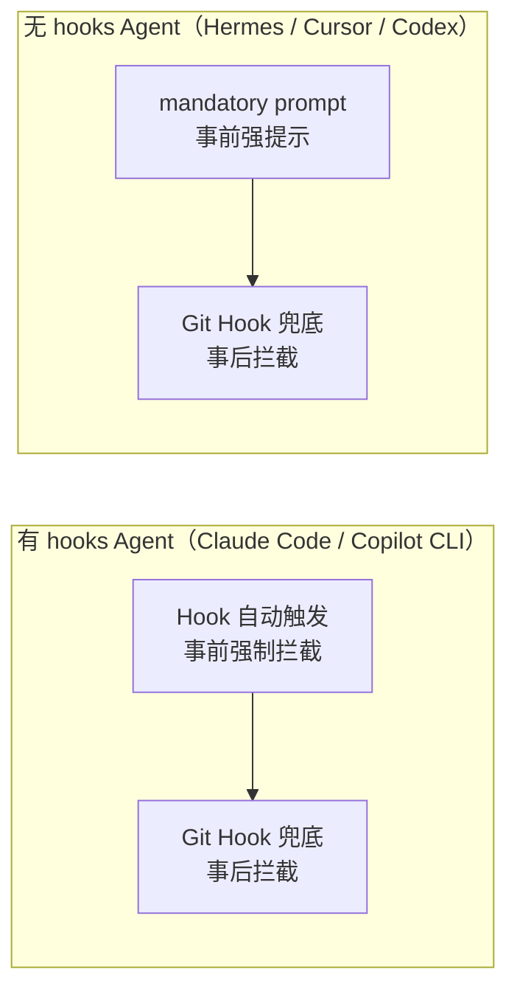

# Prompt-Driven 强提示 + Git Hook 补偿

> 已实现的"事前提示 + 事后拦截"双保险方案——有 hooks 的 Agent 自动强制执行，无 hooks 的 Agent 用强提示 + git hook 兜底

## 决策原则

| 方案 | 适用范围 | 原因 |
|------|---------|------|
| **Prompt-Driven 强提示** | 仅无-hooks Agent | 有 hooks 的已自动执行，再加 prompt 是冗余废话 |
| **Prompt-Driven 轻提示** | 仅有-hooks Agent（可选） | 作为 hook 的补充说明，非强制 |
| **Git Hook 补偿** | **所有 Agent** | 兜底防线，拦截任何人直接 commit 的场景 |

## 实现内容

### 1. `IAgentAdapter` 加 `supports_hooks` 属性

```python
class IAgentAdapter(Protocol):
    name: str
    supports_hooks: bool  # 目标平台是否原生支持 hook 自动触发
    translate_hooks(...)
    get_settings_path(...)
    merge_settings(...)
```

| 适配器 | `supports_hooks` |
|--------|-----------------|
| ClaudeCodeAdapter | `True` |
| CopilotCLIAdapter | `True` |
| HermesAdapter | `False` |
| CursorAdapter | `False` |
| OpenAIAdapter | `False` |

### 2. `_translate_gates_to_prompt` 加 `strength` 参数

```python
def _translate_gates_to_prompt(self, mode, checks, strength="mild"):
```

- `strength="mild"` → 轻提示（hook-capable Agent）
- `strength="mandatory"` → 强提示（无-hooks Agent）

### 3. git pre-commit hook 脚本

创建 `packages/hooks/git-pre-commit-hook.sh`：
- 运行 `harness check` 扫描变更文件
- 不通过 → commit 被拒绝
- 通过 → 放行

### 4. `bridge.py` deploy 流程加条件分支

```python
def deploy(self, profile, project_dir=None):
    adapter = get_adapter(adapter_name)

    # hooks 翻译
    hooks_config = adapter.translate_hooks(profile.hooks, ...)

    # gate prompt —— 条件分支
    if adapter.supports_hooks:
        gate_prompt = self._translate_gates_to_prompt(mode, checks, strength="mild")
    else:
        gate_prompt = self._translate_gates_to_prompt(mode, checks, strength="mandatory")

    # git hook —— 所有 Agent 都安装
    self._install_git_hooks(root)
```

### 5. `_install_git_hooks` 方法

- 检测项目是否有 `.git/hooks/` 目录
- 创建/更新 `.git/hooks/pre-commit`
- 已有 pre-commit 时追加，不覆盖原有内容
- 幂等操作（已有 harness 段会替换）

## 测试覆盖

- `TestSupportsHooks`：5 个适配器 supports_hooks 值验证
- `TestGatePrompt`：mild/mandatory/default/mandatory-mentions-git-hook 测试
- `TestGitHookInstallation`：no-git-dir/creates/appends/replaces/idempotent 测试
- `TestDeploy`：supports_hooks/prompt_strength/git_hook_installed 断言
- 全量 1319 核心测试通过，0 failures

## 双保险全景



<details>
<summary>ASCII 原图</summary>

```
有 hooks Agent: Hook 自动触发（事前强制拦截） → Git Hook 兜底（事后拦截）
无 hooks Agent: mandatory prompt（事前强提示） → Git Hook 兜底（事后拦截）

无论哪种 Agent，不合规代码都无法通过 git commit
```
</details>
