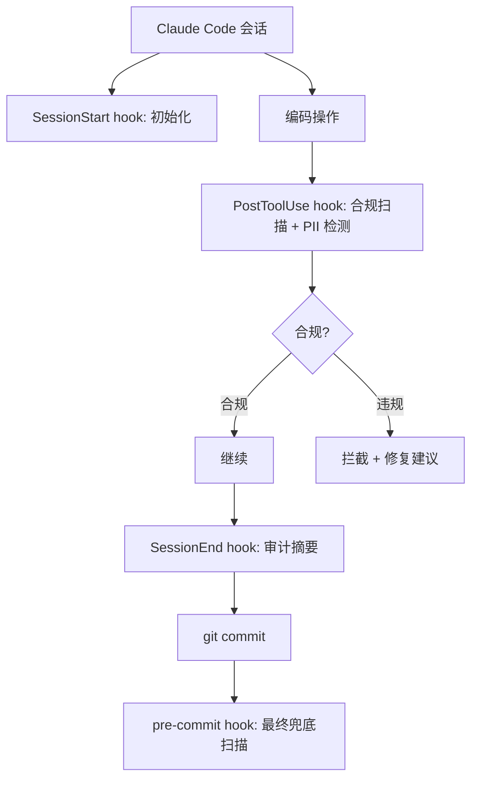

# Claude Code 使用指南

> harness-cook + Claude Code = hooks 自动治理，最完整的治理体验

**快速导航**：[🆚 各平台对比](./agent-platforms) · [🦅 Hermes 指南](./agent-hermes) · [📖 MCP Server](./mcp-server) · [📖 快速开始](./quick-start)

---

## 激活方式

```bash
# 默认激活（Claude Code 适配器，无需 --agent 参数）
python3 packages/cli/harness_cli.py activate

# 或显式指定
python3 packages/cli/harness_cli.py activate --agent claude-code
```

激活后自动完成：

| 步骤 | 说明 |
|------|------|
| 安装核心包 | `pip install -e packages/core` |
| 配置 MCP Server | 不再往 `~/.claude/settings.json` 写 mcpServers——claude-code 走 hooks 自动校验，不依赖 MCP 入口（遗留 mcpServers 由 `_cleanup_stale_mcpserver()` 清理） |
| 部署 Profile | Bridge deploy → `.claude/settings.json` hooks + `.claude/settings.local.json` hooks |
| 注册 Skills | 符号链接到 `~/.claude/skills/` |
| 添加 MCP 权限 | 写入 `.claude/settings.local.json` permissions.allow（25 个工具） |
| 初始化目录 | 创建 `.harness/audit/` + 写入 `active_profile` / `active_adapter` / `.harness/env` |
| 安装 git hook | pre-commit hook 兜底防线 |

**重要**：激活后需要重启 Claude Code 才能生效。

---

## 部署了什么

### 1. `~/.claude/settings.json` — 不再注册 MCP Server（全局）

claude-code 适配器走 hooks 自动校验，**不再往 `~/.claude/settings.json` 写 `mcpServers.harness-cook`**（旧版 activate 写入的遗留条目由 `_cleanup_stale_mcpserver()` 清理）。claude-code 的治理依赖 hooks 自动触发，不依赖 MCP 入口；其他适配器（Hermes/Cursor 等）的 MCP 配置由 `bridge.deploy` 写入各自平台配置文件。

### 2. 项目 `.claude/settings.json` — hooks 配置（项目级）

Bridge deploy 将 Profile hooks 翻译为 Claude Code 原生格式并写入：

```json
{
  "hooks": {
    "SessionStart": [
      {
        "matcher": "",
        "hooks": [
          { "type": "command", "command": "python3 /path/to/harness-cook/packages/hooks/hook-session-init.py" }
        ]
      }
    ],
    "PostToolUse": [
      {
        "matcher": "",
        "hooks": [
          { "type": "command", "command": "python3 /path/to/harness-cook/skills/auto-audit/run-skill.py auto-audit" }
        ]
      }
    ],
    "SessionEnd": [
      {
        "matcher": "",
        "hooks": [
          { "type": "command", "command": "python3 /path/to/harness-cook/packages/hooks/hook-task-audit.py" }
        ]
      }
    ]
  }
}
```

### 3. 项目 `.claude/settings.local.json` — MCP 权限（项目级，gitignored）

25 个 MCP 工具的自动授权：

```json
{
  "permissions": {
    "allow": [
      "mcp__harness-cook__harness_check",
      "mcp__harness-cook__harness_guardrails_check",
      "mcp__harness-cook__harness_audit",
      "mcp__harness-cook__harness_pipeline_run",
      "mcp__harness-cook__harness_pipeline_status",
      "mcp__harness-cook__harness_agent_list",
      "mcp__harness-cook__harness_status",
      "mcp__harness-cook__harness_register",
      "mcp__harness-cook__harness_gate_create",
      "mcp__harness-cook__harness_gate_approve",
      "mcp__harness-cook__harness_hook_trigger",
      "mcp__harness-cook__harness_plan",
      "mcp__harness-cook__harness_run",
      "mcp__harness-cook__harness_profile_list",
      "mcp__harness-cook__harness_profile_load",
      "mcp__harness-cook__harness_skill_list",
      "mcp__harness-cook__harness_skill_register",
      "mcp__harness-cook__harness_bridge_deploy",
      "mcp__harness-cook__harness_rule_import",
      "mcp__harness-cook__harness_trace_export",
      "mcp__harness-cook__harness_knowledge_query",
      "mcp__harness-cook__harness_knowledge_search",
      "mcp__harness-cook__harness_knowledge_stats",
      "mcp__harness-cook__harness_knowledge_activate",
      "mcp__harness-cook__harness_knowledge_deactivate"
    ]
  }
}
```

---

## Hook 点映射

| Profile Hook 点 | Claude Code 原生 Hook | 说明 |
|----------------|----------------------|------|
| `session_start` | `SessionStart` | ✅ 直接映射——会话开始时触发 |
| `session_end` | `SessionEnd` | ✅ 直接映射——会话结束时触发 |
| `pre_tool_use` | `PreToolUse` | ✅ 直接映射——工具调用前触发 |
| `post_tool_use` | `PostToolUse` | ✅ 直接映射——工具调用后触发 |
| `on_error` | `PostToolUseFailure` | ✅ 直接映射——工具执行失败时触发 |
| `user_prompt_submit` | `UserPromptSubmit` | ✅ 直接映射——用户提交 prompt 时触发 |
| `pre_execute` | `PreToolUse` | 映射到工具级——Claude Code 没有直接的任务级 hook |
| `post_execute` | `PostToolUse` | 映射到工具级——同上 |
| `on_file_change` | `PostToolUse` + matcher | 文件级——通过 PostToolUse 的 matcher 过滤 Write/Edit 工具 |

---

## 默认启用的 3 个 Hook

（来自 `default.yaml` hooks 配置）

| Hook 点 | 类型 | 命令/技能 | 触发时机 |
|--------|------|---------|---------|
| `session_start` | script | `hook-session-init.py` | Claude Code 会话启动时 |
| `post_execute` | skill | `auto-audit` | Agent 每次执行任务后 |
| `session_end` | script | `hook-task-audit.py` | Claude Code 会话结束时 |

Enterprise Profile 启用 7 个 Hook（含合规扫描、护栏检测等）。

---

## 治理如何运作

Claude Code 是**强制性 Agent**（`supports_hooks=True`）：

### 1. Hooks 自动触发（核心治理机制）

Agent 执行时自动触发 hooks，无需主动调用：

- **Write/Edit 工具使用后** → `PostToolUse` hook → 合规扫描 + PII 检测
- **Bash 命令执行后** → `PostToolUse` hook → 安全检查
- **会话开始** → `SessionStart` hook → 初始化环境 + 加载配置
- **会话结束** → `SessionEnd` hook → 生成审计摘要

### 2. Gate Prompt 轻提示（补充说明）

因为 hooks 已自动强制执行，gate prompt 只用 mild 强度补充说明：

```
[harness gate] 门禁模式=hybrid，检查项: no-secrets, no-eval
```

### 3. Git Pre-commit Hook 兜底（双保险）

hooks 自动触发 + git hook 兜底 = **不合规代码无法 commit**。



<details>
<summary>ASCII 原图 — Claude Code 治理流程</summary>

```
Claude Code 会话
  ↓
SessionStart hook → 初始化环境
  ↓
编码操作 → PostToolUse hook → 合规扫描 + PII 检测
  ↓
合规? → OK → 继续 / FAIL → 拦截 + 修复建议
  ↓
SessionEnd hook → 审计摘要
  ↓
git commit → pre-commit hook → 最终兜底
```
</details>

---

## 可用的 MCP 工具

25 个 MCP 工具对所有适配器都可用。Claude Code 的特点是 **hooks 自动触发核心治理工具 + 可手动调用获取更详细结果**。

### 核心治理工具（hooks 自动触发）

| 工具 | 说明 | Claude Code 使用方式 |
|------|------|---------------------|
| `harness_check` | 合规扫描 | PostToolUse hook 自动触发 + 可手动调用获取详细报告 |
| `harness_guardrails_check` | PII/安全护栏 | hook 自动触发 PII 检测 + 可手动调用 |
| `harness_audit` | 审计日志查询 | SessionEnd hook 自动记录 + 可手动查询历史 |

> 编排工具（pipeline/run/plan）、配置与注册工具（profile/bridge/register/gate/skill/status/rule_import/trace_export）等其余 22 个 MCP 工具的完整参数说明见 [MCP Server 指南](/guide/mcp-server)。

---

## 典型使用流程

1. **激活** → `harness activate` → 重启 Claude Code
2. **会话开始** → `SessionStart` hook 自动执行 `hook-session-init.py` → 初始化 `.harness/audit/` 等
3. **编码** → Write/Edit 工具 → `PostToolUse` hook 自动合规扫描 → 违规则拦截
4. **执行 Bash** → `PostToolUse` hook 自动 PII 检测
5. **会话结束** → `SessionEnd` hook 自动生成审计摘要
6. **git commit** → pre-commit hook 兜底扫描 → 不合规则拒绝

---

## 常见问题

### 激活后 hooks 没生效？

需要重启 Claude Code。hooks 在会话初始化时加载，不重启则不会生效。

### 如何调整治理强度？

编辑 `.harness/profiles/default.yaml` 的 `gates.default_mode`：
- `strict` — 直接拦截违规
- `hybrid` — 拦截后流转人工审批（默认）
- `loose` — 仅记录，不拦截

### 如何添加更多 hook？

编辑 `.harness/profiles/default.yaml` 的 `hooks` 区段，然后重新 deploy：

```bash
python3 packages/cli/harness_cli.py activate  # 重新激活即可
```

### MCP 工具权限报错？

检查 `.claude/settings.local.json` 的 `permissions.allow` 是否包含 25 个 MCP 工具名称。如果缺失，重新执行 `harness activate`。

### 如何还原？

```bash
python3 packages/cli/harness_cli.py deactivate
```

还原清单：清理 `.claude/settings.json` 和 `.claude/settings.local.json` 中的 harness 条目 + 清理 `.gitignore` + 删除 `.harness/` 目录。不卸载 pip 包。

---

## 相关文档

- [🆚 各平台对比总览](./agent-platforms) — 快速选择适合你的 Agent
- [🦅 Hermes 使用指南](./agent-hermes) — 对比：强制性 vs 建议性治理
- [📖 Bridge 指南](./bridge) — 适配器翻译机制、Hook 点映射内部原理
- [📖 MCP Server](./mcp-server) — 25 个 MCP 工具的完整参数说明
- [📖 Skill 插槽点](./skill-slots) — 17 个插槽点详细说明
