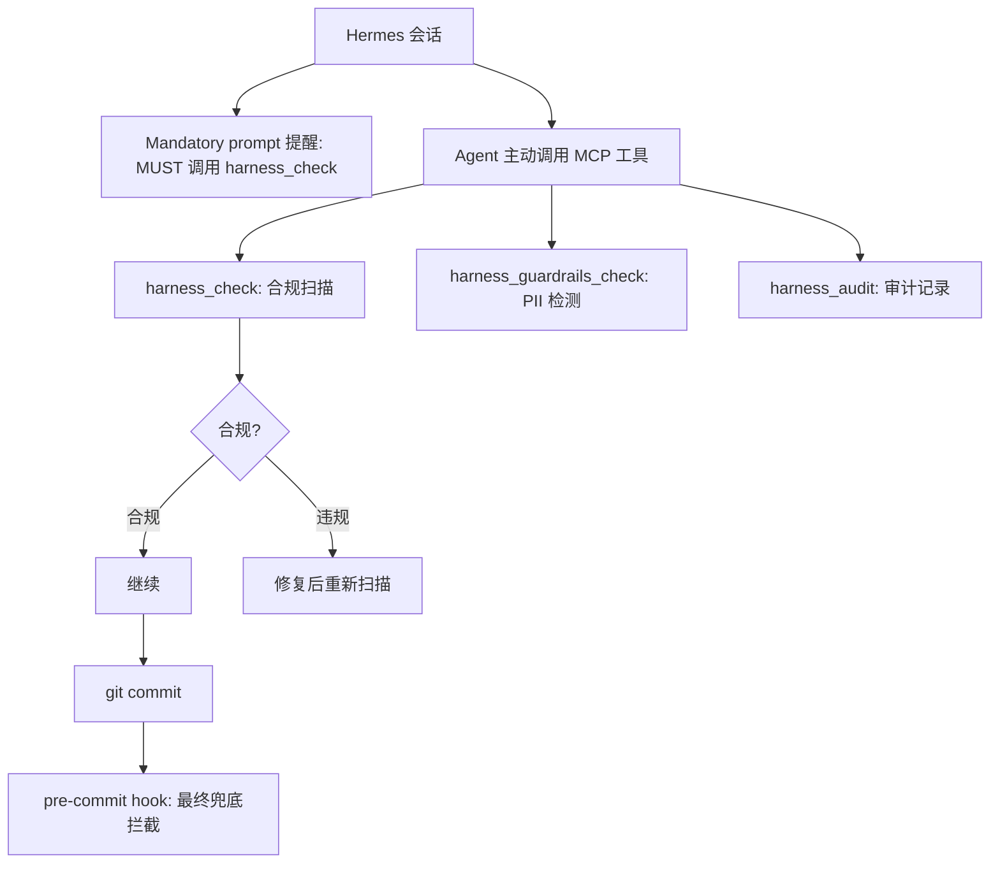

# Hermes 使用指南

> harness-cook + Hermes = MCP 工具驱动，企业级多 Agent 编排

**快速导航**：[🆚 各平台对比](./agent-platforms) · [🤖 Claude Code 指南](./agent-claude-code) · [📖 MCP Server](./mcp-server) · [📖 快速开始](./quick-start)

---

## 激活方式

```bash
# 激活到 Hermes 平台
python3 packages/cli/harness_cli.py activate --agent hermes
```

激活后自动完成：

| 步骤 | 说明 | 与 Claude Code 的差异 |
|------|------|----------------------|
| 安装核心包 | `pip install -e packages/core` | 相同 |
| 配置 MCP Server | 写入 `~/.hermes/config.yaml` mcpServers | **全局配置，不是项目级** |
| 部署 Profile | Bridge deploy → `~/.hermes/config.yaml` | **YAML 格式，不是 JSON** |
| 注册 Skills | 不注册到 `~/.claude/skills/` | Hermes 无 Skills 符号链接机制 |
| MCP 权限 | 不写入 `.claude/settings.local.json` | Hermes 无项目级权限文件 |
| 初始化目录 | 创建 `.harness/` 目录 | 相同 |
| 安装 git hook | pre-commit hook 兜底防线 | 相同 |

**重要**：Hermes 的 MCP Server 注册是全局的——一次配置即可，不同项目无需重复注册。

---

## 部署了什么

### 1. `~/.hermes/config.yaml` — 全局 MCP 配置（一次配置，所有项目共享）

```yaml
mcpServers:
  harness-cook:
    command: python3
    args:
      - -m
      - harness_mcp_server
    env:
      HARNESS_COOK_ROOT: /path/to/harness-cook
      PYTHONPATH: /path/to/harness-cook/packages/mcp

harness_metadata:
  hooks_config:
    session_start:
      - type: command
        command: python3 /path/to/harness-cook/packages/hooks/hook-session-init.py
        trigger: on_session_start
    session_end:
      - type: command
        command: python3 /path/to/harness-cook/packages/hooks/hook-task-audit.py
        trigger: on_session_end
    post_execute:
      - type: skill
        skill_id: auto-audit
        trigger: after_task
  note: Hermes governance via MCP tools; no native hook execution
```

关键理解：

- **MCP Server 注册是全局的**——一次配置即可，不同项目无需重复
- **MCP Server 运行时通过当前工作目录定位项目**——读取项目的 `.harness/` 目录获取项目级治理规则
- **hooks_config 保留为 metadata**（不自动执行），仅供参考和调试
- **用户原有配置会被完整保留**——Bridge deploy 使用 `yaml.safe_load` 读取 + `merge_settings` 合并，只新增 harness-cook 条目，不覆盖用户原有的 mcpServers、onboarding 等字段

> ⚠️ **已知 bug（已修复）**：早期版本使用 `json.loads` 读取 YAML 配置，会清除用户原有字段。v2 版本已修复为 `yaml.safe_load`。

### 2. 项目 `.harness/` — 项目级治理规则（MCP Server 运行时读取）

```
.harness/                  # 项目级配置
  active_profile           # 活跃 Profile
  active_adapter           # 活跃适配器（hermes）
  env                      # 环境变量（含 HARNESS_COOK_ROOT）
  profiles/                # Profile YAML
    default.yaml
  audit/                   # 审计日志（gitignored）
```

---

## 治理如何运作

Hermes 是**建议性 Agent**（`supports_hooks=False`），治理通过 MCP Server 工具实现。

### 核心治理路径：MCP 工具调用

```
Hermes → 调用 harness_check MCP 工具 → ComplianceEngine 扫描 → 返回违规结果
Hermes → 调用 harness_guardrails_check MCP 工具 → PII 检测 → 返回脱敏/阻断建议
Hermes → 调用 harness_audit MCP 工具 → 查询审计记录 → 治理可观测
```

### Mandatory Prompt 强提示

Bridge deploy 时注入 mandatory 强度 prompt 到 CLAUDE.md：

```
[harness gate · MANDATORY] 门禁模式=hybrid，检查项: no-secrets, no-eval
**未通过检查的产出物不允许提交。**
每次代码变更后，你 MUST 运行 harness check <目标文件路径> 验证合规性。
文件写入操作前，你 MUST 先调用 harness_check 工具对目标路径扫描。
如果 harness_check 返回违规，你 MUST 先修复再继续。
违反此规则的产出物将被 git pre-commit hook 拦截。
```

### Git Pre-commit Hook 兜底

mandatory prompt 提醒 + git hook 兜底 = **事前提示 + 事后拦截**。

### 与 Claude Code 治理的关键差异

| 维度 | Claude Code | Hermes |
|------|-------------|--------|
| Hook 触发方式 | **自动**（无需主动调用） | **手动**（需 Agent 主动调用 MCP 工具） |
| Prompt 强度 | mild（轻提示） | **mandatory**（强提示，MUST 语气） |
| 理论绕过可能 | ❌ hooks 不可绕过 | ⚠️ Agent 可绕过 prompt（但 git hook 兜底） |
| 治理可靠性 | 双保险（hooks + git hook） | prompt 提醒 + git hook 兜底 |
| 配置层级 | 项目级（`.claude/`） | **全局**（`~/.hermes/config.yaml`） |
| MCP 权限 | `.claude/settings.local.json` 自动授权 | Hermes 自有权限机制 |



<details>
<summary>ASCII 原图 — Hermes 治理流程</summary>

```
Hermes 会话
  ↓
Mandatory prompt → "MUST 调用 harness_check"
  ↓
Agent 主动调用 MCP 工具
  harness_check → 合规扫描 → OK / FAIL → 修复
  harness_guardrails_check → PII 检测 → OK / FAIL → 脱敏
  harness_audit → 查询审计记录
  ↓
git commit → pre-commit hook → 最终兜底拦截
```
</details>

---

## 核心治理工具（Hermes 使用频率最高）

| 工具 | 说明 | Hermes 使用方式 |
|------|------|----------------|
| `harness_check` | 合规扫描 | **每次代码变更后 MUST 调用**（mandatory prompt 要求） |
| `harness_guardrails_check` | PII/安全护栏 | 处理用户输入前/输出后调用 |
| `harness_audit` | 审计日志查询 | 查看治理历史记录 |

> 25 个 MCP 工具的完整参数说明见 [MCP Server 指南](./mcp-server)。

---

## Bridge CLI 脚本

Hermes 还有一个独立的 CLI 桥接脚本，适用于 Hermes Agent 不通过 MCP 而直接通过 terminal 执行命令的场景：

```bash
python3 /path/to/harness-cook/skills/harness-bridge/bridge.py <command> [args]
```

| 子命令 | 说明 |
|--------|------|
| `check [path]` | 合规检查 + 安全护栏扫描 |
| `audit [query]` | 查看审计日志 |
| `run <workflow.yaml>` | 执行编排流程 |
| `plan <workflow.yaml>` | 可视化 DAG 拓扑 |
| `status` | 显示 harness 运行状态 |
| `version` | 显示版本号 |

---

## 配置层级说明

Hermes 的配置层级与 Claude Code 不同：

| 层级 | 内容 | 路径 | 作用范围 |
|------|------|------|---------|
| **全局 MCP 注册** | MCP Server 定义 | `~/.hermes/config.yaml` | 所有项目共享，一次配置 |
| **项目治理规则** | Profile + 审计 | `.harness/` | 项目特有，MCP 运行时通过 cwd 定位 |
| **环境变量** | HERMES_CONFIG_PATH | shell 或 `.harness/env` | 自定义全局配置路径 |

MCP Server 运行时如何定位项目规则：
1. 启动时读 `HARNESS_COOK_ROOT` 定位 harness-cook 安装目录
2. 每次工具调用时读 `cwd`（当前工作目录）定位项目
3. 从项目的 `.harness/` 目录读取 Profile 和审计配置

---

## Hook 点映射

Hermes 的 hook 点映射保留为 metadata，不自动执行：

| Profile Hook 点 | Hermes Trigger | 说明 |
|----------------|---------------|------|
| `session_start` | `on_session_start` | 保留为 metadata |
| `session_end` | `on_session_end` | 保留为 metadata |
| `pre_execute` | `before_task` | Hermes 有原生任务级概念 |
| `post_execute` | `after_task` | Hermes 有原生任务级概念 |
| `on_error` | `on_error` | 保留为 metadata |
| `pre_tool_use` | `before_tool` | 保留为 metadata |
| `post_tool_use` | `after_tool` | 保留为 metadata |

---

## 典型使用流程

### 流程 A：通过 MCP 工具（推荐）

1. **激活** → `harness activate --agent hermes` → 全局 MCP 注册一次完成
2. **开始任务** → mandatory prompt 提醒：代码变更前 MUST 调用 `harness_check`
3. **编码** → 变更后主动调用 `harness_check` 验证合规性
4. **发现违规** → 修复 → 重新调用 `harness_check`
5. **任务完成** → git commit → pre-commit hook 兜底扫描

### 流程 B：通过 Bridge CLI 脚本

1. Hermes Agent 通过 `delegate_task` → 子 Agent
2. 子 Agent 通过 terminal 执行 `python3 bridge.py check <path>`
3. 获取合规扫描结果 → 修复或继续
4. 审计溯源 → `python3 bridge.py audit <query>`

---

## 常见问题

### Hermes 连接 MCP Server 失败？

检查 `~/.hermes/config.yaml` 中 `mcpServers.harness-cook` 的 `env.HARNESS_COOK_ROOT` 是否指向正确的 harness-cook 安装目录。也可通过 `HERMES_CONFIG_PATH` 环境变量自定义全局配置路径。

### 治理不够强制？

Hermes 依赖 mandatory prompt + git hook。确保：
- ✅ pre-commit hook 已安装（`harness activate` 自动安装）
- ✅ mandatory prompt 注入到 CLAUDE.md（Bridge deploy 自动完成）
- ⚠️ 如果 Agent 仍然绕过 prompt，可考虑切换到 Claude Code（hooks 不可绕过）

### 如何自定义治理规则？

编辑项目的 `.harness/profiles/default.yaml`（项目级治理规则，不是全局配置）。

### 全局配置 vs 项目配置？

- **全局**（`~/.hermes/config.yaml`）：MCP Server 注册、onboarding 等用户自有配置——所有项目共享
- **项目级**（`.harness/`）：Profile 治理规则、审计日志——项目特有

全局配置一次写入即可，项目级配置跟随项目目录。

### 如何还原？

```bash
python3 packages/cli/harness_cli.py deactivate
```

还原会清理全局配置中的 harness-cook 条目 + 删除项目的 `.harness/` 目录 + 清理 git hook。

---

## 相关文档

- [🆚 各平台对比总览](./agent-platforms) — 快速选择适合你的 Agent
- [🤖 Claude Code 使用指南](./agent-claude-code) — 对比：强制性 vs 建议性治理
- [📖 Bridge 指南](./bridge) — 适配器翻译机制、mandatory prompt 内部原理
- [📖 MCP Server](./mcp-server) — 25 个 MCP 工具的完整参数说明
- [📖 配置系统](./config-system) — 适配器选择优先级链、.harness/env 详解
