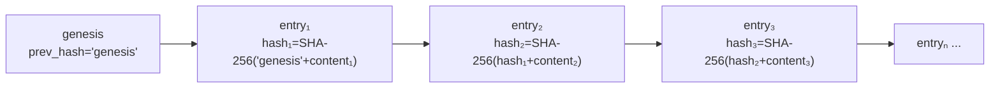
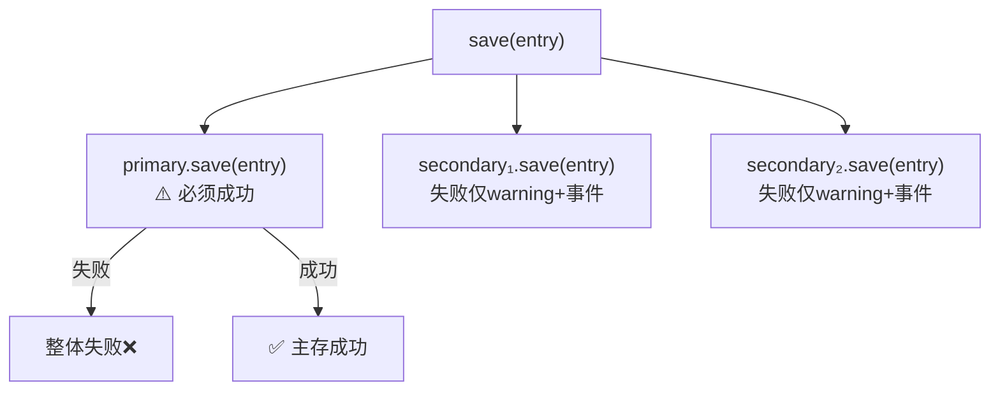

# 审计层

> Agent 治理的问责机制——不可篡改的哈希链记录每一次决策，多后端双写确保审计数据永不丢失。

**快速导航**：[📖 原理（本页）](#原理) · [🏃 可运行 Demo](/demo/audit)

---

## 原理

### SHA-256 哈希链

AuditStore 使用链式哈希保证记录不可篡改：



<details>
<summary>ASCII 原图 — SHA-256 哈希链</summary>

```
genesis → entry₁ → entry₂ → entry₃ → ...
         hash₁    hash₂    hash₃

hash₁ = SHA-256("genesis" + content₁)
hash₂ = SHA-256(hash₁ + content₂)
hash₃ = SHA-256(hash₂ + content₃)
```
</details>

每条记录写入时计算 `chain_hash = SHA-256(prev_hash + content)`：
- genesis 记录的 `prev_hash = "genesis"`
- 修改任何历史记录 → 后续所有 hash 验证失败
- 删除任何记录 → 链断裂

### IAuditStore Protocol

`@runtime_checkable` Protocol 定义 5 个必须实现的方法：

| 方法 | 签名 | 用途 |
|------|------|------|
| `save` | `(entry: AuditEntry) -> str` | 写入审计记录，返回 entry_id |
| `load` | `(session_id, date_str) -> List[AuditEntry]` | 按 session 加载记录 |
| `search` | `(query, date_from, date_to, agent_id, limit) -> List[AuditEntry]` | 搜索审计记录 |
| `verify_chain` | `() -> Dict` | 验证哈希链完整性 |
| `integrity_report` | `() -> Dict` | 生成完整性报告 |

所有审计后端（AuditStore / LangfuseAuditStore / ArizeAuditStore / DatadogAuditStore / HeliconeAuditStore / MultiAuditStore）都实现此 Protocol。

### MultiAuditStore 多后端双写

MultiAuditStore 组合多个 IAuditStore 实现**主存必须成功、次存火忘式写入**：



<details>
<summary>ASCII 原图 — MultiAuditStore save 分支</summary>

```
save(entry)
  ├── primary.save(entry)   → 必须成功（失败则整体失败）
  └── secondary₁.save(entry) → 失败只 warning + 发 AUDIT_SECONDARY_FAIL 事件
  └── secondary₂.save(entry) → 失败只 warning + 发 AUDIT_SECONDARY_FAIL 事件
```
</details>

- **主存储**：所有读操作（load/search/verify_chain）只从主存储
- **次存储**：纯写、fire-and-forget、失败不阻塞
- **次存储失败可观测**：Bus 事件 AUDIT_SECONDARY_FAIL，可追踪但不影响主流程

### 4 个外部审计后端

| 后端 | 模块 | 独特价值 |
|------|------|---------|
| LangfuseAuditStore | `harness.integrations.langfuse_store` | Agent 调用追踪（trace/span 级粒度） |
| ArizeAuditStore | `harness.integrations.arize_store` | Phoenix trace + 合规性标注同步 |
| DatadogAuditStore | `harness.integrations.datadog_store` | 基础设施 + Agent 动作全栈 trace |
| HeliconeAuditStore | `harness.integrations.helicone_store` | API 代理层审计（请求/响应级） |

### OTel 标准化输出

TraceloopExporter 将 AuditEntry 转换为 OpenTelemetry Span 格式：

- `name`: `harness.gate.{gate_id}` / `harness.compliance.{rule_id}`
- `attributes`: `harness.*` 属性键
- `status`: OK/ERROR 基于 passed 字段

任何 OTel Collector（Jaeger/Zipkin/Grafana Tempo/Traceloop）都能消费。

### 存储路径策略

AuditStore 的存储位置遵循项目跟随策略：

1. 显式指定 `store_dir` → 使用指定路径
2. 指定 `project_dir` → `{project_dir}/.harness/audit/`
3. 自动检测项目根 → `{root}/.harness/audit/`
4. 以上都没有 → `~/.harness/audit/`（降级）

---

## 配置

### AuditStore 基础配置

```python
from harness.audit import AuditStore

# 默认：自动检测项目根目录
store = AuditStore()

# 指定项目目录
store = AuditStore(project_dir="/path/to/project")

# 显式指定存储目录
store = AuditStore(store_dir="/custom/path/audit")
```

### AuditEntry 结构

```python
from harness.audit import AuditEntry
from datetime import datetime

entry = AuditEntry(
    session_id="session-001",       # 会话标识
    agent_id="claude-code",         # Agent 标识
    action="execute",               # 动作类型
    decision="completed",           # 决策结果
    timestamp=datetime.now(),       # 时间戳
    outcomes=[                      # 决策详情
        {"rule": "SEC-001", "passed": True, "severity": "high"},
        {"rule": "PII-001", "passed": False, "severity": "critical"},
    ],
)
```

### MultiAuditStore 配置

```python
from harness.audit import AuditStore
from harness.integrations.multi_store import MultiAuditStore
from harness.bus import EventBus

bus = EventBus()
local_store = AuditStore()

# 仅本地存储（默认）
multi = MultiAuditStore([local_store], bus=bus)

# 本地 + Langfuse 双写（需安装 langfuse SDK）
from harness.integrations.langfuse_store import LangfuseAuditStore
langfuse = LangfuseAuditStore(
    public_key="pk-xxx",
    secret_key="sk-xxx",
    host="https://cloud.langfuse.com",
)
multi = MultiAuditStore([local_store, langfuse], bus=bus)
```

### Profile YAML 配置

```yaml
audit:
  backends: [local]             # local / langfuse / arize / datadog / helicone
  trace_format: builtin         # builtin / otel-json / traceloop
  collector_url: ""             # OTel Collector URL（空=不导出）
```

---

更多配置细节见 [审计使用教程](/tutorial/audit-usage)，可运行 Demo 见 [审计 Demo](/demo/audit)。
