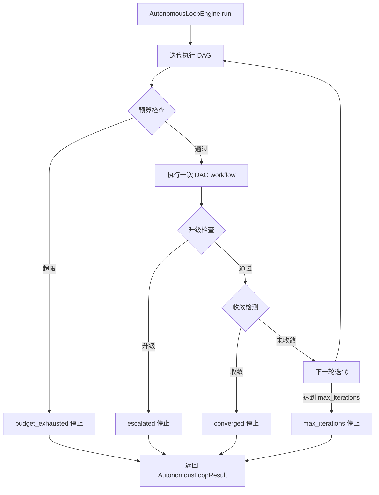

# 自主循环(@experimental)

> harness-cook 的「**自主迭代**」——DAG 循环执行、收敛检测、预算控制

**快速导航**：[📖 原理（本页）](#原理) · [🎓 使用方法](/tutorial/basic-usage) · [🏃 可运行 Demo](/demo/autonomous-loop)

> ⚠️ **@experimental**：此模块为实验性功能，API 可能变更。不推荐在生产环境中依赖。

---

## 原理

### DAG 循环执行

AutonomousLoopEngine 让 DAGEngine 支持自主迭代执行（/loop 模式）：
1. 每次迭代执行一次 DAG workflow
2. 检查收敛条件（连续 N 次无新发现则停止）
3. 预算控制（token 或时间超限则停止）

### 收敛检测

基于「**产出物增量**」检测收敛：每次迭代收集产出物路径集合，连续 convergence_window 次无增量 → 收敛。也支持自定义收敛检查函数。

### 预算控制

双维度预算控制：
- **token 预算**——累计 token 超过 budget_token_limit → 停止
- **时间预算**——wall-clock 时间超过 budget_time_limit_ms → 停止

### 四种停止原因

| 原因 | 说明 |
|------|------|
| converged | 连续 N 次无新发现（或自定义收敛检查通过） |
| budget_exhausted | token 或时间预算耗尽 |
| max_iterations | 达到最大迭代次数硬上限 |
| escalated | 执行过程中升级（需要人工干预） |

### 组合模式

AutonomousLoopEngine 持有 DAGEngine 引用（组合模式），不修改 DAGEngine 的内部逻辑。

```python
from harness.experimental import AutonomousLoopEngine, AutonomousLoopConfig
from harness.engine import DAGEngine

# 创建 DAG 引擎和循环引擎
dag_engine = DAGEngine()
loop_engine = AutonomousLoopEngine(dag_engine)

# 配置自主循环
config = AutonomousLoopConfig(
    max_iterations=10,            # 最大迭代 10 次（硬上限）
    convergence_window=2,         # 连续 2 次无新发现 → 收敛
    budget_token_limit=0,         # 不限 token 预算（0=不限制）
    budget_time_limit_ms=0,       # 不限时间预算（0=不限制）
)

# 运行自主循环
result = loop_engine.run(workflow, config)

# 查看结果
print(f"迭代次数: {result.iterations}")
print(f"是否收敛: {result.converged}")
print(f"预算耗尽: {result.budget_exhausted}")
print(f"停止原因: {result.stop_reason}")
print(f"总 token: {result.total_tokens}")
print(f"总耗时: {result.total_duration_ms} ms")

# 自定义收敛检查
def custom_check(contexts):
    """自定义收敛：最后3次执行结果相同则收敛"""
    if len(contexts) < 3:
        return False
    last_3 = contexts[-3:]
    return all(c.node_artifacts == last_3[0].node_artifacts for c in last_3)

config = AutonomousLoopConfig(
    max_iterations=20,
    convergence_check=custom_check,
)
result = loop_engine.run(workflow, config)
```

### 核心概念

| 类 | 职责 |
|----|------|
| AutonomousLoopConfig | 循环配置——max_iterations/convergence/budget |
| AutonomousLoopResult | 循环结果——iterations/converged/stop_reason |
| AutonomousLoopEngine | 循环引擎——迭代执行+收敛+预算 |

### 自主循环流程



<details>
<summary>ASCII 原图</summary>

```
AutonomousLoopEngine.run → 迭代执行 DAG
  → 预算检查 → 超限 → budget_exhausted 停止
  → 通过 → 执行一次 DAG workflow
    → 升级检查 → 升级 → escalated 停止
    → 通过 → 收敛检测
      → 收敛 → converged 停止
      → 未收敛 → 下一轮迭代
        → 达到 max_iterations → max_iterations 停止
  → 返回 AutonomousLoopResult
```
</details>

### 与其他模块协作

| 协作模块 | 方式 |
|----------|------|
| DAGEngine | 组合模式——AutonomousLoopEngine 持有 DAGEngine 引用 |
| EventBus | 每次迭代发布 WORKFLOW_START 事件 |
| RollbackEngine | 单次迭代失败时回滚 |

---

## 配置

### Profile YAML 配置

```yaml
autonomous_loop:
  max_iterations: 10          # 最大迭代次数
  convergence_window: 2       # 收敛窗口（连续无新发现次数）
  budget_token_limit: 0       # token 预算（0=不限）
  budget_time_limit_ms: 0     # 时间预算（0=不限）
```

---

更多配置细节见 [基础用法教程](/tutorial/basic-usage)，可运行 Demo 见 [自主循环 Demo](/demo/autonomous-loop)。
