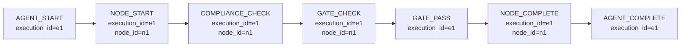

# 调用链追踪

> Agent 执行的全链路可观测——通过 EventBus 事件链追踪模块间通信，还原一个任务从触发到完成的全过程。

**快速导航**：[📖 原理（本页）](#原理) · [🎓 使用方法](/tutorial/call-graph) · [📖 相关](/guide/engine-bus) · [📖 相关](/guide/audit-layer)

---

## 原理

### EventBus 事件链模型

harness-cook 的模块间通信基于 EventBus 事件链——每个核心动作都会发射 BusEvent，通过 `execution_id` 关联，形成完整的调用链：



<details>
<summary>ASCII 原图 — 事件链模型</summary>

```
Agent 执行全链路事件链（execution_id 关联）：

AGENT_START (e1)
  └── NODE_START (e1, node=n1)
       ├── COMPLIANCE_CHECK (e1, node=n1)
       ├── GATE_CHECK (e1, node=n1)
       │   ├── GATE_PASS (e1) 或 GATE_FAIL (e1)
       ├── NODE_COMPLETE (e1, node=n1)
  └── NODE_START (e1, node=n2)
       ├── ... 同上
       ├── NODE_COMPLETE (e1, node=n2)
  └── AGENT_COMPLETE (e1)

关键设计：
  - execution_id: 同一次任务执行的所有事件共享同一 ID
  - node_id: DAG 中每个节点的独立标识
  - 事件类型覆盖 Agent → Node → Compliance → Gate 完整生命周期
```
</details>

### BusEventType 28 种事件类型

事件按模块分为 11 个分类：

| 分类 | 事件类型 | BusEventType 值 | 说明 |
|------|---------|-----------------|------|
| Agent 生命周期 | Agent 启动 | `AGENT_START` | Agent 开始执行任务 |
| Agent 生命周期 | Agent 完成 | `AGENT_COMPLETE` | Agent 执行完成 |
| Agent 生命周期 | Agent 错误 | `AGENT_ERROR` | Agent 执行出错 |
| 执行生命周期 | 节点启动 | `NODE_START` | DAG 节点开始执行 |
| 执行生命周期 | 节点完成 | `NODE_COMPLETE` | DAG 节点执行完成 |
| 执行生命周期 | 节点错误 | `NODE_ERROR` | DAG 节点执行出错 |
| 门禁生命周期 | 门禁检查 | `GATE_CHECK` | 门禁开始检查 |
| 门禁生命周期 | 门禁通过 | `GATE_PASS` | 门禁检查通过 |
| 门禁生命周期 | 门禁失败 | `GATE_FAIL` | 门禁检查失败 |
| 门禁生命周期 | 门禁升级 | `GATE_ESCALATION` | 门禁升级人工审批 |
| 工作流生命周期 | DAG 启动 | `DAG_START` | DAG 工作流开始执行 |
| 工作流生命周期 | DAG 完成 | `DAG_COMPLETE` | DAG 工作流执行完成 |
| 工作流生命周期 | DAG 错误 | `DAG_ERROR` | DAG 工作流执行出错 |
| 合规 | 合规扫描 | `COMPLIANCE_CHECK` | 合规扫描开始 |
| 合规 | 合规结果 | `COMPLIANCE_RESULT` | 合规扫描结果 |
| 协商 | 协商开始 | `NEGOTIATION_START` | 多 Agent 协商开始 |
| 协商 | 协商完成 | `NEGOTIATION_COMPLETE` | 协商达成共识 |
| 升级 | 升级触发 | `ESCALATION_TRIGGER` | 问题升级触发 |
| 升级 | 升级解决 | `ESCALATION_RESOLVED` | 升级问题解决 |
| 护栏 | 护栏检查 | `GUARDRAILS_CHECK` | 护栏检查触发 |
| 护栏 | 护栏结果 | `GUARDRAILS_RESULT` | 护栏检查结果 |
| 学习 | 学习记录 | `LEARNING_RECORD` | 学习反馈记录 |
| 学习 | 学习推荐 | `LEARNING_RECOMMENDATION` | 学习推荐结果 |
| 回滚 | 回滚触发 | `ROLLBACK_TRIGGER` | 回滚触发 |
| 回滚 | 回滚完成 | `ROLLBACK_COMPLETE` | 回滚完成 |
| 审计 | 审计记录 | `AUDIT_RECORD` | 审计日志记录 |

### BusEvent 结构

每个 BusEvent 携带完整的上下文信息：

```python
@dataclass
class BusEvent:
    type: BusEventType               # 事件类型
    execution_id: str                 # 执行上下文 ID（关联同一任务的所有事件）
    node_id: str = ""                 # DAG 节点 ID（定位到具体节点）
    agent_id: str = ""               # Agent ID（定位到具体 Agent）
    data: dict = field(default_factory=dict)  # 事件数据（类型相关）
    timestamp: Optional[str] = None   # 事件时间戳
```

### 模块间通信模式

EventBus 是模块间通信的中央枢纽——所有核心模块通过事件总线传递状态：

| 模块 | 发射事件 | 接收事件 |
|------|---------|---------|
| DAGEngine | DAG_START, NODE_START, NODE_COMPLETE, DAG_COMPLETE | GATE_PASS, GATE_FAIL（门禁结果决定节点是否继续） |
| GateEngine | GATE_CHECK, GATE_PASS, GATE_FAIL, GATE_ESCALATION | NODE_START（节点开始时触发门禁检查） |
| ComplianceEngine | COMPLIANCE_CHECK, COMPLIANCE_RESULT | NODE_START（节点开始时触发合规扫描） |
| SkillRegistry | NODE_START（Skill 注册通知） | 各种事件（根据插槽触发 Skill） |
| GuardrailsPair | GUARDRAILS_CHECK, GUARDRAILS_RESULT | AGENT_START（Agent 启动时触发护栏） |
| LearningEngine | LEARNING_RECORD, LEARNING_RECOMMENDATION | AGENT_COMPLETE（任务完成后学习） |
| RollbackEngine | ROLLBACK_TRIGGER, ROLLBACK_COMPLETE | GATE_FAIL, NODE_ERROR（失败时触发回滚） |

### 事件历史与追踪

EventBus 维护事件历史（上限 1000 条，超出自动裁剪保留最近部分）：

```python
# 查询特定执行的所有事件
events = bus.get_history(
    event_type=None,          # 不限事件类型
    execution_id="e1",        # 按 execution_id 过滤
    limit=50,                 # 最近50条
)

# 查询特定类型的事件
gate_events = bus.get_history(
    event_type=BusEventType.GATE_PASS,  # 只看门禁通过事件
    execution_id=None,
    limit=20,
)
```

### 暂停/恢复机制

EventBus 支持暂停/恢复——暂停期间的事件被缓冲，恢复时批量发射：

```python
bus.pause()          # 暂停事件发射（缓冲新事件）
# ... 执行批量操作 ...
bus.resume()         # 恢复发射（缓冲的事件批量发射）
```

适用于批量初始化场景（如加载多个规则包时避免重复通知）。

---

## 配置

### 创建 EventBus

```python
from harness.bus import EventBus

# 全局单例
bus = get_bus()

# 依赖注入
bus = EventBus()
```

### 订阅事件

```python
from harness.bus import BusEventType, BusEvent

# 订阅特定事件类型
handler = bus.subscribe(
    event_type=BusEventType.GATE_PASS,
    handler_fn=lambda event: print(f"门禁通过: {event.execution_id}"),
    name="gate-pass-logger",      # handler 名称（可选）
    priority=10,                  # 执行优先级（数字越小越先执行）
)

# 取消订阅
bus.unsubscribe(handler)
```

EventHandler 按优先级排序执行，异常隔离——一个 handler 失败不影响其他 handler。

### 发射事件

```python
from harness.bus import BusEvent, BusEventType

# 同步发射
bus.emit(BusEvent(
    type=BusEventType.NODE_START,
    execution_id="e1",
    node_id="n1",
    data={"agent_id": "coder", "task": "implement feature"},
))

# 批量同步发射
bus.emit_many([
    BusEvent(type=BusEventType.NODE_START, execution_id="e1", node_id="n1"),
    BusEvent(type=BusEventType.NODE_COMPLETE, execution_id="e1", node_id="n1"),
])

# 异步发射（ThreadPoolExecutor, max_workers=2）
bus.emit_async(BusEvent(
    type=BusEventType.LEARNING_RECORD,
    execution_id="e1",
    data={"feedback": "positive"},
))
```

### 事件链追踪实战

追踪一个完整任务执行的事件链：

```python
# 1. 记录事件（各模块自动发射）
# DAGEngine 发射: DAG_START → NODE_START → NODE_COMPLETE → DAG_COMPLETE
# GateEngine 发射: GATE_CHECK → GATE_PASS 或 GATE_FAIL
# ComplianceEngine 发射: COMPLIANCE_CHECK → COMPLIANCE_RESULT

# 2. 按 execution_id 查询事件链
events = bus.get_history(execution_id="e1")

# 3. 按时间排序，还原调用链
for event in sorted(events, key=lambda e: e.timestamp):
    print(f"[{event.timestamp}] {event.type.value} node={event.node_id} data={event.data}")
```

### EventBus 统计

```python
stats = bus.stats()
# {
#   "subscriptions": 15,          # 订阅数
#   "events_emitted": 42,         # 已发射事件数
#   "events_in_history": 42,      # 历史事件数
#   "is_paused": False,           # 是否暂停
#   "event_type_counts": {...},   # 各事件类型的计数
# }
```

### Profile YAML 配置

```yaml
bus:
  history_limit: 1000                     # 事件历史上限（超出自动裁剪）
  async_max_workers: 2                    # 异步发射线程池大小
  handlers:
    gate_pass:                            # 门禁通过事件的 handler
      handler_fn: on_gate_pass_handler
      priority: 5
    node_error:                           # 节点错误事件的 handler
      handler_fn: on_node_error_handler
      priority: 10
    audit:                                # 审计事件 handler
      handler_fn: audit_handler
      priority: 1                         # 优先级最高（最先执行）
```

---

更多配置细节见 [调用链追踪教程](/tutorial/call-graph)，EventBus 原理见 [EventBus 指南](/guide/engine-bus)，审计追溯见 [审计层指南](/guide/audit-layer)。
