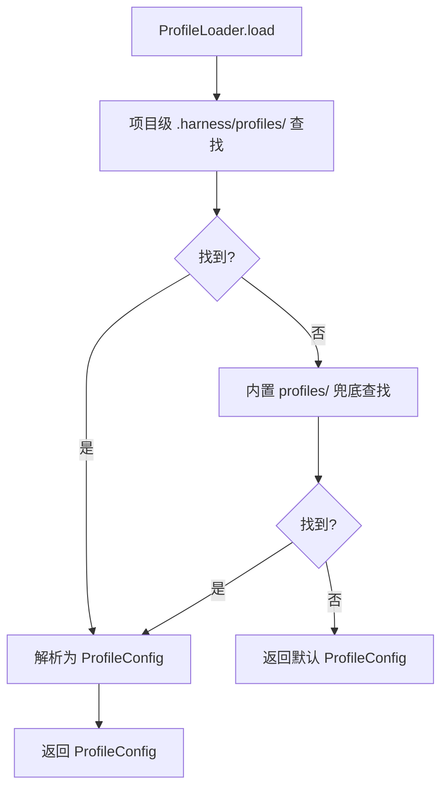

# 配置系统

> harness-cook 的「**配置中枢**」——4 级搜索优先级、环境变量覆盖、Profile 分层查找

**快速导航**：[📖 原理（本页）](#原理) · [🎓 使用方法](/tutorial/basic-usage) · [🏃 可运行 Demo](/demo/mcp-full)

---

## 原理

### 4 级配置搜索优先级

ProfileLoader 采用 4 级搜索优先级确定当前活跃 Profile：

| 优先级 | 来源 | 说明 |
|--------|------|------|
| 1 | HARNESS_PROFILE OS 环境变量 | CI/自动化覆盖（最高） |
| 2 | .harness/env 文件 | 项目级持久化（`harness activate` 写入） |
| 3 | .harness/active_profile 标记文件 | 纯 profile 名（不含 overlay） |
| 4 | "default" 回退 | 无配置时的默认值 |

> 治理强度（gates.default_mode、constraints、severity）直接定义在 Profile YAML 中，
> 用户编辑 `.harness/profiles/*.yaml` 即可调整，不需要叠加层。

### 适配器选择优先级链

适配器（部署目标平台）的选择也遵循类似的优先级链，但与 Profile 选择正交：

| 优先级 | 来源 | 说明 |
|--------|------|------|
| 1 | `--agent` CLI 参数 | 用户显式指定（最强覆盖） |
| 2 | HARNESS_ADAPTER OS 环境变量 | CI/自动化覆盖 |
| 3 | .harness/env 文件中 `HARNESS_ADAPTER=` | 机器级持久化（activate 写入） |
| 4 | .harness/active_adapter 标记文件 | 项目级持久化选择 |
| 5 | Profile `agent.adapter` 字段 | 配置声明——作为回退默认值 |
| 6 | "claude-code" 回退 | 无任何配置时的默认值 |

> **Adapter 与 Profile 正交**：Adapter 决定"部署到哪"（运行时/环境决策），Profile 决定"部署什么规则"（治理决策）。两者独立解析、互不影响。

相关持久化文件：

| 文件 | 内容 | Git 状态 | 说明 |
|------|------|---------|------|
| `.harness/active_profile` | Profile 名称（如 `default`） | ✅ 提交到 Git | 项目级持久化，团队共享 |
| `.harness/active_adapter` | 适配器名称（如 `hermes`） | ✅ 提交到 Git | 项目级持久化，团队共享 |
| `.harness/env` | `HARNESS_COOK_ROOT` / `HARNESS_PROFILE` / `HARNESS_ADAPTER` | ❌ gitignored | 机器级持久化，不同开发者各自配置 |

### 项目根目录检测

find_project_root() 三级检测策略：
1. **CLAUDE_PROJECT_DIR 环境变量**——Claude Code 启动时自动设置（最高优先级）
2. **git rev-parse --show-toplevel**——CLI 场景降级，从 cwd 向上查找 git 根
3. **当前工作目录**——非 git 项目降级

### HarnessConfig 全局配置

HarnessConfig 集中管理所有模块参数：项目信息、日志级别、调度配置、护栏配置、门禁模式、合规规则包、学习开关、Profile 配置、Hook/Skill 插槽、治理引擎配置等。

### Profile 分层查找

Profile 描述角色行为模式（如 claude-code、frontend-developer），同时包含治理强度（gates.default_mode、constraints、severity）。分层查找规则：

| 层级 | 目录 | 说明 |
|------|------|------|
| 1 | 项目级 `.harness/profiles/` | 用户自定义（优先） |
| 2 | 内置 `packages/core/harness/profiles/` | 框架预设（兜底） |

> 内置 Profile 是初始化模板，`harness activate` 复制到 `.harness/profiles/` 后即为用户可编辑的工作副本。

```python
from harness.config import HarnessConfig, ProfileLoader, find_project_root

# 检测项目根目录
root = find_project_root()
print(f"项目根目录: {root}")

# 全局配置
config = HarnessConfig(
    project_name="my-project",
    log_level="INFO",
    default_gate_mode="hybrid",
    compliance_packs=["security", "privacy"],
    learning_enabled=True,
)

# Profile 加载
loader = ProfileLoader()

# 自动选择活跃 Profile
active_profile = loader.resolve_active()
print(f"活跃 Profile: {active_profile}")

# 加载 Profile（治理强度已包含在内）
profile = loader.load(active_profile)
print(f"Gate 模式: {profile.default_gate_mode.value}")

# 列出可用 Profiles
profiles = loader.list_profiles()
print(f"可用 Profiles: {profiles}")
```

### harness-cook 安装目录检测

resolve_harness_root() 检测 harness-cook 的安装目录（用于 hook 命令的绝对路径拼接）：

1. **外部传入参数**——activate.py 通过 `bridge.deploy(harness_root=...)` 传入正确路径（最可靠，推荐）
2. **CLAUDE_PROJECT_DIR 环境变量**——Claude Code 启动时自动设置
3. **.harness/env 文件中的 HARNESS_COOK_ROOT**——项目级持久化（`harness activate` Step 5 写入）
4. **当前工作目录 cwd fallback**——不推荐，在激活流程中 `.harness/env` 尚未创建时可能返回错误路径

::: warning 重要说明
激活流程中，bridge deploy（Step 3）在 `.harness/env` 创建（Step 5）之前执行。因此 `resolve_harness_root()` 的 cwd fallback 在激活时不可靠。`activate.py` 现在显式传入 `harness_root` 参数绕过自动检测，确保 hook 命令路径始终正确。
:::

### Hook 命令路径转换

resolve_hook_command() 将 Profile 中的内置路径转换为绝对路径：

```python
# 输入（Profile YAML 中的相对路径）
"python3 packages/hooks/hook-session-init.py"

# 输出（部署后的绝对路径）
"python3 /absolute/path/to/harness-cook/packages/hooks/hook-session-init.py"
```

转换规则：
- 内置路径模式（`packages/hooks/`、`packages/core/`、`scripts/`、`skills/`）→ 拼接 `harness_root` 生成绝对路径
- 项目路径（以 `.harness/` 开头）→ 保持原样，不转换
- 其他路径 → 保持原样，不转换

::: tip 设计原则
hook 命令使用绝对路径而非环境变量引用（如 `$HARNESS_COOK_ROOT`），原因：
1. Claude Code settings.json 不支持 shell 变量展开
2. 绝对路径确保每次 hook 触发时路径一致，不依赖环境变量是否设置
3. `harness_root` 由 activate.py 外部传入，保证始终指向正确的安装目录
:::

| 类/函数 | 职责 |
|---------|------|
| HarnessConfig | 全局配置——所有模块参数集中管理 |
| ProfileLoader | Profile 加载器——搜索+解析+分层查找 |
| ProfileConfig | Profile 定义——角色行为模式 + 治理强度 |
| resolve_active_adapter() | 适配器选择——5 级优先级链解析 |
| write_adapter_marker() | 写入 `.harness/active_adapter` 标记文件 |
| find_project_root() | 项目根检测——3 级优先级 |

### Profile 加载流程



<details>
<summary>ASCII 原图</summary>

```
ProfileLoader.load → 项目级 .harness/profiles/ 查找
  → 找到? → 是 → 解析为 ProfileConfig → 返回
            → 否 → 内置 profiles/ 兜底查找
                     → 找到? → 是 → 解析为 ProfileConfig → 返回
                              → 否 → 返回默认 ProfileConfig
```
</details>

### 与其他模块协作

| 协作模块 | 方式 |
|----------|------|
| DAGEngine | ProfileConfig 中的 gate 模式和约束配置 |
| ComplianceEngine | compliance_packs 配置指定加载规则包 |
| GuardrailsPair | 护栏配置（输入/输出） |
| LearningEngine | learning_enabled 开关 |
| SkillRegistry | skill_slots 配置 |

---

## 配置

### Profile YAML 配置

```yaml
# .harness/profiles/default.yaml
name: default
description: "默认 Profile — claude-code 通用模式"
default_agent: claude-code
pipeline_agents:
  - analyst
  - coder
  - validator
  - committer
default_gate_mode: hybrid
constraints:
  destructive_blocked: false
  max_changes: 100
  max_files: 30
severity:
  _default: medium
compliance_packs:
  - security
  - privacy
learning_enabled: true
```

---

更多配置细节见 [基础用法教程](/tutorial/basic-usage)，可运行 Demo 见 [MCP 全量 Demo](/demo/mcp-full)。
