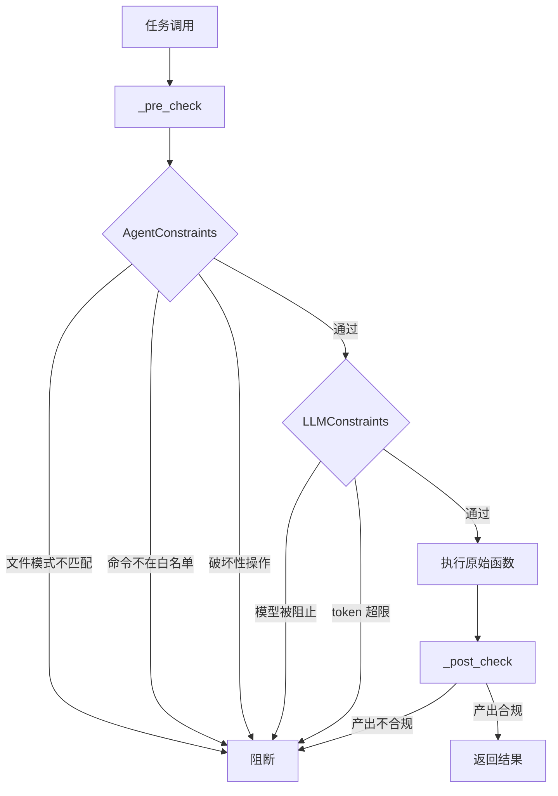

# Agent 约束与资源管控

> harness-cook 的「**边界管控**」——Agent 行为约束 + LLM 资源分层，双管齐下

**快速导航**：[📖 原理（本页）](#原理) · [🎓 使用方法](/tutorial/basic-usage) · [🏃 可运行 Demo](/demo/llm-tiering)

---

## 原理

### Agent 行为约束

AgentConstraints 限制 Agent 的行为边界：
- **文件模式**——只允许修改匹配 `file_patterns` 的文件
- **命令白名单**——只允许执行 `allowed_commands` 列出的命令
- **破坏性操作阻断**——`destructive_blocked=True` 阻断 rm/drop/delete 等危险操作
- **变更数量上限**——`max_changes` 限制单次任务最大变更文件数

### LLM 资源分层

ModelTier 三级分层控制 Agent 使用的模型层级：
- **PREMIUM**——高质量输出（架构设计、安全审查），成本 💰💰💰
- **STANDARD**——日常编码（代码生成、Bug 修复），成本 💰💰
- **FAST**——快速响应（格式化、简单问答），成本 💰

> ⚠️ harness 不直接调 LLM——只约束 Agent 平台的行为边界。分层控制的是 **Agent 调用的模型层级**，而不是 harness-cook 自身去调 LLM。

### token 预算控制

TokenTracker 聚合统计 token 消耗、成本估算、超限检查。

### 模型黑白名单

`allowed_models` / `blocked_models` 约束 Agent 使用的具体模型名称。

### 约束检查流程

1. **_pre_check**——AgentConstraints + LLMConstraints 验证
2. **执行**——调用原始函数
3. **_post_check**——产出约束验证

```python
from harness.constraints import AgentConstraints
from harness.llm import ModelTier, LLMConstraints, TokenTracker

# Agent 行为约束
agent_constraints = AgentConstraints(
    file_patterns=["src/**/*.py", "tests/**/*.py"],
    max_changes=50,
    destructive_blocked=True,
    allowed_commands=["grep", "cat", "ls"],
)

# LLM 资源约束
llm_constraints = LLMConstraints(
    tier=ModelTier.STANDARD,
    allowed_models=["gpt-4", "gpt-3.5-turbo"],
    blocked_models=["gpt-4-32k"],
    max_tokens=4096,
)

# token 预算跟踪
tracker = TokenTracker()
tracker.record(TokenUsageRecord(
    model="gpt-4",
    tier=ModelTier.STANDARD,
    input_tokens=500,
    output_tokens=1000,
))
```

### 核心概念

| 类 | 职责 |
|----|------|
| AgentConstraints | Agent 行为约束（文件模式、命令、破坏性操作） |
| AgentPriority | Agent 优先级（CRITICAL/HIGH/NORMAL/LOW） |
| ConstraintSeverity | 约束严重度（CRITICAL/WARNING/INFO） |
| ModelTier | 模型分层（PREMIUM/STANDARD/FAST） |
| LLMConstraints | LLM 资源约束（模型黑白名单、token 上限） |
| TokenTracker | token 预算跟踪 |

### 约束检查流程图



<details>
<summary>ASCII 原图</summary>

```
任务调用 → _pre_check → AgentConstraints 检查
  → 文件模式不匹配 → 阻断
  → 命令不在白名单 → 阻断
  → 破坏性操作 → 阻断
  → 通过 → LLMConstraints 检查
    → 模型被阻止 → 阻断
    → token 超限 → 阻断
    → 通过 → 执行原始函数 → _post_check
      → 产出合规 → 返回结果
      → 产出不合规 → 阻断
```
</details>

---

## 配置

### Profile YAML 配置

```yaml
constraints:
  default_priority: normal     # 默认优先级
  destructive_blocked: true    # 阻断破坏性操作
  max_changes: 50              # 最大变更数量

llm:
  tier: standard               # 模型分层: premium/standard/fast
  allowed_models:
    - gpt-4
    - gpt-3.5-turbo
  blocked_models:
    - gpt-4-32k
  max_tokens: 4096
```

---

更多配置细节见 [基础用法教程](/tutorial/basic-usage)，可运行 Demo 见 [Agent 调用分层路由 Demo](/demo/llm-tiering)。
