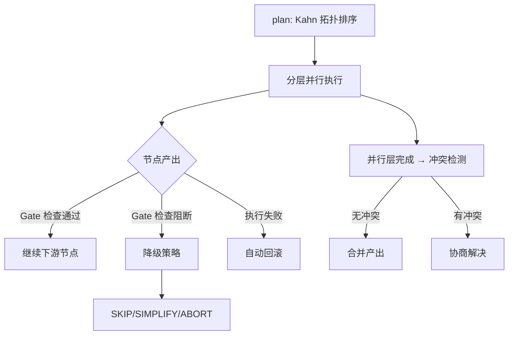

# DAG 编排引擎

> harness-cook 的「**执行中枢**」——DAG 拓扑编排、并行执行、条件分支、门禁拦截

**快速导航**：[📖 原理（本页）](#原理) · [🎓 使用方法](/tutorial/dag-workflow) · [🏃 可运行 Demo](/demo/dag-workflow)

---

## 原理

### 拓扑编排

DAGEngine 使用 Kahn 算法对 DAG 节点做拓扑排序，确保每个节点在其所有上游节点完成后才执行。排序结果即为合法执行序列。

### 并行执行

无依赖关系的节点在同一「层」中并行运行。DAGEngine 使用 ThreadPoolExecutor 并行执行同层节点，显著减少总耗时。

### 条件分支

WorkflowEdge 支持 `condition` 字段——`success` 边在节点成功时激活，`failure` 边在节点失败时激活。这允许流程根据执行结果分流。

### 门禁拦截

每个 WorkflowNode 可配置 `gate` 检查。节点产出先过 Gate 检查，不合规则阻断，合规则继续。Gate 模式（strict/hybrid/loose）决定阻断力度。

### 自动回滚

节点执行失败时，RollbackEngine 自动恢复文件快照，确保项目状态回到执行前。

### 降级策略

门禁审批超时时，DowngradeEngine 按 risk_level 执行降级动作（SKIP/SIMPLIFY/ABORT）。

### 冲突谈判

并行层执行完成后，NegotiationEngine 检测多 Agent 文件冲突并自动合并或仲裁。

### 技能钩子

节点执行前后触发 SkillRegistry 的 PRE_EXECUTE/POST_EXECUTE 等生命周期回调。

```python
from harness.engine import DAGEngine
from harness.types import DAGWorkflow, WorkflowNode, WorkflowEdge

engine = DAGEngine()

# 规划执行顺序
plan = engine.plan(workflow)       # → 拓扑排序节点 ID 列表

# 执行工作流
result = engine.execute(workflow)  # → ExecutionContext（含所有节点状态和产出）
```

### 核心概念

| 类 | 职责 |
|----|------|
| DAGEngine | DAG 拓扑编排与执行 |
| WorkflowNode | 节点定义（agent、task、gate 配置） |
| WorkflowEdge | 边定义（from/to/condition） |
| DAGConfig | 全局配置（并行度、超时、回滚） |
| TaskStatus | 节点状态（PENDING/RUNNING/SUCCESS/FAILED/SKIPPED） |
| ExecutionContext | 执行上下文（节点状态、产出、trace） |

### 执行流程



<details>
<summary>ASCII 原图</summary>

```
plan → Kahn 拓扑排序
  → 分层并行执行
    → 节点产出
      → Gate 检查通过 → 继续下游
      → Gate 检查阻断 → 降级策略 → SKIP/SIMPLIFY/ABORT
      → 执行失败 → 自动回滚
    → 并行层完成 → 冲突检测
      → 无冲突 → 合并产出
      → 有冲突 → 协商解决
```
</details>

### 协作关系

| 集成模块 | 协作方式 |
|----------|---------|
| AgentRegistry | 节点引用 Agent 执行任务 |
| GateEngine | 节点产出过 Gate 检查 |
| RollbackEngine | 失败时自动恢复快照 |
| SmartScheduler | 调度计划指导执行顺序 |
| SkillRegistry | 生命周期回调钩子 |
| NegotiationEngine | 并行层冲突解决 |

---

## 配置

### Profile YAML 配置

```yaml
dag:
  max_parallel: 4           # 最大并行度
  timeout: 300              # 单节点超时（秒）
  auto_rollback: true       # 失败自动回滚
  gate_mode: hybrid         # 门禁模式: strict/hybrid/loose
```

---

更多配置细节见 [DAG 工作流教程](/tutorial/dag-workflow)，可运行 Demo 见 [DAG 工作流 Demo](/demo/dag-workflow)。
