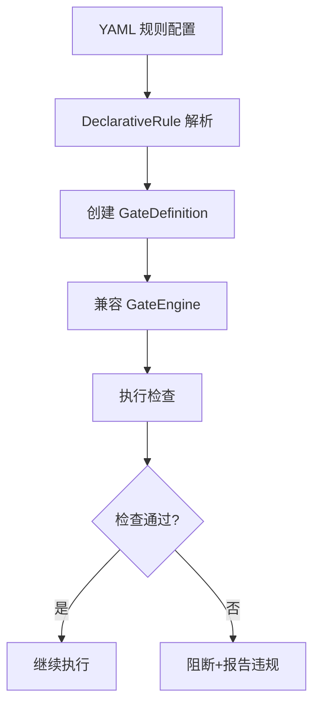

# 声明式规则

> harness-cook 的「**低门槛接入**」——YAML 声明式规则注册、内置检查器、自定义扩展

**快速导航**：[📖 原理（本页）](#原理) · [🎓 使用方法](/tutorial/gate-approval) · [🏃 可运行 Demo](/demo/gate)

---

## 原理

### YAML 声明式规则

DeclarativeRule 从 YAML 配置创建 GateDefinition——无需编写 Python 代码，一行 YAML 即可注册门禁检查。降低了门禁接入门槛，让非开发人员也能定义规则。

### 内置 5 种检查器

| 检查器 | 说明 | 适用场景 |
|--------|------|---------|
| RegexChecker | 正则模式匹配，支持 severity 配置 | 日志格式、命名规范 |
| SecretPatternsChecker | 密钥泄露检测（OpenAI key、GitHub token、GitLab token、Slack token） | 安全审查 |
| EvalDetectionChecker | eval()/exec() 调用检测 | 代码安全 |
| SQLInjectionChecker | SQL 注入风险检测 | 数据安全 |
| FileSizeChecker | 文件大小限制检查 | 大文件预防 |

### 自定义 CheckerBase 扩展

CheckerBase Protocol 定义统一契约：`name` 属性 + `check(artifact, config)` 方法 → 返回 CheckResult。实现该 Protocol 即可创建自定义检查器。

### 与 GateEngine 兼容

DeclarativeRule 创建的 GateDefinition 与 GateEngine 完全兼容——声明式规则生成的检查项与编程式 Gate 检查项统一处理。

```python
from harness.declarative_rules import (
    DeclarativeRule, CheckerBase,
    RegexChecker, SecretPatternsChecker,
    EvalDetectionChecker, SQLInjectionChecker,
    FileSizeChecker,
)

# 使用内置检查器创建门禁
rule = DeclarativeRule.from_yaml("""
checks:
  - id: secret-leak
    checker: secret_patterns
    severity: critical
    description: "检测密钥泄露"

  - id: eval-usage
    checker: eval_detection
    severity: high
    description: "检测 eval/exec 调用"

  - id: sql-injection
    checker: sql_injection
    severity: high
    description: "检测 SQL 注入风险"
""")

# 生成 GateDefinition（兼容 GateEngine）
gate_def = rule.to_gate_definition()

# 自定义检查器
class CustomNamingChecker:
    """自定义命名规范检查器"""
    name = "custom_naming"

    def check(self, artifact, config):
        # 实现自定义检查逻辑
        violations = []
        pattern = config.get("pattern", "^[a-z_]+$")
        import re
        if not re.match(pattern, artifact.get("name", "")):
            violations.append(f"命名不符合规范: {pattern}")
        return {"passed": len(violations) == 0, "violations": violations}

# SecretPatternsChecker 内置模式
checker = SecretPatternsChecker()
result = checker.check(
    artifact={"content": "api_key=sk-abc123..."},
    config={"severity": "critical"},
)
```

### 核心概念

| 类 | 职责 |
|----|------|
| DeclarativeRule | 声明式规则——YAML → GateDefinition |
| CheckerBase | 检查器 Protocol——name + check() |
| RegexChecker | 正则匹配检查器 |
| SecretPatternsChecker | 密钥泄露检查器 |
| EvalDetectionChecker | eval/exec 检查器 |
| SQLInjectionChecker | SQL 注入检查器 |
| FileSizeChecker | 文件大小检查器 |

### 声明式规则流程



<details>
<summary>ASCII 原图</summary>

```
YAML 规则配置 → DeclarativeRule 解析 → 创建 GateDefinition
→ 兼容 GateEngine → 执行检查
  → 检查通过 → 继续执行
  → 检查不通过 → 阻断+报告违规
```
</details>

### 与其他模块协作

| 协作模块 | 方式 |
|----------|------|
| GateEngine | GateDefinition 兼容接入 |
| ComplianceEngine | 内置检查器作为合规规则包 |
| TaintTracker | SQL 注入检查与污点追踪互补 |

---

## 配置

### Profile YAML 配置

```yaml
declarative_rules:
  checks:
    - id: secret-leak
      checker: secret_patterns
      severity: critical
      description: "检测密钥泄露"

    - id: eval-usage
      checker: eval_detection
      severity: high
      description: "检测 eval/exec 调用"

    - id: file-size
      checker: file_size
      config:
        max_size_kb: 500
      severity: medium
      description: "检测超大文件"
```

---

更多配置细节见 [门禁审批教程](/tutorial/gate-approval)，可运行 Demo 见 [门禁 Demo](/demo/gate)。
