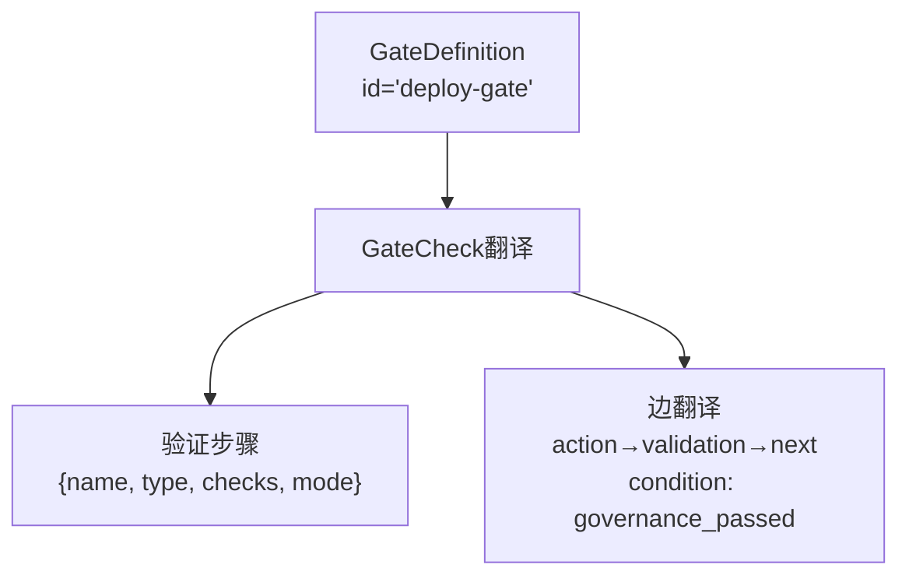
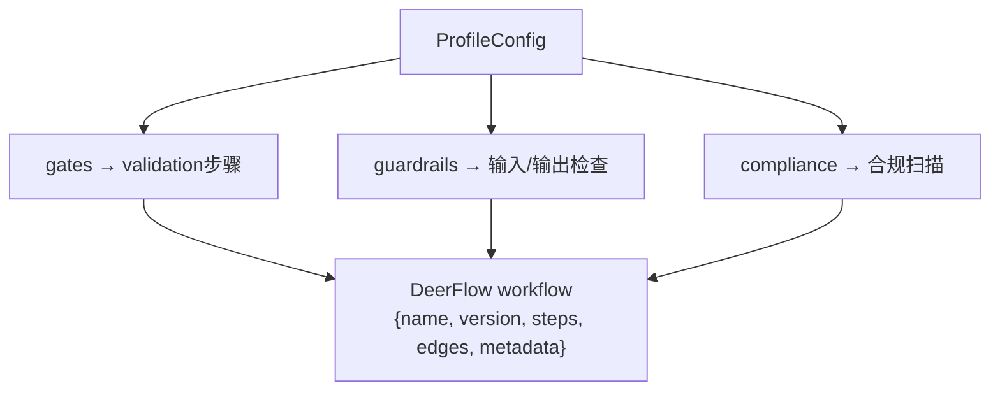
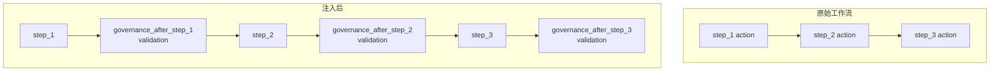

# DeerFlow 治理桥接

> 将 harness-cook 治理能力桥接到 DeerFlow 工作流——将门禁翻译为验证步骤，将 Profile 翻译为 workflow 定义，在工作流中注入治理检查点。

**快速导航**：[📖 原理（本页）](#原理) · [🎓 使用方法](/tutorial/dag-workflow) · [🏃 可运行 Demo](/demo/dag-workflow)

---

## 原理

### 桥接设计

DeerFlowBridge 提供三个核心翻译能力：

| 方法 | 翻译方向 | 说明 |
|------|---------|------|
| `translate_gate_to_validation(gate)` | GateDefinition → DeerFlow 验证步骤 | 将门禁检查项翻译为 DeerFlow validation 类型步骤 |
| `translate_profile_to_workflow(profile)` | ProfileConfig → DeerFlow workflow 定义 | 将完整 Profile 配置翻译为 DeerFlow 工作流 |
| `execute_with_governance(workflow, config)` | 注入治理检查点 | 在现有工作流的每个 action 步骤后插入 governance 验证 |

### 门禁→验证步骤翻译

GateDefinition 的每个 GateCheck 翻译为 DeerFlow 验证步骤：



<details>
<summary>ASCII 原图 — GateDefinition翻译树</summary>

```
GateDefinition(id="deploy-gate", checks=[...])
  │
  ├── GateCheck → {
  │     "name": "validate_deploy-gate_sec-001",
  │     "type": "validation",
  │     "checks": [{"id", "category", "severity", "description"}],
  │     "mode": gate.mode.value,
  │   }
  │
  └── 边：action步骤 → 验证步骤 → 下一步
      → "from": action_name, "to": validate_step_name
      → "from": validate_step_name, "to": next_step, "condition": "governance_passed"
```
</details>

### Profile→工作流翻译

ProfileConfig 翻译为完整的 DeerFlow workflow：



<details>
<summary>ASCII 原图 — ProfileConfig映射树</summary>

```
ProfileConfig
  │
  ├── gates → validation 步骤（每个 GateDefinition 一个）
  ├── guardrails → 输入/输出检查步骤
  ├── compliance → 合规扫描步骤
  │
  └── DeerFlow workflow = {
        "name": profile.name,
        "version": profile.version,
        "steps": [...],    # action + validation 步骤
        "edges": [...],    # action → validation → next 步骤
        "metadata": {...}, # governance 配置
      }
```
</details>

### 治理检查点注入

`execute_with_governance()` 在现有工作流的每个 action 步骤后自动注入治理验证：



<details>
<summary>ASCII 原图 — 治理检查点注入流程</summary>

```
原始工作流:
  step_1(action) → step_2(action) → step_3(action)

注入后:
  step_1(action) → governance_after_step_1(validation) → step_2(action) → governance_after_step_2(validation) → step_3(action) → governance_after_step_3(validation)
```
</details>

注入规则：
- 只在 `type="action"` 的步骤后注入
- 注入步骤类型为 `"validation"`
- HYBRID 模式：`interrupt_on_failure=True`（可暂停人工审核）
- STRICT 模式：失败直接阻断
- `inject_governance=False`：跳过注入，返回原始工作流

---

## 配置

### 创建 DeerFlowBridge

```python
from harness.integrations.deerflow_bridge import DeerFlowBridge

bridge = DeerFlowBridge()
```

### 门禁翻译

```python
from harness.types import GateDefinition, GateMode, GateCheck, CheckResult

gate = GateDefinition(
    id="deploy-gate",
    mode=GateMode.HYBRID,
    checks=[
        GateCheck(id="sec-001", category="security", severity="high",
                  description="禁止硬编码密钥", check_fn=lambda a: CheckResult(passed=True)),
    ],
)

validation = bridge.translate_gate_to_validation(gate)
print(f"验证步骤名: {validation['name']}")
print(f"验证步骤类型: {validation['type']}")
print(f"检查项数: {len(validation['checks'])}")
```

### Profile 翻译

```python
from harness.types import ProfileConfig

profile = ProfileConfig(
    name="my-project",
    version="1.0",
    # ... 其他配置
)

workflow = bridge.translate_profile_to_workflow(profile)
print(f"工作流名: {workflow['name']}")
print(f"步骤数: {len(workflow['steps'])}")
print(f"边数: {len(workflow['edges'])}")
```

### 治理注入

```python
# 简单工作流
workflow = {
    "steps": [
        {"name": "generate_code", "type": "action", "description": "代码生成"},
        {"name": "review_code", "type": "action", "description": "代码审查"},
    ],
    "edges": [
        {"from": "generate_code", "to": "review_code"},
    ],
}

# 注入治理检查点
result = bridge.execute_with_governance(workflow, config={
    "gate_mode": "hybrid",
    "inject_governance": True,
})

print(f"注入状态: {result['governance_injected']}")
print(f"原始步骤数: {result['original_steps_count']}")
print(f"增强步骤数: {result['enhanced_steps_count']}")
print(f"新增检查点: {result['governance_checkpoints_added']}")
```

### 不注入治理

```python
# 跳过注入——返回原始工作流
result = bridge.execute_with_governance(workflow, config={
    "inject_governance": False,
})
print(f"注入状态: {result['governance_injected']}")  # False
print(f"步骤数: {result['total_steps']}")  # 原始步骤数
```

---

更多配置细节见 [DAG 工作流教程](/tutorial/dag-workflow)，可运行 Demo 见 [DAG Demo](/demo/dag-workflow)。
