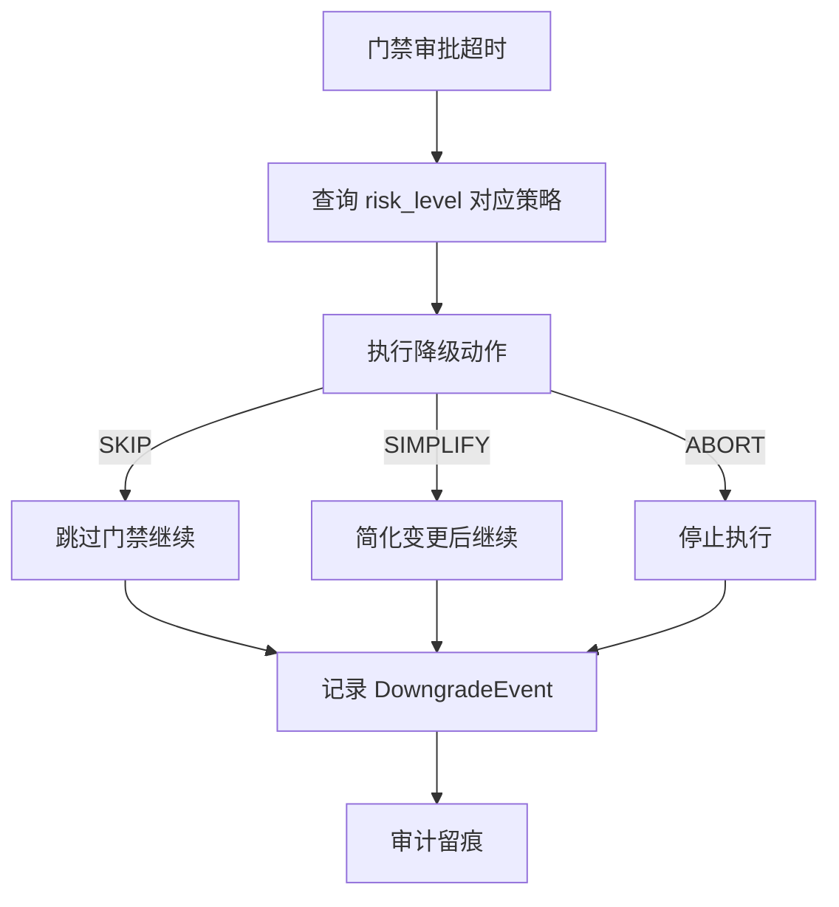

# 降级策略

> harness-cook 的「**安全退路**」——超时自动降级、风险分级策略、审计留痕

**快速导航**：[📖 原理（本页）](#原理) · [🎓 使用方法](/tutorial/downgrade-rollback) · [🏃 可运行 Demo](/demo/downgrade-rollback)

---

## 原理

### 风险分级策略

每级风险（HIGH/MEDIUM/LOW）配置不同的超时阈值和降级动作。高风险超时更长、动作更严格（ABORT）；低风险超时更短、动作更宽松（SKIP）。

### 超时触发

门禁审批超时后，DowngradeEngine 自动执行降级。超时阈值由当前 risk_level 对应的策略决定。

### 降级动作

| 动作 | 说明 | 适用风险级别 |
|------|------|-------------|
| SKIP | 跳过门禁继续执行 | LOW |
| SIMPLIFY | 简化变更后继续 | MEDIUM |
| ABORT | 停止执行 | HIGH |

### 审计留痕

每次降级记录 DowngradeEvent，包含原因、耗时、动作、risk_level。所有降级事件可通过 AuditEngine 查询。

### 策略隔离

按策略名（如 conservative/aggressive）获取独立 DowngradeEngine 实例，不同策略互不干扰。

```python
from harness.downgrade import DowngradeEngine, get_downgrade_engine

# 按策略名获取隔离实例
engine = get_downgrade_engine("conservative")

# 执行降级
decision = engine.execute_downgrade(
    gate_id="quality_gate",
    risk_level="high",
    reason="Approval timeout after 300s",
)
# decision → GateApprovalDecision (skip/simplify/abort)
```

### 核心概念

| 类 | 职责 |
|----|------|
| DowngradePolicy | 降级策略定义（各级超时+动作） |
| DowngradeAction | 降级动作枚举（SKIP/SIMPLIFY/ABORT） |
| DowngradeEngine | 降级执行引擎 |
| DowngradeTracker | 降级事件追踪器 |
| DowngradeEvent | 降级事件记录 |

### 降级流程



<details>
<summary>ASCII 原图</summary>

```
门禁审批超时 → 查询 risk_level 对应策略 → 执行降级动作
  → SKIP → 跳过门禁继续 → 记录 DowngradeEvent → 审计留痕
  → SIMPLIFY → 简化变更后继续 → 记录 DowngradeEvent → 审计留痕
  → ABORT → 停止执行 → 记录 DowngradeEvent → 审计留痕
```
</details>

### 与 DAGEngine 协作

| 场景 | 协作方式 |
|------|---------|
| 门禁超时 | DAGEngine 调用 DowngradeEngine.execute_downgrade() |
| 降级完成 | 降级决策影响后续节点执行 |

---

## 配置

### Profile YAML 配置

```yaml
downgrade:
  policies:
    conservative:            # 策略名
      high:
        timeout: 300         # 高风险超时（秒）
        action: abort        # 动作: skip/simplify/abort
      medium:
        timeout: 120
        action: simplify
      low:
        timeout: 60
        action: skip
```

---

更多配置细节见 [降级回滚教程](/tutorial/downgrade-rollback)，可运行 Demo 见 [降级+回滚 Demo](/demo/downgrade-rollback)。
