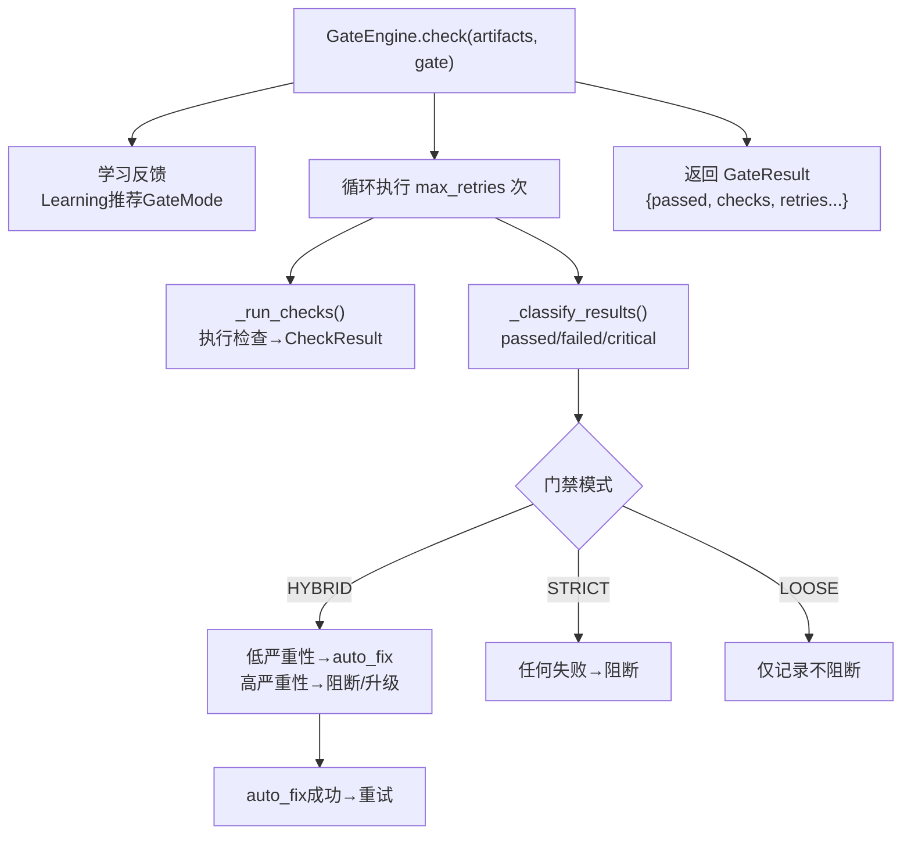

# 门禁层

> Agent 治理的执行闸口——在关键节点决定代码/动作是否可以继续，还是需要阻断或升级人工审核。

**快速导航**：[📖 原理（本页）](#原理) · [🎓 使用方法](/tutorial/gate-approval) · [🏃 可运行 Demo](/demo/gate)

---

## 原理

### 三档门禁模式

GateEngine 提供三种门禁模式，覆盖从严格管控到自由交付的全场景：

| 模式 | GateMode | 检查失败行为 | 适用场景 |
|------|---------|-------------|---------|
| 严格 | `STRICT` | 所有检查必须通过，否则阻塞 | 生产部署、安全关键路径 |
| 混合 | `HYBRID` | lint/style 可自动修复；高严重性阻塞，低严重性仅记录 | 日常开发、CI 流水线 |
| 宽松 | `LOOSE` | 只做基本检查，不阻塞交付 | 快速原型、实验性项目 |

### 门禁执行流程



<details>
<summary>ASCII 原图 — GateEngine.check执行树</summary>

```
GateEngine.check(artifacts, gate)
  │
  ├── 学习反馈：检查 Learning 推荐的 GateMode
  │   （可能覆盖 YAML 中定义的模式）
  │
  ├── 循环执行（最多 max_retries 次）
  │   ├── _run_checks(artifacts, gate, attempt)
  │   │   → 对每个 GateCheck 执行检查函数
  │   │   → 收集 CheckResult 列表
  │   │
  │   ├── _classify_results(results, mode)
  │   │   → 根据模式分类：passed / failed / critical_failed
  │   │
  │   ├── HYBRID 模式：低严重性 → auto_fix + 继续
  │   │                 高严重性 → 阻断或升级人工
  │   ├── STRICT 模式：任何失败 → 阻断
  │   ├── LOOSE 模式：任何失败 → 仅记录，不阻断
  │   │
  │   └── 自动修复成功 → 重试检查（修复后可能通过）
  │
  └── 返回 GateResult
      ├── passed: bool           # 整体是否通过
      ├── total_checks: int      # 检查总数
      ├── passed_checks: int     # 通过数
      ├── failed_checks: int     # 失败数
      ├── auto_fixed: int        # 自动修复数
      ├── check_results: list    # 每项检查的详细结果
      ├── retries_used: int      # 重试次数
      ├── escalated: bool        # 是否升级人工
      └── duration_ms: int       # 执行耗时
```
</details>

### GateDefinition 结构

```python
GateDefinition(
    id="deploy-gate",              # 门禁唯一标识
    checks=[...],                  # 检查项列表
    mode=GateMode.HYBRID,         # 门禁模式
    max_retries=3,                 # 最大重试次数
    retry_strategy=RetryStrategy(), # 重试策略配置
)
```

### GateCheck 结构

```python
GateCheck(
    id="sec-001",                  # 检查项唯一标识
    category="security",           # 类别：security/privacy/compliance/style/logic
    severity="high",               # 严重性：critical/high/medium/low
    description="禁止硬编码密钥",  # 检查描述
    check_fn=my_check_function,    # 检查函数 → CheckResult
)
```

### 检查函数签名

```python
def my_check_function(artifact: Artifact) -> CheckResult:
    """
    检查函数接受一个 Artifact，返回 CheckResult

    Args:
        artifact: 包含 type, path, content, metadata 的产出物

    Returns:
        CheckResult(passed=bool, severity=str, message=str, auto_fix=Optional[FixAction])
    """
    if "hardcoded" in artifact.content:
        return CheckResult(
            passed=False,
            severity="high",
            message="发现硬编码密钥",
        )
    return CheckResult(passed=True, severity="info", message="检查通过")
```

### 学习反馈机制

GateEngine 支持从历史执行结果学习，动态调整门禁模式：

- 学习系统可能推荐将 HYBRID → STRICT（如果某节点频繁失败）
- 也可能推荐 STRICT → HYBRID（如果某节点始终通过）
- 推荐通过 `_gate_mode_hints` 字典传递
- 推荐只是建议，优先级低于用户显式配置

### 重试策略

RetryStrategy 配置重试行为：

```python
RetryStrategy(
    max_retries=3,          # 最大重试次数
    backoff="exponential",  # 退避策略：exponential / linear / fixed
    initial_delay=1.0,      # 首次重试延迟（秒）
)
```

自动修复成功后会重新检查——修复可能使检查通过，减少不必要的阻断。

---

## 配置

### 创建门禁引擎

```python
from harness.gates import GateEngine
from harness.bus import EventBus

bus = EventBus()
gate_engine = GateEngine(
    bus=bus,
    max_retries_override=None,  # None = 使用 GateDefinition 中的 max_retries
)
```

### 定义门禁

```python
from harness.types import GateDefinition, GateMode, GateCheck, CheckResult
from harness.gates import GateEngine

def check_hardcoded_secrets(artifact):
    """检查硬编码密钥"""
    import re
    if re.search(r'(?:password|secret|api_key)\s*=\s*["\']', artifact.content):
        return CheckResult(passed=False, severity="high", message="硬编码密钥检测")
    return CheckResult(passed=True, severity="info", message="无硬编码密钥")

def check_pii_leak(artifact):
    """检查 PII 泄露"""
    import re
    if re.search(r'\b\d{3}-\d{2}-\d{4}\b', artifact.content):  # SSN pattern
        return CheckResult(passed=False, severity="critical", message="SSN 泄露检测")
    return CheckResult(passed=True, severity="info", message="无 PII 泄露")

# 严格门禁——部署前检查
deploy_gate = GateDefinition(
    id="deploy-gate",
    mode=GateMode.STRICT,
    checks=[
        GateCheck(id="sec-001", category="security", severity="high",
                  description="禁止硬编码密钥", check_fn=check_hardcoded_secrets),
        GateCheck(id="sec-002", category="security", severity="critical",
                  description="禁止 PII 泄露", check_fn=check_pii_leak),
    ],
    max_retries=2,
)

# 注册门禁
gate_engine.register(deploy_gate)
```

### Profile YAML 配置

```yaml
gates:
  default_mode: hybrid          # strict / hybrid / loose
  max_retries: 3
  nodes:
    - id: deploy-gate
      mode: strict
      checks:
        - id: sec-001
          category: security
          severity: high
          description: 禁止硬编码密钥
        - id: sec-002
          category: security
          severity: critical
          description: 禁止 PII 泄露
```

---

更多配置细节见 [门禁审批教程](/tutorial/gate-approval)，可运行 Demo 见 [门禁 Demo](/demo/gate)。
