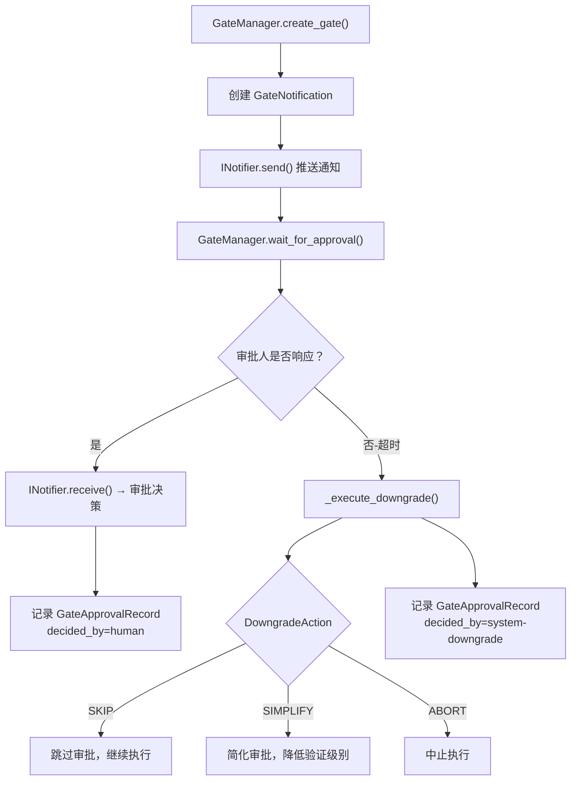

# 门禁通知推送

> Agent 治理的沟通桥梁——在门禁需要人工审批时，推送通知给审批人，超时后自动降级，全程留下审计追溯。

**快速导航**：[📖 原理（本页）](#原理) · [🎓 使用方法](/tutorial/gate-approval) · [🏃 可运行 Demo](/demo/gate)

---

## 原理

### 双通道架构

GateManager 采用**通知-审批双通道**设计：

- **通知通道**：INotifier Protocol 定义通知发送接口，LocalNotifier 是首期默认实现（日志通知），未来可扩展 SlackNotifier、EmailNotifier 等
- **审批通道**：通知器同时承担接收审批决策的职责，`receive(gate_id)` 返回审批人的决策结果

### 审批生命周期



<details>
<summary>ASCII 原图 — 审批生命周期</summary>

```
GateManager.create_gate(gate_id, recipient, message, priority)
  │
  ├── 创建 GateNotification
  │   ├── gate_id: 唯一标识
  │   ├── recipient: 通知接收者
  │   ├── deadline: 超时时间（由 AutoDowngrade 计算）
  │   └── priority: URGENT / NORMAL / INFO
  │
  ├── INotifier.send(notification) → 推送通知
  │
  └── GateManager.wait_for_approval(gate_id)
      │
      ├── 轮询 INotifier.receive(gate_id)
      │   ├── 收到决策 → 记录 GateApprovalRecord (decided_by=human)
      │   └── 未收到 → 继续轮询（500ms 间隔）
      │
      └── 超时 → _execute_downgrade()
          ├── SKIP   → 跳过审批，继续执行（最低风险）
          ├── SIMPLIFY → 简化审批，降低验证级别（中等风险）
          ├── ABORT   → 中止执行（零风险但任务失败）
          │
          └── 记录 GateApprovalRecord (decided_by=system-downgrade)
              └── notify_on_downgrade=True → 日志通知
```
</details>

### NotificationPriority 三级优先级

| 优先级 | NotificationPriority | 行为 | 适用场景 |
|--------|---------------------|------|---------|
| 紧急 | `URGENT` | 需立即审批，阻断流程 | 生产部署审批、安全关键路径 |
| 正常 | `NORMAL` | 需在 deadline 前审批 | 日常变更审批、代码合并 |
| 信息 | `INFO` | 仅通知，不需审批 | 审批结果通知、降级通知 |

### INotifier Protocol

```python
class INotifier(Protocol):
    """通知发送接口——所有通知器必须实现"""
    def send(self, notification: GateNotification) -> bool: ...
    def receive(self, gate_id: str) -> Optional[GateApprovalDecision]: ...
```

### LocalNotifier 默认实现

首期 LocalNotifier 只做日志记录，不做实际推送。审批决策通过手动调用 `decide()` 注入：

```python
class LocalNotifier:
    """本地日志通知器——首期实现"""
    def send(self, notification: GateNotification) -> bool:
        """发送通知——记录到日志+存储"""
        self._pending[notification.gate_id] = notification
        logger.info(f"Gate通知: {notification.summary()}")
        return True

    def receive(self, gate_id: str) -> Optional[GateApprovalDecision]:
        """接收审批决策"""
        return self._decisions.get(gate_id)

    def decide(self, gate_id: str, decision: GateApprovalDecision) -> None:
        """手动注入审批决策（模拟人工审批）"""
        self._decisions[gate_id] = decision
```

### 自定义通知器

扩展 SlackNotifier 示例：

```python
class SlackNotifier:
    """Slack 通知器——推送审批通知到 Slack 频道"""
    def __init__(self, webhook_url: str, channel: str):
        self.webhook_url = webhook_url
        self.channel = channel

    def send(self, notification: GateNotification) -> bool:
        """发送 Slack 通知"""
        payload = {
            "channel": self.channel,
            "text": f"[{notification.priority.value}] Gate审批: {notification.message}",
            "attachments": [{
                "title": "审批操作",
                "actions": [
                    {"name": "approve", "text": "批准", "url": notification.action_url},
                    {"name": "reject", "text": "拒绝", "url": notification.action_url},
                ],
            }],
        }
        # POST 到 Slack webhook
        return True

    def receive(self, gate_id: str) -> Optional[GateApprovalDecision]:
        """从 Slack 回调接收审批决策"""
        # 实际实现需要配合 HTTP 回调端点
        return None
```

### GateApprovalDecision 四种决策

| 决策 | GateApprovalDecision | 含义 |
|------|---------------------|------|
| 批准 | `APPROVED` | 审批通过，流程继续 |
| 拒绝 | `REJECTED` | 审批拒绝，流程阻断 |
| 超时 | `TIMEOUT` | 审批超时，触发降级 |
| 取消 | `CANCELLED` | 主动取消审批 |

### GateApprovalRecord 审计追溯

每条审批记录包含完整追溯信息：

```python
GateApprovalRecord(
    gate_id="deploy-gate",          # 唯一标识
    decision=GateApprovalDecision.APPROVED,  # 审批决策
    decided_at=datetime.now(timezone.utc),   # 决策时间
    decided_by="human",             # 决策者：human / system-downgrade
    reason="人工审批: approved",    # 决策原因
)
```

### AutoDowngrade 超时降级配置

```python
AutoDowngrade(
    after_minutes=30,                       # 默认30分钟超时
    action=DowngradeAction.SKIP,            # 降级动作：skip/simplify/abort
    notify_on_downgrade=True,               # 降级时是否通知
    fallback_message="审批超时,自动降级",    # 降级通知内容
)
```

三种降级动作（SKIP/SIMPLIFY/ABORT）的风险分级策略：SKIP 为低风险跳过审批、SIMPLIFY 为中等风险简化验证、ABORT 为零风险但任务失败中止。

> 📖 三种降级动作的风险对比详解 → [降级策略](./downgrade#降级动作)

---

## 配置

### 创建 GateManager

```python
from harness.gate_notification import GateManager, LocalNotifier, AutoDowngrade, DowngradeAction

# 使用默认配置
manager = GateManager()

# 自定义通知器和降级策略
manager = GateManager(
    notifier=SlackNotifier(webhook_url="https://hooks.slack.com/...", channel="#approvals"),
    downgrade=AutoDowngrade(
        after_minutes=60,           # 1小时超时
        action=DowngradeAction.ABORT,  # 超时则中止
        notify_on_downgrade=True,
    ),
)
```

### 创建审批并等待

```python
from harness.gate_notification import NotificationPriority, GateApprovalDecision

# 创建审批
notification = manager.create_gate(
    gate_id="deploy-gate-001",
    recipient="team-lead",
    message="部署到生产环境需要审批",
    priority=NotificationPriority.URGENT,
    deadline_minutes=30,
)

# 等待审批（阻塞式轮询）
decision = manager.wait_for_approval("deploy-gate-001")

if decision == GateApprovalDecision.APPROVED:
    print("审批通过，继续部署")
elif decision == GateApprovalDecision.REJECTED:
    print("审批拒绝，停止部署")
elif decision == GateApprovalDecision.TIMEOUT:
    print("审批超时，已自动降级")
```

### 查看审批统计

```python
# 获取单条审批记录
record = manager.get_record("deploy-gate-001")
print(record.summary())  # "Gate deploy-gate-001: approved (by human, 人工审批: approved)"

# 列出所有审批记录
all_records = manager.list_records()

# 统计信息
stats = manager.stats()
# {"total_gates": 5, "total_records": 3, "approved": 2, "rejected": 1, "timeout": 0, "cancelled": 0}
```

### 取消审批

```python
manager.cancel_gate("deploy-gate-001")
# 记录 GateApprovalRecord(decision=CANCELLED, decided_by="system", reason="主动取消")
```

### Profile YAML 配置

```yaml
gate_notification:
  notifier: local                          # local / slack / email / webhook
  slack:
    webhook_url: https://hooks.slack.com/services/xxx
    channel: "#approvals"
  downgrade:
    after_minutes: 30                      # 超时分钟数
    action: skip                           # skip / simplify / abort
    notify_on_downgrade: true              # 降级时是否通知
  priorities:                              # 各优先级的超时配置
    urgent: 15                             # 紧急审批超时15分钟
    normal: 60                             # 正常审批超时60分钟
    info: 120                              # 信息通知超时120分钟
```

---

更多配置细节见 [门禁通知教程](/tutorial/gate-approval)，可运行 Demo 见 [门禁 Demo](/demo/gate)。
