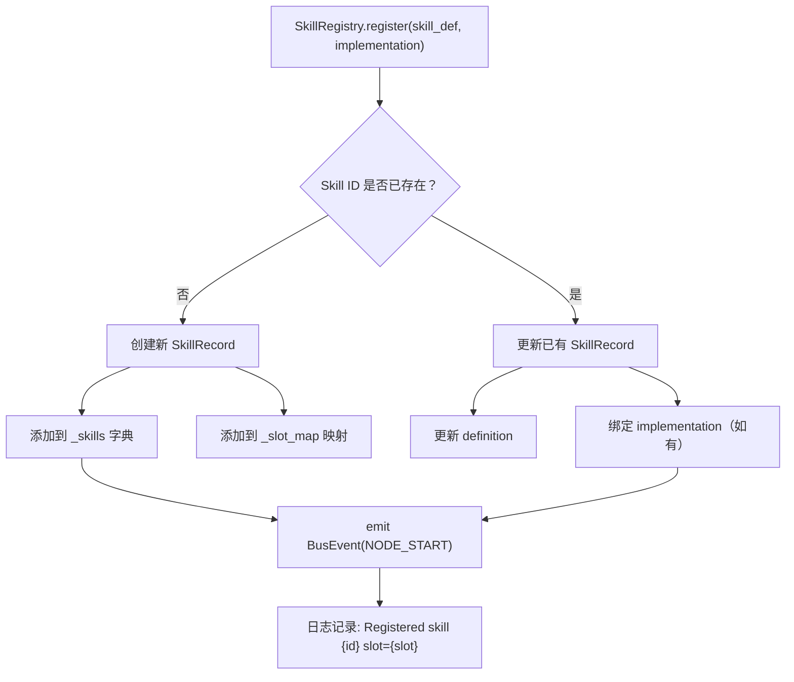

# Hook 注册与执行

> Agent 生命周期的可插拔骨架——通过 17 个插槽点，在 Agent 执行的关键阶段自动触发 Skill，实现声明式行为扩展。

**快速导航**：[📖 原理（本页）](#原理) · [🎓 使用方法](/tutorial/skill-slots) · [🏃 可运行 Demo](/demo/skill)

---

## 原理

### 插槽驱动设计

SkillRegistry 采用**插槽驱动发现**模式——每个 Skill 挂载到一个插槽（SkillSlotName），在对应生命周期阶段自动执行。注册是声明式的：SkillDefinition 声明能力，implementation 可后绑定。

### 17 个插槽点详解

harness-cook 支持 17 个插槽点，覆盖 Agent 执行的完整生命周期（会话级、任务级、工具级、门禁级、文件级、提交级、协作级、决策级、交互级）。默认启用 3 个核心插槽（SESSION_START、POST_EXECUTE、SESSION_END），按需启用更多实现细粒度控制。

> 📖 17 个插槽点的完整分类、触发时机、配置示例 → [Skill 插槽点指南](./skill-slots)

### SkillDefinition 结构

每个 Skill 通过 SkillDefinition 声明自身能力：

```python
@dataclass
class SkillDefinition:
    id: str                           # "auto-audit" | "custom-lint"
    name: str                         # 人类可读名称
    description: str = ""             # 功能描述
    version: str = "1.0.0"            # 版本号
    entry_point: str = ""             # CLI 方式执行的脚本路径
    prompt_template: str = ""         # 提示词模板路径（可选）
    slot: SkillSlotName = SkillSlotName.POST_EXECUTE  # 挂载插槽
    tools: list[SkillTool] = field(default_factory=list)  # Skill 专属工具
    tags: list[str] = field(default_factory=list)      # 标签（分类/过滤）
    config_schema: dict = field(default_factory=dict)  # 配置 JSON Schema
    metadata: dict = field(default_factory=dict)       # 扩展元数据
    timeout_seconds: int = 60         # implementation 执行超时（秒），0=不限
```

SkillTool 定义 Skill 可使用的专属工具：

```python
@dataclass
class SkillTool:
    name: str                         # "git-diff" | "eslint"
    command: str                      # "git diff HEAD~1"
    description: str = ""
```

### Skill 注册流程



<details>
<summary>ASCII 原图 — Skill 注册流程</summary>

```
SkillRegistry.register(skill_def, implementation)
  │
  ├── skill_def.id 已存在？
  │   ├── 是 → 更新已有 SkillRecord
  │   │   ├── 更新 definition
  │   │   ├── 绑定 implementation（如有）
  │   │   └── 日志: "Skill {id} already registered — updating"
  │   │
  │   └── 否 → 创建新 SkillRecord
  │       ├── 添加到 _skills 字典
  │       ├── 添加到 _slot_map 映射
  │       └── 日志: "Registered skill {id} ({name}) slot={slot}"
  │
  └── emit BusEvent(NODE_START) → 通知 EventBus
```
</details>

### 执行双模式

SkillRegistry 支持两种执行方式：

| 模式 | 条件 | 方式 | 超时保护 |
|------|------|------|---------|
| Python 函数 | `implementation` 已绑定 | 直接调用函数 | SIGALRM（Unix）或 threading.Timer（Windows） |
| CLI 脚本 | 仅 `entry_point` | subprocess 执行 | 120s 硬超时 |

执行优先级：**implementation > entry_point**。有绑定的 Python 函数时直接调用，否则 CLI 方式执行脚本。

超时保护策略：

- **Unix**：`signal.SIGALRM`（精确，不占线程）
- **Windows / 非主线程**：`threading.Timer`（占一个线程但通用）
- 超时后返回 `TaskStatus.FAILED`，不强制杀死线程

entry_point 安全验证：

- 禁止路径穿越（`../`、`~`）
- 禁止绝对路径（`/` 开头）
- 必须以 `.py` 结尾

### SkillRecord 执行统计

每个 SkillRecord 维护自身执行统计：

```python
class SkillRecord:
    definition: SkillDefinition       # Skill 定义
    implementation: Optional[Callable] # Python 函数（可后绑定）
    active: bool = True               # 是否激活
    exec_count: int = 0               # 执行次数
    error_count: int = 0              # 错误次数
    last_used: Optional[float] = None # 最后执行时间戳
```

`is_ready` 属性：`active=True` 且有入口（implementation 或 entry_point）。

### 项目级 Skill 自动发现

`register_project_skills()` 从 `.harness/skills/` 目录自动发现项目级 Skill：

1. 定位 `.harness/skills/` 目录
2. 扫描子目录，检查是否包含 `SKILL.md`
3. 解析 `SKILL.md` 的 YAML front matter 提取元数据
4. 自动查找 `.py` 脚本作为 `entry_point`
5. 用解析出的元数据 + entry_point 注册到 SkillRegistry

**优先级规则**：内置 Skill 优先级更高——同名项目级 Skill 不会覆盖内置 Skill。

SKILL.md 格式：

```markdown
---
name: custom-lint
title: 自定义 Lint 检查
description: "项目级代码风格检查"
slot: pre_execute
tags: ["lint", "style"]
version: "1.0.0"
entry_point: "custom_lint.py"
---
# Custom Lint

检查项目代码风格...
```

---

## 配置

### 创建 SkillRegistry

```python
from harness.skill_registry import SkillRegistry
from harness.bus import EventBus

# 默认（使用全局 EventBus）
registry = SkillRegistry()

# 依赖注入（使用自定义 EventBus）
bus = EventBus()
registry = SkillRegistry(bus=bus)
```

### 注册 Skill

```python
from harness.types import SkillDefinition, SkillSlotName

# 注册带 Python 实现的 Skill
def audit_handler(context: dict) -> str:
    """自动审计处理器"""
    task_id = context.get("task_id")
    return f"审计完成: {task_id}"

record = registry.register(
    SkillDefinition(
        id="auto-audit",
        name="自动审计",
        description="任务完成后自动记录审计日志",
        slot=SkillSlotName.POST_EXECUTE,
        tags=["audit", "compliance"],
        timeout_seconds=30,
    ),
    implementation=audit_handler,
)

# 注册仅 CLI 入口的 Skill
record = registry.register(
    SkillDefinition(
        id="custom-lint",
        name="自定义 Lint",
        entry_point="skills/custom-lint/lint.py",
        slot=SkillSlotName.PRE_EXECUTE,
        tags=["lint", "style"],
    ),
)
```

### 后绑定实现

```python
# 先注册定义，后绑定实现
registry.register(SkillDefinition(id="my-skill", name="My Skill", slot=SkillSlotName.POST_EXECUTE))

# 后续绑定
registry.bind_implementation("my-skill", my_handler_function)
```

### 查询 Skill

```python
# 按插槽查找
skills = registry.find_by_slot(SkillSlotName.POST_EXECUTE)
# → [SkillRecord(auto-audit), SkillRecord(auto-review)]

# 按标签查找
skills = registry.find_by_tag("audit")
# → [SkillRecord(auto-audit)]

# 按 ID 获取
record = registry.get("auto-audit")

# 列出所有激活的 Skill
active_skills = registry.list_active()

# 列出每个插槽上的 Skill
slots = registry.list_slots()
# → {"post_execute": ["auto-audit", "auto-review"], "on_gate_pass": ["auto-verify"]}
```

### 执行 Skill

```python
from harness.types import TaskResult

result = registry.execute_skill("auto-audit", {
    "task_id": "task-001",
    "session_id": "session-001",
    "node_id": "node-1",
})
# → TaskResult(task_id="task-001", agent_id="auto-audit", status=COMPLETED, ...)
```

### 注册统计

```python
stats = registry.stats()
# {
#   "total_skills": 5,
#   "active_skills": 4,
#   "ready_skills": 3,
#   "total_executions": 12,
#   "total_errors": 1,
#   "slots": {"post_execute": ["auto-audit", "auto-review"], ...},
#   "by_tag": {"audit": 2, "compliance": 1, "review": 1},
# }
```

### Profile YAML 配置

```yaml
skills:
  builtin: true                              # 加载内置 Skills
  project_dir: .                             # 项目根目录（用于发现 .harness/skills/）
  slots:
    pre_execute:                              # PRE_EXECUTE 插槽
      - id: custom-lint
        name: 自定义 Lint
        entry_point: .harness/skills/custom-lint/lint.py
        tags: [lint, style]
    post_execute:                             # POST_EXECUTE 插槽
      - id: auto-audit
        name: 自动审计
        entry_point: skills/auto-audit/audit_report.py
        tags: [audit, compliance]
    on_gate_pass:                             # ON_GATE_PASS 插槽
      - id: auto-verify
        name: 自动验证
        entry_point: skills/auto-verify/verify.py
        tags: [verify, testing]
  defaults:
    timeout_seconds: 60                       # Skill 执行默认超时
    active: true                              # 默认激活
```

---

更多配置细节见 [Skill 插槽教程](/tutorial/skill-slots)，可运行 Demo 见 [Skill Demo](/demo/skill)。详细插槽点说明见 [Skill 插槽指南](/guide/skill-slots)。
