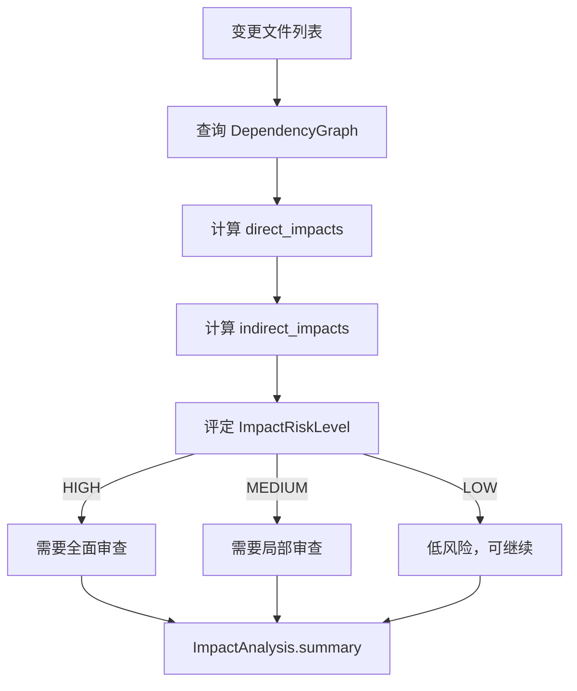

# 影响分析

> harness-cook 的「**变更雷达**」——多语言依赖图构建、影响传播路径、风险评级

**快速导航**：[📖 原理（本页）](#原理) · [🎓 使用方法](/tutorial/compliance-scan) · [🏃 可运行 Demo](/demo/analysis)

---

## 原理

### 多语言依赖图构建

FileImpactAnalyzer 通过 LanguageRegistry 支持多语言 import 扫描，构建项目级 DependencyGraph：
- **Python**——import/from 语句扫描
- **JS/TS/Vue**——import/require 语句扫描
- **Java**——import 语句扫描
- **Go**——import 语句扫描
- **Kotlin/Ruby/Rust/C/C++**——扩展语言支持

### 依赖图结构

DependencyGraph 存储节点（文件路径 + 入口点标记）和边（source→target 依赖关系），支持双向查询：
- `get_dependencies(file)` → 该文件依赖了哪些文件
- `get_dependents(file)` → 哪些文件依赖了该文件（反向查询）

### 影响传播路径

FileImpactAnalyzer.analyze_impact() 分析变更文件的影响传播：
- **direct_impacts**——直接依赖变更文件的文件
- **indirect_impacts**——间接依赖变更文件的文件（多级传播）
- **风险评级**——ImpactRiskLevel(HIGH/MEDIUM/LOW)

### 风险评级

ImpactRiskLevel 三级风险评定：
- **HIGH**——大量文件受影响，需要全面审查
- **MEDIUM**——中等影响，需要局部审查
- **LOW**——少量文件受影响，低风险

```python
from harness.impact_types import (
    DependencyGraph, ImpactAnalysis,
    ImpactRisk, ImpactRiskLevel,
)
from harness.impact_analyzer import FileImpactAnalyzer

# 构建依赖图
analyzer = FileImpactAnalyzer()
graph = analyzer.build_graph_from_project("/path/to/project")

# 查看依赖关系
deps = graph.get_dependencies("src/auth.py")
dependents = graph.get_dependents("src/auth.py")
print(f"auth.py 依赖: {deps}")
print(f"依赖 auth.py 的文件: {dependents}")

# 分析变更影响
impact = analyzer.analyze_impact(change_files=["src/auth.py"])
print(f"直接影响: {impact.direct_impacts}")
print(f"间接影响: {impact.indirect_impacts}")
print(f"风险评级: {impact.risk.level.value}")      # HIGH/MEDIUM/LOW
print(f"需要审查: {impact.requires_review}")
print(f"影响总结: {impact.summary()}")

# 手动构建依赖图
graph = DependencyGraph()
graph.add_node("src/auth.py", is_entry_point=True)
graph.add_node("src/models.py", is_entry_point=False)
graph.add_edge("src/auth.py", "src/models.py")
stats = graph.stats()
print(f"节点数: {stats.node_count}, 边数: {stats.edge_count}")
```

### 核心概念

| 类 | 职责 |
|----|------|
| FileImpactAnalyzer | 影响分析引擎——项目扫描 + 影响传播 |
| DependencyGraph | 依赖图——节点+边的双向查询 |
| ImpactAnalysis | 影响分析结果——直接+间接影响+风险 |
| ImpactRisk | 风险评定——级别+原因+是否需审查 |
| ImpactRiskLevel | 风险级别枚举——HIGH/MEDIUM/LOW |

### 影响分析流程



<details>
<summary>ASCII 原图</summary>

```
变更文件列表 → 查询 DependencyGraph
  → 计算 direct_impacts
  → 计算 indirect_impacts
  → 评定 ImpactRiskLevel
    → HIGH → 需要全面审查
    → MEDIUM → 需要局部审查
    → LOW → 低风险，可继续
  → ImpactAnalysis.summary
```
</details>

### 与其他模块协作

| 协作模块 | 方式 |
|----------|------|
| ComplianceEngine | 影响分析结果辅助合规判断范围 |
| GateEngine | HIGH/MEDIUM 影响触发更严格门禁 |
| TaintTracker | 依赖图辅助跨文件污点追踪 |

---

## 配置

### Profile YAML 配置

```yaml
impact_analysis:
  languages:                  # 支持扫描的语言
    - python
    - javascript
    - typescript
    - vue
    - java
    - go
  entry_points:               # 入口点文件标记
    - "src/main.py"
    - "src/app.ts"
```

---

更多配置细节见 [合规扫描教程](/tutorial/compliance-scan)，可运行 Demo 见 [代码分析 Demo](/demo/analysis)。
