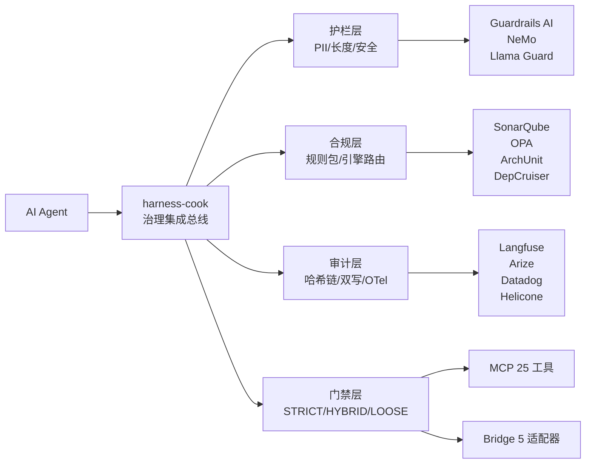

# 指南

> harness-cook 是 **Agent 治理集成总线**——不造发动机，造方向盘 + 仪表盘 + 刹车踏板。

**核心定位：引擎委托给专业选手，只保留组合价值。护栏用 Guardrails AI/NeMo，合规用 SonarQube/ArchUnit/OPA，审计用 Langfuse/Arize/Datadog。harness-cook 只做总线 + 交付 + 策略框架。**

---

## 支持的 Agent 平台

harness-cook 通过 Bridge 适配器模式部署到 5 个 Agent 平台，按治理强度分两类：**强制性**（Claude Code、Copilot CLI——hooks 自动触发）和 **建议性→接近强制**（Hermes、Cursor、OpenAI——mandatory prompt + MCP + git hook 兜底）。

> 📖 各平台详细对比、3 步激活流程 + 配置对照表 → [Agent 平台指南](./agent-platforms) · [Adapter 快速上手](./adapter-quickstart)

---

## 架构总览



<details>
<summary>ASCII 原图 — 架构总览</summary>

```
AI Agent → harness-cook 治理集成总线
              ├── 护栏层 (PII/长度/安全) → Guardrails AI / NeMo / Llama Guard
              ├── 合规层 (规则包/引擎路由) → SonarQube / OPA / ArchUnit / DepCruiser
              ├── 审计层 (哈希链/双写/OTel) → Langfuse / Arize / Datadog / Helicone
              ├── 门禁层 (STRICT/HYBRID/LOOSE)
              │   ├── MCP 25 工具
              │   └── Bridge 5 适配器
              └── 吸收式设计：不装不影响，装了自动增强
```
</details>

---

## 七层架构

| 层 | 定位 | 核心机制 | 指南 |
|----|------|---------|------|
| **护栏** | 第一道防线——输入输出拦截 | PII 检测 + 红脱/阻断/警告 | [护栏层原理](./guardrails-layer) |
| **合规** | 第二道防线——产出后检查 | 规则包驱动 + 引擎路由（按类别） | [合规层原理](./compliance-layer) |
| **审计** | 问责机制——不可篡改记录 | SHA-256 链 + 多后端双写 | [审计层原理](./audit-layer) |
| **门禁** | 执行闸口——阻断/放行/升级 | 三档模式 + 重试 + 自动修复 | [门禁层原理](./gate-layer) |
| **智能增强** | 经验积累 + 知识中枢 + 变更雷达 | 自学习闭环 + 10类知识管理 + 影响传播 | [自学习](./learning) · [知识管理](./knowledge) · [影响分析](./impact-analysis) · [污点追踪](./taint-tracking) |
| **执行管控** | DAG编排 + 调度 + 协商 + 安全退路 | 拓扑执行 + 资源调度 + 冲突化解 | [DAG引擎](./dag-engine) · [调度器](./scheduler) · [协商](./negotiation) · [降级](./downgrade) · [回滚](./rollback) · [约束](./constraints) |
| **引擎集成** | 总线 + 规则 + 声明式 + 市场 | 委托专业引擎 + YAML低门槛接入 | [引擎总线](./engine-bus) · [规则包](./rule-packs) · [声明式规则](./declarative-rules) · [规则市场](./rule-market) |

---

## 编排平台

| 主题 | 指南 |
|------|------|
| LangGraph StateGraph 治理检查点 | [LangGraph 中间件](./langgraph-middleware) |
| DeerFlow 工作流治理桥接 | [DeerFlow 桥接](./deerflow-bridge) |
| 自主迭代执行(@experimental) | [自主循环](./autonomous-loop) |

---

## 开发者接入与部署

| 主题 | 指南 |
|------|------|
| @harness_agent 装饰器——一键接入 | [装饰器](./decorators) |
| Profile/Overlay 配置合叠 | [配置系统](./config-system) |
| Profile → 多平台 Agent 原生配置 | [Bridge](./bridge) |
| 各 Agent 平台使用指南——激活、治理、工具、流程 | [Agent 平台指南](./agent-platforms) |
| Superpowers Skill → Harness Slot 映射 | [Superpowers Bridge](./superpowers-bridge) |
| JSON-RPC 2.0，25 个 MCP Tools | [MCP Server](./mcp-server) |
| 17 个插槽点 + Superpowers Bridge | [Skill 插槽点](./skill-slots) |
| Hook 注册、插槽、执行、项目级 Skill 发现 | [Hook 注册与执行](./hook-registry) |
| 依赖注入 vs 全局单例——选择与迁移 | [依赖注入模式](./dependency-injection) |
| EventBus 事件链 + 28 种 BusEventType | [调用链追踪](./call-graph) |
| ModelTier 分层 + TokenTracker 成本追踪 | [Agent 调用分层路由](./llm-tiering) |
| 门禁审批通知——INotifier/LocalNotifier/降级 | [门禁通知](./gate-notification) |
| Agents 注册与发现 | [Agents 模块](./agents-module) |
| CLI 操作 | [CLI](./cli) |
| 可视化界面 | [Dashboard](./dashboard) |
| HTML/DOT/DSM 三种报告 | [可视化报告](./report) |
| OTel Span/指标自动采集 | [OTel 集成](./otel-integration) |

---

## 导航

- 📖 **指南**（本页）——架构原理与设计思想：[什么是 Harness](./what-is-harness) · [核心概念](./core-concepts)
- 🎓 **教程**——逐步使用方法：[教程入口](/tutorial/)
- 🏃 **Demo**——可运行脚本 + 配置示例：[Demo 入口](/demo/)
