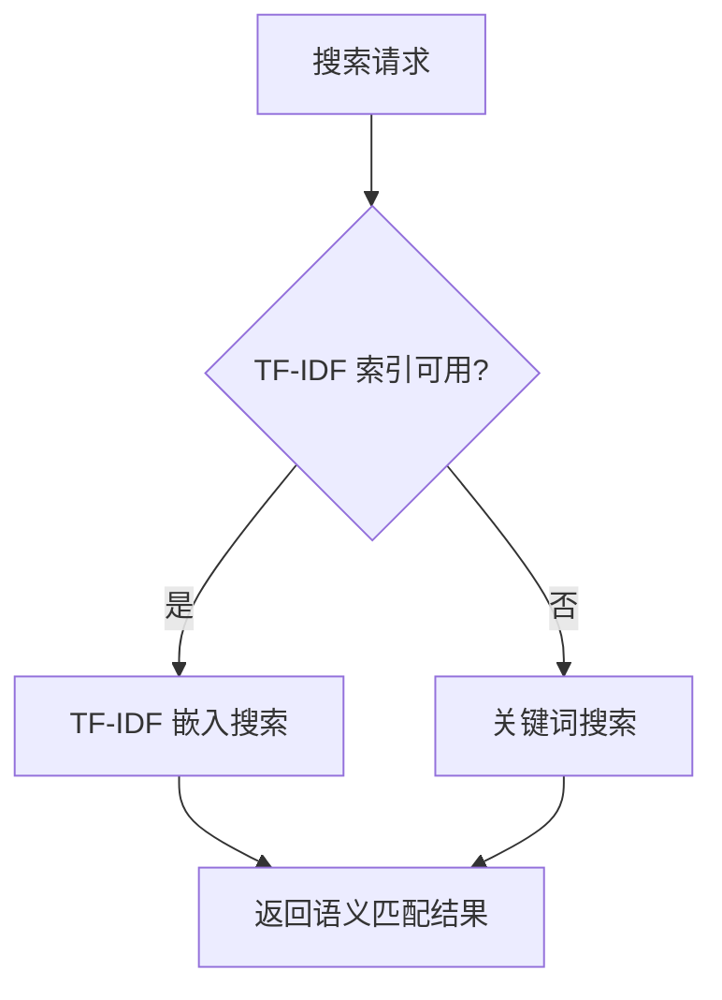

# 知识管理

> harness-cook 的「**知识中枢**」——10 类知识结构化管理、TF-IDF 语义搜索、执行注入

**快速导航**：[📖 原理（本页）](#原理) · [🎓 使用方法](/tutorial/basic-usage) · [🏃 可运行 Demo](/demo/knowledge-rule-report)

---

## 原理

### 10 类知识结构化管理

KnowledgeType 定义 10 类知识，每类有明确的语义边界：

| KnowledgeType | 说明 | 示例 |
|---------------|------|------|
| ARCHITECTURE | 架构知识 | "项目采用分层架构" |
| CONVENTION | 编码惯例 | "变量名用 snake_case" |
| DEPENDENCY | 依赖关系 | "auth 模块依赖 database" |
| API | API 用法 | "AuthService.login() 返回 Token" |
| PATTERN | 设计模式 | "使用策略模式处理支付" |
| RISK | 风险知识 | "直接拼接 SQL 有注入风险" |
| DECISION | 决策记录 | "选择 Redis 作缓存而非 Memcached" |
| TASK | 任务知识 | "Bug #1234 需修复登录超时" |
| TEST | 测试知识 | "登录接口需覆盖超时场景" |
| GLOSSARY | 术语表 | "SSO = Single Sign-On" |

### 四级作用域

KnowledgeScope 定义 4 级作用域：PROJECT > MODULE > FILE > FUNCTION，越细粒度优先级越高。

### TF-IDF 语义搜索

LocalKnowledgeProvider 实现三层搜索策略：
1. **关键词搜索**——直接按关键词匹配
2. **TF-IDF 嵌入搜索**——构建 TF-IDF 向量索引，语义相似度匹配
3. **回退搜索**——TF-IDF 索引不可用时回退到关键词搜索

### 执行上下文注入

KnowledgeContext 在任务执行时注入相关知识条目，Agent 可直接利用注入的上下文作出更优决策。

### 本地持久化

LocalKnowledgeProvider 使用 JSON 文件存储（路径 `~/.harness/knowledge/{project}/`），原子写入确保数据完整性。

```python
from harness.knowledge import (
    KnowledgeType, KnowledgeScope,
    IKnowledgeProvider, LocalKnowledgeProvider,
    KnowledgeContext,
)

# 创建知识提供者
provider = LocalKnowledgeProvider(project="my-project")
provider.initialize()

# 存入知识
provider.put(
    key="auth-architecture",
    content="项目采用 JWT + RBAC 分层认证架构",
    type=KnowledgeType.ARCHITECTURE,
    scope=KnowledgeScope.PROJECT,
)

# 语义搜索
results = provider.semantic_search("认证架构设计")
for item in results:
    print(f"{item.type.value}: {item.content}")

# 关键词查询
results = provider.query("JWT", scope=KnowledgeScope.PROJECT)

# 查看统计
stats = provider.stats()
print(f"知识条目数: {stats.total_entries}")
print(f"类型分布: {stats.type_distribution}")
```

### 核心概念

| 类 | 职责 |
|----|------|
| KnowledgeType | 知识类型枚举——10 类 |
| KnowledgeScope | 知识作用域——4 级 |
| IKnowledgeProvider | 知识提供者 Protocol——统一契约 |
| LocalKnowledgeProvider | 本地知识提供者——JSON 存储 + TF-IDF |
| KnowledgeContext | 知识上下文——执行时注入 |

### 搜索流程



<details>
<summary>ASCII 原图</summary>

```
搜索请求 → TF-IDF 索引可用?
  → 是 → TF-IDF 嵌入搜索 → 返回语义匹配结果
  → 否 → 关键词搜索 → 返回匹配结果
```
</details>

### 与其他模块协作

| 协作模块 | 方式 |
|----------|------|
| LearningEngine | 高置信度推荐持久化为知识条目 |
| DAGEngine | KnowledgeContext 注入任务执行上下文 |
| ComplianceEngine | RISK 类型知识辅助合规判断 |

---

## 配置

### Profile YAML 配置

```yaml
knowledge:
  provider: local           # 知识提供者: local (默认)
  project: my-project       # 项目名（用于存储路径）
  semantic_search: true     # 启用 TF-IDF 语义搜索
```

---

更多配置细节见 [基础用法教程](/tutorial/basic-usage)，可运行 Demo 见 [知识/规则/报告 Demo](/demo/knowledge-rule-report)。
