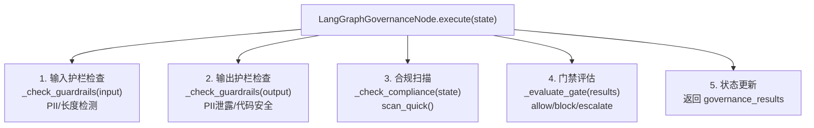

# LangGraph 治理中间件

> 嵌入 LangGraph StateGraph 的治理检查点——在工作流步骤间自动执行输入护栏、输出护栏、合规扫描和门禁评估。

**快速导航**：[📖 原理（本页）](#原理) · [🎓 使用方法](/tutorial/dag-workflow) · [🏃 可运行 Demo](/demo/dag-workflow)

---

## 原理

### 治理节点设计

LangGraph 要求节点函数接收 state dict、返回更新字段 dict。LangGraphGovernanceNode 遵循这一约定：



<details>
<summary>ASCII 原图 — LangGraphGovernanceNode执行树</summary>

```
LangGraphGovernanceNode.execute(state)
  │
  ├── 1. 输入护栏检查
  │   → _check_guardrails(state["input_text"], direction="input")
  │   → 使用 GuardrailsPair 检测 PII、长度限制
  │
  ├── 2. 输出护栏检查
  │   → _check_guardrails(state["output_text"], direction="output")
  │   → 使用 GuardrailsPair 检测 PII 泄露、代码安全
  │
  ├── 3. 合规扫描
  │   → _check_compliance(state)
  │   → 使用 ComplianceEngine.scan_quick() 扫描输出代码
  │
  ├── 4. 门禁评估
  │   → _evaluate_gate(results)
  │   → 根据 gate_mode 决定 allow/block/escalate
  │
  └── 5. 状态更新
      → 返回 {
            "governance_results": [...],
            "governance_passed": bool,
            "governance_blocked": bool,
            "gate_decision": "allow" / "block" / "escalate",
        }
```
</details>

### 状态字段约定

LangGraphGovernanceNode 使用以下状态字段：

| 字段 | 类型 | 用途 |
|------|------|------|
| `input_text` | `str` | 输入文本（输入护栏检查对象） |
| `output_text` | `str` | 输出文本（输出护栏+合规扫描对象） |
| `governance_results` | `list[dict]` | 治理检查结果列表 |
| `governance_passed` | `bool` | 总体是否通过 |
| `governance_blocked` | `bool` | 是否被门禁拦截（需人工评审） |
| `gate_decision` | `str` | 门禁决策：allow/block/escalate |

### 配置项

| 配置键 | 默认值 | 说明 |
|--------|--------|------|
| `check_input_guardrails` | `True` | 是否检查输入护栏 |
| `check_output_guardrails` | `True` | 是否检查输出护栏 |
| `check_compliance` | `True` | 是否执行合规扫描 |
| `gate_mode` | `"hybrid"` | 门禁模式：strict/hybrid/loose |
| `input_config` | `InputGuardrailConfig(...)` | 输入护栏配置 |
| `output_config` | `OutputGuardrailConfig(...)` | 输出护栏配置 |

### HYBRID 模式下的 interrupt_before

LangGraph 支持 `interrupt_before` 参数实现人工审核暂停：

```python
# HYBRID 模式时，门禁 escalation 会设置 interrupt
# StateGraph 编译时指定 interrupt_before=["human_review"]
graph = StateGraph(State)
graph.add_node("governance", governance_node.execute)
graph.add_node("human_review", human_review_node)
graph.compile(interrupt_before=["human_review"])
```

### wrap_node_with_governance 辅助函数

`wrap_node_with_governance(node_fn, config)` 将任意 LangGraph 节点函数包装为前置输入护栏 + 后置输出护栏+门禁+合规：

```python
from harness.integrations.langgraph_middleware import wrap_node_with_governance

def my_code_gen_node(state):
    # 原始节点逻辑
    return {"output_text": "generated code"}

# 包装后的节点：自动在前后加入治理检查
wrapped = wrap_node_with_governance(my_code_gen_node, config={
    "check_input_guardrails": True,
    "check_output_guardrails": True,
    "check_compliance": True,
    "gate_mode": "hybrid",
})
```

---

## 配置

### 基础使用

```python
from harness.integrations.langgraph_middleware import LangGraphGovernanceNode

# 默认配置（HYBRID 模式，所有检查开启）
node = LangGraphGovernanceNode()

# 自定义配置
node = LangGraphGovernanceNode(config={
    "gate_mode": "strict",
    "check_input_guardrails": True,
    "check_output_guardrails": True,
    "check_compliance": True,
})
```

### 嵌入 StateGraph

```python
from langgraph.graph import StateGraph, END

# 定义状态类型
from typing import TypedDict, Annotated
import operator

class GovernanceState(TypedDict):
    input_text: str
    output_text: str
    governance_results: list
    governance_passed: bool
    governance_blocked: bool
    gate_decision: str

# 构建工作流
graph = StateGraph(GovernanceState)
graph.add_node("agent", agent_node)
graph.add_node("governance", governance_node.execute)
graph.add_node("human_review", human_review_node)

# 边：agent → governance → END/人工
graph.add_edge("agent", "governance")
graph.add_conditional_edges("governance", route_after_governance,
    {"allow": END, "block": END, "escalate": "human_review"})
graph.add_edge("human_review", END)

graph.set_entry_point("agent")
app = graph.compile(interrupt_before=["human_review"])
```

### 条件路由函数

```python
def route_after_governance(state):
    """根据治理结果决定下一步"""
    if state.get("governance_blocked"):
        decision = state.get("gate_decision", "block")
        if decision == "escalate":
            return "escalate"  # → human_review
        return "block"  # → END（直接终止）
    return "allow"  # → END（正常完成）
```

---

更多配置细节见 [DAG 工作流教程](/tutorial/dag-workflow)，可运行 Demo 见 [DAG Demo](/demo/dag-workflow)。
