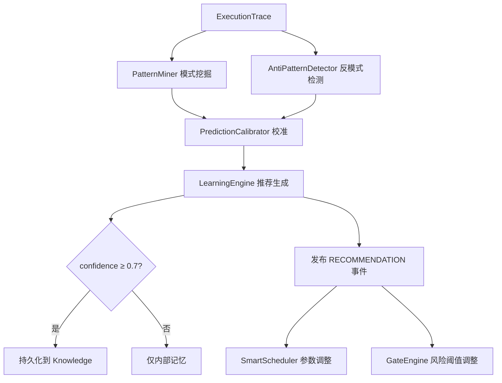

# 自学习与推荐

> harness-cook 的「**经验积累**」——失败模式挖掘、反模式检测、预测校准、推荐推送

**快速导航**：[📖 原理（本页）](#原理) · [🎓 使用方法](/tutorial/basic-usage) · [🏃 可运行 Demo](/demo/learning-scheduler)

---

## 原理

### 自学习闭环

LearningEngine 集成 PatternMiner、AntiPatternDetector、PredictionCalibrator 三大组件，形成闭环：**失败模式挖掘 → 反模式检测 → 预测校准 → 推荐推送 → Scheduler/Gate 反馈**。

### 失败模式挖掘

PatternMiner 从 ExecutionTrace 中挖掘三类模式：
- **failure_patterns**——频繁失败的任务模式（如"修改 A 总是导致 B 测试失败"）
- **resource_waste**——资源浪费模式（如"小任务用了 PREMIUM 模型"）
- **success_patterns**——成功模式（如"先测试再编码"成功率 95%）

### 反模式检测

AntiPatternDetector 检测 trace 中的反模式，生成 Recommendation 列表。结合 token 预算，识别高 token 消耗但低产出的任务。

### 预测校准

PredictionCalibrator 根据历史执行数据校准预测——逐步提高预测准确度，避免推荐偏离实际。

### 推荐推送与反馈

LearningEngine.learn() 执行后，高置信度推荐（confidence ≥ 0.7）自动持久化到 Knowledge 模块；同时通过 EventBus 发布 RECOMMENDATION 事件，SmartScheduler 和 GateEngine 可接收并调整参数。

```python
from harness.learning import LearningEngine, PatternMiner, AntiPatternDetector
from harness.learning import PredictionCalibrator, ExperienceStore

# 创建学习引擎
store = ExperienceStore()
miner = PatternMiner()
detector = AntiPatternDetector()
calibrator = PredictionCalibrator()
engine = LearningEngine(
    pattern_miner=miner,
    anti_pattern_detector=detector,
    prediction_calibrator=calibrator,
    experience_store=store,
)

# 从执行轨迹学习
from harness.learning import ExecutionTrace
trace = ExecutionTrace(
    task="fix-login-bug",
    agent_id="coder",
    outcome="success",
    duration_ms=5000,
    tokens_used=2000,
    files_changed=["src/auth.py"],
    test_results={"passed": 8, "failed": 0},
)
recommendations = engine.learn(trace)

# 查看学习统计
stats = store.stats()
print(f"总轨迹: {stats.total_traces}")
print(f"总模式: {stats.total_patterns}")
print(f"成功率: {stats.success_rate}")
```

### 核心概念

| 类 | 职责 |
|----|------|
| PatternMiner | 模式挖掘——failure/resource_waste/success 三类 |
| AntiPatternDetector | 反模式检测——生成 Recommendation |
| PredictionCalibrator | 预测校准——根据历史调整预测 |
| LearningEngine | 学习引擎——闭环集成三大组件 |
| ExperienceStore | 经验存储——轨迹+模式持久化 |
| Recommendation | 推荐记录——类型+置信度+建议 |
| ExecutionTrace | 执行轨迹——任务执行的完整记录 |

### 学习闭环流程



<details>
<summary>ASCII 原图</summary>

```
ExecutionTrace → PatternMiner 模式挖掘
                → AntiPatternDetector 反模式检测
                → PredictionCalibrator 校准
                → LearningEngine 推荐生成
                  → confidence ≥ 0.7 → 持久化到 Knowledge
                  → confidence < 0.7 → 仅内部记忆
                → 发布 RECOMMENDATION 事件
                  → SmartScheduler 参数调整
                  → GateEngine 风险阈值调整
```
</details>

### 与其他模块协作

| 协作模块 | 方式 |
|----------|------|
| Knowledge | 高置信度推荐持久化为知识条目 |
| SmartScheduler | RECOMMENDATION 事件→调度参数调整 |
| GateEngine | RECOMMENDATION 事件→风险阈值调整 |
| EventBus | RECOMMENDATION 事件发布 |

---

## 配置

### Profile YAML 配置

```yaml
learning:
  enabled: true              # 开启自学习
  interval: 10               # 每10次任务后执行一次学习
  confidence_threshold: 0.7  # 推荐持久化的置信度阈值
```

---

更多配置细节见 [基础用法教程](/tutorial/basic-usage)，可运行 Demo 见 [学习+调度 Demo](/demo/learning-scheduler)。
