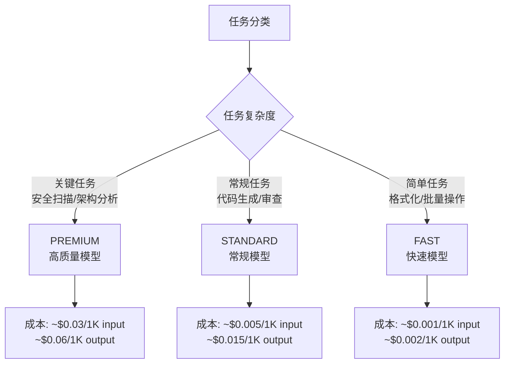

# Agent 调用分层路由

> Agent 资源使用的约束与追踪——通过 ModelTier 三级分层建议 Agent 平台选择合适的模型，LLMConstraints 约束行为边界，TokenTracker 审计成本。

**快速导航**：[📖 原理（本页）](#原理) · [🎓 使用方法](/tutorial/llm-tiering) · [📖 相关](/guide/constraints) · [📖 相关](/guide/audit-layer)

---

## 原理

### 定位边界

harness-cook 对接的是 Agent 平台（Claude Code / Hermes），**不直接调度 LLM**。Agent 平台自己管 LLM 调度、熔断、路由，harness 只需：

- **建议分级**：ModelTier 建议使用哪个质量级别
- **约束边界**：LLMConstraints 约束 Agent 的资源使用上限
- **审计追踪**：TokenTracker 记录 Agent 平台报告的 token 使用数据

已移除（定位偏移）：ILLMProvider / LLMDispatcher / CircuitBreaker / ModelRouter——LLM 调度是 Agent 平台职责，不应由 harness 直接管控。

### ModelTier 三级分层



<details>
<summary>ASCII 原图 — ModelTier 分层</summary>

```
                    ModelTier 分层路由

    任务分类 ──→ 任务复杂度 ──→ 建议分级 ──→ 成本估算

    关键任务（安全扫描、架构分析）──→ PREMIUM ──→ $0.03/1K input, $0.06/1K output
    常规任务（代码生成、审查）───────→ STANDARD ──→ $0.005/1K input, $0.015/1K output
    简单任务（格式化、批量操作）───→ FAST ──→ $0.001/1K input, $0.002/1K output

    设计原则：
      - harness 不直接调度 LLM，只建议分级
      - 最终决策权在 Agent 平台
      - 降级策略：PREMIUM → STANDARD → FAST（失败时逐级降级）
```
</details>

| 分级 | ModelTier | 适用场景 | 成本（每 1K token） |
|------|-----------|---------|---------------------|
| 高质量 | `PREMIUM` | 关键任务：安全扫描、架构分析、生产部署验证 | input: $0.03, output: $0.06 |
| 常规 | `STANDARD` | 大多数任务：代码生成、审查、合规扫描 | input: $0.005, output: $0.015 |
| 快速 | `FAST` | 简单任务：格式化、批量操作、低优先级后台任务 | input: $0.001, output: $0.002 |

### LLMConstraints 约束验证

LLMConstraints 定义 Agent 的资源使用边界——7 个约束维度：

| 约束维度 | 字段 | 类型 | 说明 |
|---------|------|------|------|
| Token 上限 | `max_tokens` | Optional[int] | 单次调用 token 上限 |
| 上下文上限 | `max_context_tokens` | Optional[int] | 总上下文 token 上限 |
| 温度约束 | `temperature` | Optional[float] | 温度参数上限（范围 0.0-1.0） |
| 模型分级 | `tier` | ModelTier | 建议使用的模型分级（默认 STANDARD） |
| 模型白名单 | `allowed_models` | Optional[List[str]] | 只允许这些模型 |
| 模型黑名单 | `blocked_models` | Optional[List[str]] | 不允许这些模型 |
| 重试/超时 | `max_retries` / `timeout` | int | 最大重试次数 / 单次调用超时（秒） |

约束验证方法：

```python
constraints = LLMConstraints(
    max_tokens=4000,
    temperature=0.7,
    tier=ModelTier.STANDARD,
    allowed_models=["claude-sonnet", "claude-haiku"],
    blocked_models=["claude-opus"],
    degrade_on_failure=True,           # 失败时建议降级
)

# 验证模型是否在允许范围
constraints.validate_model("claude-sonnet")  # → True
constraints.validate_model("claude-opus")    # → False（在黑名单）

# 验证温度参数
constraints.validate_temperature(0.5)   # → True（0 ≤ 0.5 ≤ 0.7）
constraints.validate_temperature(0.9)   # → False（0.9 > 0.7）

# 约束概要
constraints.summary()
# "Token上限=4000 | 温度≤0.7 | 建议分级=standard | 白名单=2个 | 黑名单=1个 | 失败降级=开启"
```

### TokenTracker 成本追踪与预算控制

TokenTracker 追踪 Agent 的 token 消耗，用于审计和预算控制——**不直接调度 LLM**，只记录 Agent 平台报告的数据。

#### 分级价格表

```python
TIER_PRICES: Dict[ModelTier, Dict[str, float]] = {
    ModelTier.PREMIUM:  {"input": 0.03, "output": 0.06},
    ModelTier.STANDARD: {"input": 0.005, "output": 0.015},
    ModelTier.FAST:     {"input": 0.001, "output": 0.002},
}
```

#### TokenUsageRecord 单次记录

```python
@dataclass
class TokenUsageRecord:
    model_tier: ModelTier              # 使用的模型分级
    model_name: Optional[str] = None   # 具体模型名（如 "claude-sonnet"）
    input_tokens: int = 0              # 输入 token 数
    output_tokens: int = 0             # 输出 token 数
    total_tokens: int = 0              # 总 token 数（自动计算）
    cost_estimate: float = 0.0         # 成本估算（美元，自动计算）
    latency_ms: int = 0                # 调用延迟
    timestamp: Optional[str] = None    # 记录时间戳（自动填充）
```

#### 预算控制

```python
tracker = TokenTracker()

# 记录 Agent 平台报告的 token 使用
tracker.record(TokenUsageRecord(
    model_tier=ModelTier.STANDARD,
    model_name="claude-sonnet",
    input_tokens=500,
    output_tokens=200,
))

# 检查是否超出约束上限
constraints = LLMConstraints(max_tokens=10000)
tracker.check_over_limit(constraints)  # → False（还在预算内）
```

#### 使用统计

```python
tracker.summary()
# {
#   "total_cost": 0.0040,              # 总成本（美元）
#   "total_calls": 5,                  # 总调用次数
#   "tier_breakdown": {
#     "standard": {"calls": 3, "total_tokens": 2100},
#     "fast": {"calls": 2, "total_tokens": 800},
#   },
# }
```

### PromptTemplate 提示词参数化

```python
@dataclass
class PromptTemplate:
    name: str                           # 模板名称
    template: str                       # 模板文本，用 {variable} 引用变量
    variables: List[str] = [...]        # 模板变量名列表
    tier: ModelTier = ModelTier.STANDARD  # 建议使用的分级

    def render(self, **kwargs) -> str:
        """渲染模板——替换变量"""
        result = self.template
        for var in self.variables:
            value = kwargs.get(var, "")
            result = result.replace(f"{{{var}}}", str(value))
        return result
```

### 与 AgentConstraints 协作

LLMConstraints 与 AgentConstraints（行为约束）互补：

- **AgentConstraints**：约束 Agent 的行为边界（文件范围、变更数量、命令白名单）
- **LLMConstraints**：约束 Agent 的资源边界（token 预算、温度、模型黑白名单）

两者共同定义 Agent 的完整约束框架。

---

## 配置

### 创建 LLMConstraints

```python
from harness.llm import LLMConstraints, ModelTier

# 无约束——自由使用
constraints = LLMConstraints()

# 严格约束——生产环境
constraints = LLMConstraints(
    max_tokens=4000,
    temperature=0.7,
    tier=ModelTier.PREMIUM,
    allowed_models=["claude-sonnet", "claude-haiku"],
    blocked_models=["claude-opus"],
    max_retries=3,
    timeout=120,
    degrade_on_failure=True,     # 失败时建议降级
)

# 宽松约束——开发环境
constraints = LLMConstraints(
    tier=ModelTier.STANDARD,
    max_tokens=8000,
    degrade_on_failure=False,    # 不降级，失败就失败
)
```

### TokenTracker 使用

```python
from harness.llm import TokenTracker, TokenUsageRecord, ModelTier, get_tracker

# 使用全局追踪器
tracker = get_tracker()

# 或创建独立追踪器
tracker = TokenTracker()

# 记录 Agent 平台报告的 token 使用
tracker.record(TokenUsageRecord(
    model_tier=ModelTier.STANDARD,
    model_name="claude-sonnet",
    input_tokens=500,
    output_tokens=200,
    latency_ms=1500,
))

# 预算检查
over_limit = tracker.check_over_limit(constraints)

# 统计报告
stats = tracker.summary()
```

### PromptTemplate 使用

```python
from harness.llm import PromptTemplate, ModelTier

template = PromptTemplate(
    name="code-review",
    template="请审查以下代码变更:\n{diff}\n关注点: {focus}",
    variables=["diff", "focus"],
    tier=ModelTier.PREMIUM,
)

prompt = template.render(diff="src/main.py changed", focus="安全漏洞")
```

### Profile YAML 配置

```yaml
llm:
  tier: standard                           # premium / standard / fast（默认建议分级）
  constraints:
    max_tokens: 4000                       # 单次调用 token 上限
    max_context_tokens: 8000               # 总上下文 token 上限
    temperature: 0.7                       # 温度参数上限
    allowed_models: [claude-sonnet, claude-haiku]  # 模型白名单
    blocked_models: [claude-opus]           # 模型黑名单
    max_retries: 3                         # 最大重试次数
    timeout: 120                           # 单次调用超时（秒）
    degrade_on_failure: true               # 失败时建议降级
  token_tracker:
    enabled: true                          # 是否启用 token 追踪
    prices:                                # 分级价格（可覆盖默认值）
      premium: {input: 0.03, output: 0.06}
      standard: {input: 0.005, output: 0.015}
      fast: {input: 0.001, output: 0.002}
  prompt_templates:
    code-review:                           # 提示词模板
      tier: premium
      variables: [diff, focus]
```

---

更多配置细节见 [LLM 分层教程](/tutorial/llm-tiering)，行为约束见 [约束指南](/guide/constraints)，审计追溯见 [审计层指南](/guide/audit-layer)。
