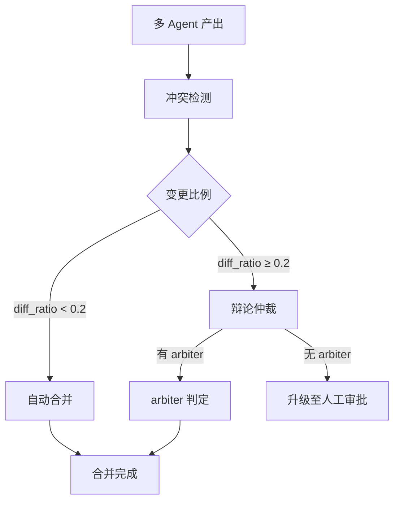

# 多 Agent 协商

> harness-cook 的「**冲突化解**」——多 Agent 文件冲突检测、自动合并、辩论仲裁

**快速导航**：[📖 原理（本页）](#原理) · [🎓 使用方法](/tutorial/basic-usage) · [🏃 可运行 Demo](/demo/negotiation)

---

## 原理

### 冲突检测

ConflictDetector 扫描多 Agent 的产出物列表，发现文件级冲突——即多个 Agent 修改同一文件的情况。

### 自动合并

当冲突文件的变更比例低于阈值（默认 20%，即 diff_ratio < 0.2）时，NegotiationEngine 自动合并两方变更。

### 辩论仲裁

变更比例超过自动合并阈值时，双方提交理由（rationale），由 arbiter Agent 判断优劣并选择一方变更。

### 人工升级

无仲裁者或辩论无法解决时，升级至人工审批（escalate）。

```python
from harness.negotiation import NegotiationEngine

engine = NegotiationEngine()

# 检测并解决冲突
agent_artifacts = {
    "agent-A": ["src/main.py", "config.yaml"],
    "agent-B": ["src/main.py", "tests/test_main.py"],
}
conflicts = engine.negotiate(agent_artifacts)

for conflict in conflicts:
    print(f"文件: {conflict.file_path}")
    print(f"解决策略: {conflict.resolution}")
```

### 核心概念

| 类 | 职责 |
|----|------|
| ConflictDetector | 文件冲突检测 |
| NegotiationEngine | 冲突解决引擎 |
| FileConflict | 冲突描述（文件、涉及 Agent、变更比例） |
| Resolution | 解决结果（auto_merge/arbitrate/escalate） |

### 协商流程



<details>
<summary>ASCII 原图</summary>

```
多 Agent 产出 → 冲突检测 → 变更比例判断
  → diff_ratio < 0.2 → 自动合并
  → diff_ratio ≥ 0.2 → 辩论仲裁
    → 有 arbiter → arbiter 判定 → 合并完成
    → 无 arbiter → 升级至人工审批
```
</details>

### 与 DAGEngine 协作

| 场景 | 协作方式 |
|------|---------|
| 并行层执行后 | DAGEngine 调用 NegotiationEngine.negotiate() |
| 冲突解决 | 合并结果写回节点产出 |

---

## 配置

### Profile YAML 配置

```yaml
negotiation:
  auto_merge_threshold: 0.2    # 自动合并的 diff 比例阈值
  arbiter_agent: "reviewer"    # 仲裁者 Agent 名称
  escalate_on_failure: true    # 谈判失败时升级至人工
```

---

更多配置细节见 [基础用法教程](/tutorial/basic-usage)，可运行 Demo 见 [协商 Demo](/demo/negotiation)。
