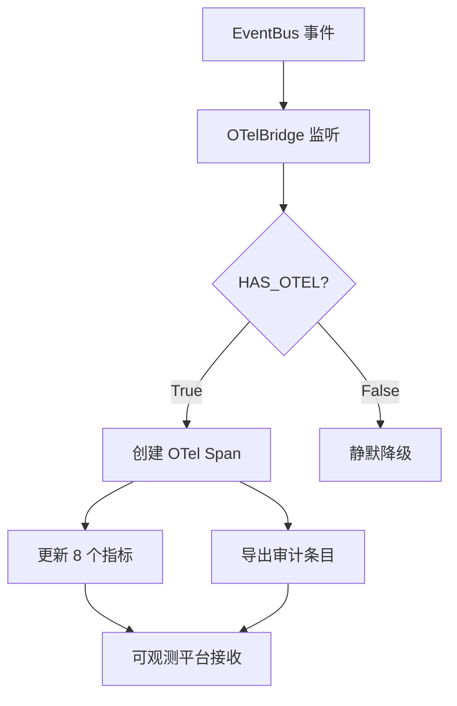

# OTel 集成

> harness-cook 的「**可观测桥梁**」——OTel Span/指标自动采集、审计条目导出

**快速导航**：[📖 原理（本页）](#原理) · [🎓 使用方法](/tutorial/audit-usage) · [🏃 可运行 Demo](/demo/audit-backends)

---

## 原理

### OTel Span 自动采集

OTelBridge 监听 EventBus 事件，自动创建 OpenTelemetry Span：
- **attach_to_engine(DAGEngine)**——挂钩 DAGEngine，为每次 DAG 执行创建 Span
- **attach_to_audit_engine(AuditEngine)**——挂钩 AuditEngine，为审计事件创建 Span

### 8 个 OTel 指标

| 指标名 | 类型 | 说明 |
|--------|------|------|
| harness.workflow.duration | Histogram | 工作流执行时间（毫秒） |
| harness.workflow.node.duration | Histogram | 节点执行时间（毫秒） |
| harness.workflow.node.count | Counter | 节点执行次数 |
| harness.workflow.node.error | Counter | 节点错误次数 |
| harness.gate.check.count | Counter | 门禁检查次数 |
| harness.gate.check.passed | Counter | 门禁通过次数 |
| harness.gate.check.failed | Counter | 门禁失败次数 |
| harness.agent.tokens.used | Counter | Agent 消耗的 token 数 |

### HAS_OTEL 标志

OTelBridge 通过 HAS_OTEL 标志判断 opentelemetry 是否已安装：
- `HAS_OTEL = True`——启用 Span 和指标采集
- `HAS_OTEL = False`——tracing 禁用，功能静默降级（不影响核心功能）

### 审计条目导出

export_audit_entry() 将 AuditEntry 导出为 OTel Span 格式，兼容 Traceloop 等可观测平台。

```python
from harness.otel_integration import OTelBridge, OTelConfig

# 创建 OTel 桥接
bridge = OTelBridge(config=OTelConfig(
    service_name="harness-cook",
    export_endpoint="http://localhost:4317",
))

# 挂钩 DAGEngine
from harness.engine import DAGEngine
dag_engine = DAGEngine()
bridge.attach_to_engine(dag_engine)

# 挂钩 AuditEngine
from harness.audit import AuditEngine
audit_engine = AuditEngine()
bridge.attach_to_audit_engine(audit_engine)

# 导出审计条目
from harness.types import AuditEntry
entry = AuditEntry(
    task="fix-login-bug",
    agent_id="coder",
    decisions=["修改 auth.py"],
)
bridge.export_audit_entry(entry)

# 检查 OTel 是否可用
from harness.otel_integration import HAS_OTEL
print(f"OTel 可用: {HAS_OTEL}")
```

### 核心概念

| 类 | 职责 |
|----|------|
| OTelBridge | OTel 桥接——Span 创建 + 指标采集 + 导出 |
| OTelConfig | OTel 配置——service_name + export_endpoint |
| HAS_OTEL | 标志——opentelemetry 是否已安装 |

### OTel 集成流程



<details>
<summary>ASCII 原图</summary>

```
EventBus 事件 → OTelBridge 监听 → HAS_OTEL?
  → True → 创建 OTel Span
    → 更新 8 个指标
    → 导出审计条目
    → 可观测平台接收
  → False → 静默降级
```
</details>

### 与其他模块协作

| 协作模块 | 方式 |
|----------|------|
| DAGEngine | attach_to_engine() 为 DAG 执行创建 Span |
| AuditEngine | attach_to_audit_engine() 为审计创建 Span |
| EventBus | 监听 WORKFLOW_START/COMPLIANCE_CHECK 等事件 |

---

## 配置

### Profile YAML 配置

```yaml
otel:
  service_name: harness-cook       # 服务名
  export_endpoint: ""              # OTel 导出端点（空=不导出）
  enabled: true                    # 启用 OTel 集成
```

---

更多配置细节见 [审计使用教程](/tutorial/audit-usage)，可运行 Demo 见 [审计后端 Demo](/demo/audit-backends)。
