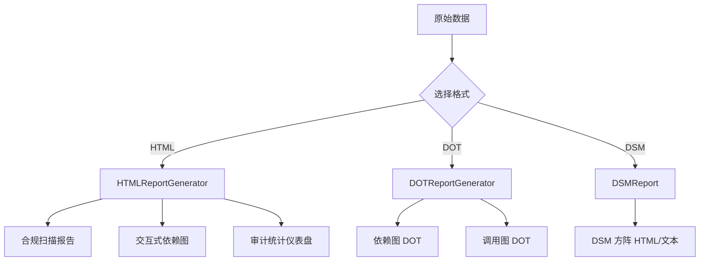

# 可视化报告

> harness-cook 的「**可视输出**」——HTML 自包含报告、DOT 依赖图、DSM 方阵三种格式

**快速导航**：[📖 原理（本页）](#原理) · [🎓 使用方法](/tutorial/basic-usage) · [🏃 可运行 Demo](/demo/knowledge-rule-report)

---

## 原理

### 三种报告格式

harness-cook 提供三种可视化报告格式，覆盖不同使用场景：

| 格式 | 说明 | 适用场景 |
|------|------|---------|
| HTML 自包含 | 内嵌 CSS/JS，单文件可打开 | 交互式浏览、邮件分享 |
| Graphviz DOT | 标准图描述语言 | 依赖图/调用图可视化 |
| DSM 方阵 | 依赖结构矩阵 | 架构分析、耦合度评估 |

### HTML 自包含报告

HTMLReportGenerator 生成三种 HTML 报告：
- **generate_compliance_report()**——合规扫描报告，列出违规项和统计
- **generate_dependency_graph()**——交互式依赖图，支持点击导航
- **generate_audit_dashboard()**——审计统计仪表盘，图表展示趋势

HTML 报告内嵌 CSS/JS，无需额外依赖，浏览器直接打开即可浏览。

### DOT 依赖图

DOTReportGenerator 生成两种 Graphviz DOT 文件：
- **generate_dependency_dot()**——文件依赖关系图
- **generate_call_graph_dot()**——函数调用关系图

DOT 文件可通过 Graphviz 工具（`dot` 命令）渲染为 PNG/SVG 等格式。

### DSM 方阵报告

DSMReport 生成依赖结构矩阵（Dependency Structure Matrix），展示模块间的耦合关系：
- **generate_dsm(dep_graph, output_format="html")**——支持 HTML 和纯文本输出
- DSM 方阵中行列交叉点表示依赖关系，便于识别循环依赖和过度耦合

```python
from harness.report import (
    HTMLReportGenerator, DOTReportGenerator, DSMReport,
)

# HTML 合规扫描报告
html_gen = HTMLReportGenerator()
html_report = html_gen.generate_compliance_report(
    results=[{"rule": "security", "violations": [...]}],
    title="合规扫描报告",
)
# html_report → 自包含 HTML 字符串

# HTML 交互式依赖图
dep_graph_html = html_gen.generate_dependency_graph(
    graph=dependency_graph,
    title="项目依赖图",
)

# HTML 审计仪表盘
dashboard_html = html_gen.generate_audit_dashboard(
    audit_data=[...],
    title="审计统计仪表盘",
)

# DOT 依赖图
dot_gen = DOTReportGenerator()
dot_dependency = dot_gen.generate_dependency_dot(
    graph=dependency_graph,
)
dot_call_graph = dot_gen.generate_call_graph_dot(
    call_graph=call_graph_data,
)

# DSM 方阵报告
dsm = DSMReport()
dsm_html = dsm.generate_dsm(
    dep_graph=dependency_graph,
    output_format="html",
)
```

### 核心概念

| 类 | 职责 |
|----|------|
| HTMLReportGenerator | HTML 报告——合规/依赖/审计 |
| DOTReportGenerator | DOT 报告——依赖图/调用图 |
| DSMReport | DSM 方阵——依赖结构矩阵 |

### 报告生成流程



<details>
<summary>ASCII 原图</summary>

```
原始数据 → 选择格式
  → HTML → HTMLReportGenerator
    → 合规扫描报告
    → 交互式依赖图
    → 审计统计仪表盘
  → DOT → DOTReportGenerator
    → 依赖图 DOT
    → 调用图 DOT
  → DSM → DSMReport
    → DSM 方阵 HTML/文本
```
</details>

### 与其他模块协作

| 协作模块 | 方式 |
|----------|------|
| ComplianceEngine | 合规扫描结果 → HTML 合规报告 |
| FileImpactAnalyzer | DependencyGraph → DOT/DSM 报告 |
| AuditEngine | 审计数据 → HTML 审计仪表盘 |

---

## 配置

### Profile YAML 配置

```yaml
report:
  default_format: html         # 默认报告格式: html/dot/dsm
  output_dir: "./reports"     # 报告输出目录
  include_css: true           # HTML 报告内嵌 CSS
  include_js: true            # HTML 报告内嵌 JS
```

---

更多配置细节见 [基础用法教程](/tutorial/basic-usage)，可运行 Demo 见 [知识/规则/报告 Demo](/demo/knowledge-rule-report)。
