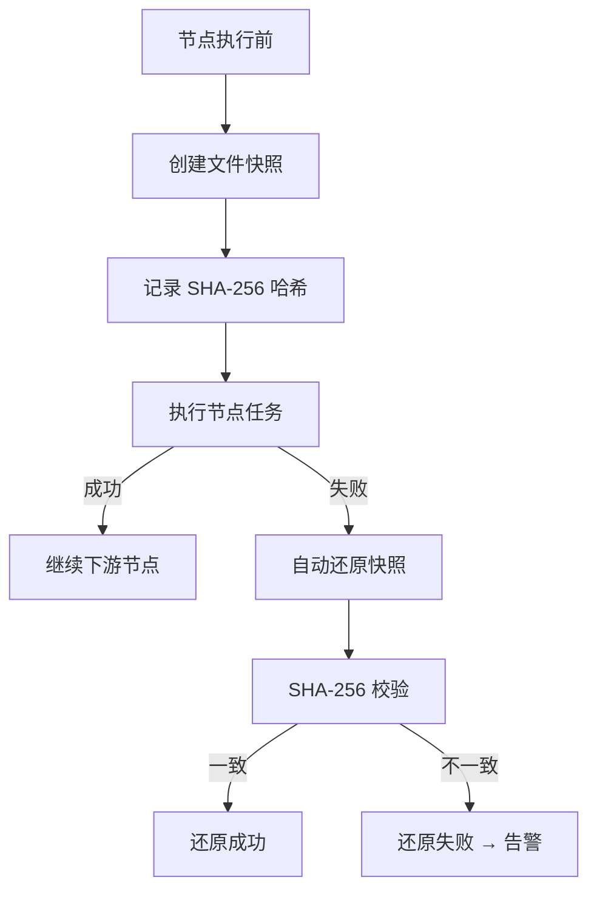

# 自动回滚

> harness-cook 的「**后悔药**」——文件快照、SHA-256 校验、一键还原

**快速导航**：[📖 原理（本页）](#原理) · [🎓 使用方法](/tutorial/downgrade-rollback) · [🏃 可运行 Demo](/demo/downgrade-rollback)

---

## 原理

### 文件快照

节点执行前，RollbackEngine 自动创建文件快照——记录每个文件的路径、内容、SHA-256 哈希值。快照确保项目状态可在失败时精确还原。

### SHA-256 校验

还原快照时校验文件哈希一致性，确保快照未被篡改或损坏。校验失败则拒绝还原。

### 一键还原

节点执行失败时，RollbackEngine 自动恢复所有相关文件到快照状态。也支持手动调用 `restore_snapshot()` 精确还原指定快照。

### TTL 清理

7 天 TTL + 100 快照上限自动清理历史快照，避免磁盘占用过大。用户可自定义 TTL 和上限。

### 程序化调用

除自动回滚外，RollbackEngine 支持手动创建、恢复、验证、清理快照——适用于调试或特殊场景。

```python
from harness.rollback import RollbackEngine, get_rollback_engine

engine = get_rollback_engine()

# 创建快照
snapshot = engine.create_snapshot(
    execution_id="exec-1",
    node_id="node-A",
    file_paths=["src/main.py", "config.yaml"],
)

# 还原快照
result = engine.restore_snapshot(snapshot.id)   # → RollbackResult

# 验证快照
verify = engine.verify_snapshot(snapshot.id)     # → VerifyResult

# 清理历史快照
cleaned = engine.cleanup_snapshots(ttl_seconds=604800, max_snapshots=100)
```

### 核心概念

| 类 | 职责 |
|----|------|
| RollbackSnapshot | 单文件快照（路径+内容+SHA-256） |
| SnapshotSet | 一组快照（一个节点所有文件） |
| RollbackResult | 回滚结果（成功/失败+还原文件列表） |
| VerifyResult | 验证结果（哈希是否一致） |
| RollbackEngine | 快照管理引擎（创建/恢复/验证/清理） |

### 回滚流程



<details>
<summary>ASCII 原图</summary>

```
节点执行前 → 创建文件快照 → 记录 SHA-256 哈希 → 执行节点任务
  → 成功 → 继续下游节点
  → 失败 → 自动还原快照 → SHA-256 校验
    → 一致 → 还原成功
    → 不一致 → 还原失败 → 告警
```
</details>

### 与 DAGEngine 协作

| 场景 | 协作方式 |
|------|---------|
| 节点执行前 | DAGEngine 调用 create_snapshot() |
| 节点失败后 | DAGEngine 调用 restore_snapshot() |
| 定期清理 | cleanup_snapshots() 按配置自动触发 |

---

## 配置

### Profile YAML 配置

```yaml
rollback:
  enabled: true                # 启用自动回滚
  snapshot_dir: ~/.harness/rollback  # 快照存储目录
  ttl_seconds: 604800          # 快照 TTL（7天）
  max_snapshots: 100           # 最大快照数量
```

---

更多配置细节见 [降级回滚教程](/tutorial/downgrade-rollback)，可运行 Demo 见 [降级+回滚 Demo](/demo/downgrade-rollback)。
