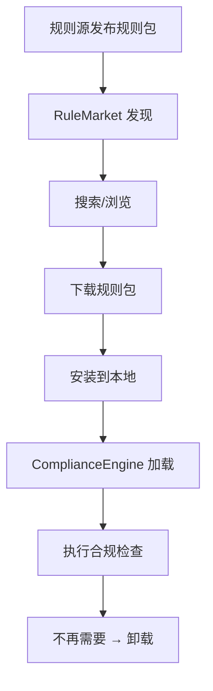

# 规则市场

> harness-cook 的「**规则生态**」——社区规则包发现、下载、安装、上传

**快速导航**：[📖 原理（本页）](#原理) · [🎓 使用方法](/tutorial/basic-usage) · [🏃 可运行 Demo](/demo/knowledge-rule-report)

---

## 原理

### 规则包生态

RuleMarket 提供规则包的发现、下载、安装、上传、搜索能力——让合规规则包像 npm 包一样可分享和复用。

### 规则包元数据

RulePackMetadata 描述规则包的核心信息：
- **name**——规则包名称
- **version**——版本号
- **author**——作者
- **description**——描述
- **category**——分类（security/privacy/coding/devops 等）
- **tags**——标签列表
- **download_count**——下载次数
- **rating**——评分

### 本地安装与卸载

- `install(pack_name)`——安装规则包到本地
- `uninstall(pack_name)`——卸载已安装的规则包
- `list_installed()`——列出已安装的规则包

### 搜索与发现

- `list_available()`——列出可用规则包
- `search(query, category=None)`——关键词+分类搜索
- `add_source(url)` / `remove_source(url)`——添加/移除规则源
- `list_sources()`——列出当前配置的规则源

> ⚠️ **注意**：`download()` 和 `sync()` 当前为 stub 实现，远程下载功能尚未完成。本地安装和搜索功能已可用。

```python
from harness.rule_market import RuleMarket, RulePackMetadata

# 创建规则市场
market = RuleMarket()

# 列出可用规则包
available = market.list_available()
for pack in available:
    print(f"{pack.name} v{pack.version} by {pack.author}")

# 搜索规则包
results = market.search(query="security", category="security")
for pack in results:
    print(f"{pack.name}: {pack.description}")

# 安装规则包
market.install("security-advanced")

# 列出已安装
installed = market.list_installed()
print(f"已安装规则包: {installed}")

# 卸载规则包
market.uninstall("security-advanced")

# 添加规则源
market.add_source("https://rules.example.com/api")
market.remove_source("https://rules.example.com/api")

# 列出规则源
sources = market.list_sources()
print(f"规则源: {sources}")

# 规则包元数据
meta = RulePackMetadata(
    name="security-advanced",
    version="1.2.0",
    author="harness-team",
    description="高级安全规则包",
    category="security",
    tags=["security", "advanced", "owasp"],
)
print(meta.to_dict())
```

### 核心概念

| 类 | 职责 |
|----|------|
| RuleMarket | 规则市场——发现/安装/搜索/上传 |
| RulePackMetadata | 规则包元数据——name/version/author/tags |

### 规则包生命周期



<details>
<summary>ASCII 原图</summary>

```
规则源发布规则包 → RuleMarket 发现
→ 搜索/浏览 → 下载规则包 → 安装到本地
→ ComplianceEngine 加载 → 执行合规检查
→ 不再需要 → 卸载
```
</details>

### 与其他模块协作

| 协作模块 | 方式 |
|----------|------|
| ComplianceEngine | install() 的规则包可被 ComplianceEngine.load_pack() 加载 |
| ConfigSystem | compliance_packs 配置指定默认加载规则包 |
| EngineBus | 规则包通过引擎集成总线接入合规引擎 |

---

## 配置

### Profile YAML 配置

```yaml
rule_market:
  sources:                    # 规则源列表
    - "https://rules.example.com/api"
  auto_update: false          # 自动更新规则包
```

---

更多配置细节见 [基础用法教程](/tutorial/basic-usage)，可运行 Demo 见 [知识/规则/报告 Demo](/demo/knowledge-rule-report)。
