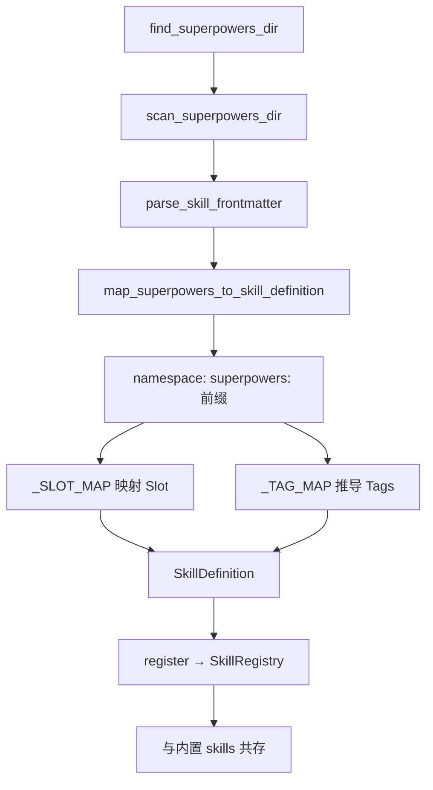

# Superpowers Bridge

> harness-cook 的「**Skill 桥接**」——Superpowers 插件 Skill 发现、映射、注册到 Harness SkillRegistry

**快速导航**：[📖 原理（本页）](#原理) · [🎓 使用方法](/tutorial/superpowers-skill-bridge) · [🏃 可运行 Demo](/demo/superpowers-bridge)

---

## 原理

### 两套体系融合

Superpowers Bridge 将 Claude Code superpowers 插件的 Skills 发现并注册到 harness SkillRegistry：
- **superpowers skills**：YAML frontmatter (name, description) + skill.md 内容
- **harness SkillDefinition**：id, name, description, slot, tags, entry_point, metadata

### 四步流程

1. **发现**——`scan_superpowers_dir()` 扫描插件目录下的 skill.md 文件
2. **解析**——`parse_skill_frontmatter()` 解析 YAML frontmatter 获取 name/description
3. **映射**——`map_superpowers_to_skill_definition()` 将 skill 映射为 SkillDefinition
4. **注册**——`register_superpowers_skills()` 批量注册到 SkillRegistry

### 命名空间隔离

superpowers skills 使用 `superpowers:` 前缀，避免与 harness 内置 skills ID 冲突。例如：
- brainstorming → `superpowers:brainstorming`
- systematic-debugging → `superpowers:systematic-debugging`

即使 skill 名称冲突也不会覆盖——namespace 隔离确保两套体系共存。

### Slot 映射

基于 superpowers skill 的语义分类，映射到 harness SkillSlotName：

| Superpowers Skill | 映射 Slot | 说明 |
|-------------------|-----------|------|
| brainstorming | PRE_EXECUTE | 执行前的规划阶段 |
| writing-plans | PRE_EXECUTE | 执行前的计划编写 |
| test-driven-development | PRE_EXECUTE | 执行前的 TDD 循环 |
| subagent-driven-development | PRE_EXECUTE | 执行前的任务分解 |
| dispatching-parallel-agents | PRE_EXECUTE | 执行前的并行分发 |
| executing-plans | PRE_EXECUTE | 执行计划 |
| using-git-worktrees | PRE_EXECUTE | 工作树准备 |
| writing-skills | PRE_EXECUTE | 创建 skill |
| verification-before-completion | POST_EXECUTE | 完成后验证 |
| receiving-code-review | POST_EXECUTE | 完成后审查 |
| requesting-code-review | POST_EXECUTE | 完成后审查请求 |
| finishing-a-development-branch | POST_EXECUTE | 分支完成 |
| systematic-debugging | ON_ERROR | 调试异常 |
| using-superpowers | SESSION_START | 会话初始化 |

未在映射表中的 superpowers skill 默认映射到 PRE_EXECUTE。

### 自动定位插件目录

find_superpowers_dir() 自动定位 superpowers 插件目录：
1. `~/.claude/plugins/cache/claude-plugins-official/superpowers/<version>/skills/`
2. `HARNESS_SUPERPOWERS_DIR` 环境变量

```python
from harness.superpowers_bridge import (
    register_superpowers_skills,
    scan_superpowers_dir,
    parse_skill_frontmatter,
    find_superpowers_dir,
    map_superpowers_to_skill_definition,
)
from harness.skill_registry import SkillRegistry, SkillDefinition

# 一键注册所有 superpowers skills
registry = SkillRegistry()
registered = register_superpowers_skills(registry)
print(f"已注册 {len(registered)} 个 superpowers skills")

# 分步操作
superpowers_dir = find_superpowers_dir()
skills = scan_superpowers_dir(superpowers_dir)
for skill_name, skill_md_path, frontmatter in skills:
    defn = map_superpowers_to_skill_definition(
        skill_name, skill_md_path, frontmatter,
    )
    registry.register(defn)
    print(f"注册: {defn.id} → slot={defn.slot.value}")

# 查看 namespace 隲撞保护
all_skills = registry.list_all()
superpowers_skills = [s for s in all_skills if s.definition.id.startswith("superpowers:")]
builtin_skills = [s for s in all_skills if not s.definition.id.startswith("superpowers:")]
print(f"内置 skills: {len(builtin_skills)} 个（无前缀）")
print(f"Superpowers skills: {len(superpowers_skills)} 个（superpowers: 前缀）")
```

### 核心概念

| 类/函数 | 职责 |
|---------|------|
| scan_superpowers_dir() | 发现——扫描插件目录 skill.md |
| parse_skill_frontmatter() | 解析——提取 YAML frontmatter |
| map_superpowers_to_skill_definition() | 映射——skill → SkillDefinition |
| register_superpowers_skills() | 注册——批量注册到 SkillRegistry |
| find_superpowers_dir() | 定位——自动发现插件目录 |
| _SLOT_MAP | Slot 映射表——14 个 skill → SkillSlotName |
| _TAG_MAP | Tag 推导表——语义标签 |

### Superpowers Bridge 流程



<details>
<summary>ASCII 原图</summary>

```
find_superpowers_dir → scan_superpowers_dir → parse_skill_frontmatter
→ map_superpowers_to_skill_definition
  → namespace: superpowers: 前缀
  → _SLOT_MAP 映射 Slot
  → _TAG_MAP 推导 Tags
→ SkillDefinition → register → SkillRegistry → 与内置 skills 共存
```
</details>

### 与其他模块协作

| 协作模块 | 方式 |
|----------|------|
| SkillRegistry | superpowers skills 注册到同一 Registry |
| SkillSlots | Slot 映射后可在 skill-slots 体系中被调用 |
| DAGEngine | PRE_EXECUTE/POST_EXECUTE Slot 在 DAG 执行时调用 |
| ConfigSystem | skill_slots 配置可引用 superpowers skills |

---

## 配置

### Profile YAML 配置

```yaml
superpowers_bridge:
  enabled: true                # 启用 Superpowers Bridge
  auto_register: true          # 自动扫描并注册
  namespace: "superpowers"     # 前缀命名空间
```

---

更多配置细节见 [Superpowers Bridge 教程](/tutorial/superpowers-skill-bridge)，可运行 Demo 见 [Superpowers Bridge Demo](/demo/superpowers-bridge)。
