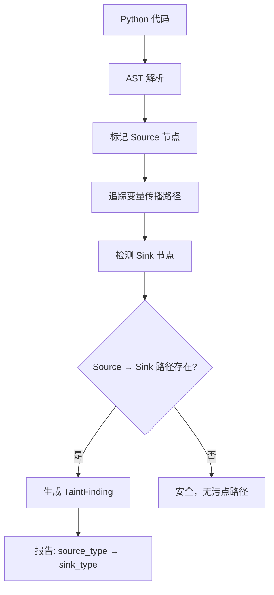

# 污点追踪

> harness-cook 的「**安全追凶**」——AST 级 source-to-sink 污点追踪、f-string SQL 特检

**快速导航**：[📖 原理（本页）](#原理) · [🎓 使用方法](/tutorial/compliance-scan) · [🏃 可运行 Demo](/demo/analysis)

---

## 原理

### Source-to-Sink 污点追踪

TaintTracker 基于 AST 分析实现 source-to-sink 污点追踪：标记数据从**污染源（source）**流入**危险操作（sink）**的路径，识别潜在安全漏洞。

### 6 种内置 Source

| TaintSourceType | 说明 | 典型模式 |
|-----------------|------|---------|
| USER_INPUT | 用户输入 | `input()`, `sys.argv` |
| ENV_VAR | 环境变量 | `os.environ` |
| FILE_READ | 文件读取 | `open().read()` |
| NETWORK | 网络输入 | `requests.get()` |
| DATABASE | 数据库输出 | `cursor.execute()` |
| COMMAND_ARG | 命令行参数 | `argparse.parse_args()` |

### 7 种内置 Sink

| TaintSinkType | 说明 | 典型模式 |
|---------------|------|---------|
| EVAL | eval/exec 调用 | `eval(var)` |
| SQL | SQL 执行 | `cursor.execute(sql)` |
| SUBPROCESS | 子进程调用 | `subprocess.call(cmd)` |
| OS_SYSTEM | 系统命令 | `os.system(cmd)` |
| NETWORK_SEND | 网络发送 | `requests.post(data)` |
| FILE_WRITE | 文件写入 | `open().write(data)` |
| DESERIALIZATION | 反序列化 | `pickle.loads(data)` |

### f-string SQL 特检

TaintTracker 特别检测 Python f-string 构造 SQL 的情况——`f"SELECT * FROM {table}"` 是 SQL 注入的高危模式，追踪器会标记 f-string 中的变量插值作为 source。

### 自定义 Source/Sink

支持传入自定义 sources 和 sinks 列表，扩展追踪覆盖范围。

```python
from harness.taint import (
    TaintTracker, TaintSource, TaintSink,
    TaintSourceType, TaintSinkType, TaintFinding,
)

# 基本污点追踪
code = '''
user_input = input("Enter name: ")
query = f"SELECT * FROM users WHERE name = '{user_input}'"
cursor.execute(query)
'''

tracker = TaintTracker()
findings = tracker.track_python(code, filepath="app.py")

for f in findings:
    print(f"Source: {f.source_type.value} at line {f.source_line}")
    print(f"Sink: {f.sink_type.value} at line {f.sink_line}")
    print(f"Variable: {f.source_var}")
    print(f"Description: {f.description}")
    print(f"Severity: {f.severity}")

# 自定义 Source/Sink
custom_sources = [
    TaintSource(
        type=TaintSourceType.USER_INPUT,
        pattern=r"request\.args\.get\(",
        description="Flask request parameter",
    ),
]
custom_sinks = [
    TaintSink(
        type=TaintSinkType.SQL,
        pattern=r"db\.execute\(",
        description="Custom DB execute",
    ),
]
findings = tracker.track_python(
    code, filepath="app.py",
    custom_sources=custom_sources,
    custom_sinks=custom_sinks,
)
```

### 核心概念

| 类 | 职责 |
|----|------|
| TaintTracker | 污点追踪引擎——AST 分析 + source-to-sink |
| TaintSource | 污染源定义——type + pattern + description |
| TaintSink | 危险操作定义——type + pattern + description |
| TaintFinding | 追踪发现——source→sink 路径记录 |
| TaintSourceType | Source 类型枚举——6 种 |
| TaintSinkType | Sink 类型枚举——7 种 |

### 污点追踪流程



<details>
<summary>ASCII 原图</summary>

```
Python 代码 → AST 解析 → 标记 Source 节点
→ 追踪变量传播路径 → 检测 Sink 节点
  → Source → Sink 路径存在 → 生成 TaintFinding
    → 报告: source_type → sink_type
  → 无路径 → 安全，无污点路径
```
</details>

### 与其他模块协作

| 协作模块 | 方式 |
|----------|------|
| ComplianceEngine | TaintFinding 作为合规违规报告 |
| DeclarativeRules | SQLInjectionChecker 与污点追踪互补 |
| DependencyGraph | 辅助跨文件污点传播分析 |

---

## 配置

### Profile YAML 配置

```yaml
taint_tracking:
  enabled: true              # 启用污点追踪
  custom_sources: []         # 自定义污染源（可选）
  custom_sinks: []           # 自定义危险操作（可选）
```

---

更多配置细节见 [合规扫描教程](/tutorial/compliance-scan)，可运行 Demo 见 [代码分析 Demo](/demo/analysis)。
