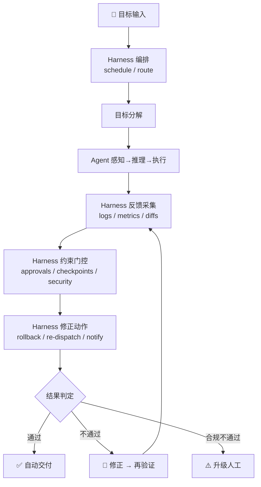

# 什么是 harness-cook

## 概述

harness-cook 是一个**Agent 治理集成总线**（Governance Integration Bus），致力于为 AI Agent 提供稳定约束与管控机制。

其核心理念可概括为一句：

> **harness-cook 不造发动机，造方向盘 + 仪表盘 + 刹车踏板。**

引擎委托给专业选手——护栏用 Guardrails AI / NeMo / Helicone，合规用 SonarQube / ArchUnit / dep-cruiser / OPA，审计用 Langfuse / Arize / Datadog / OTel。harness-cook 只做**总线 + 交付 + 策略框架**。

harness-cook **不是又一个 Agent 平台**，也不是护栏引擎、合规扫描平台或审计可观测平台——它是把这些引擎**吸收进来做下游引擎**的治理总线。用户不需要选"harness-cook or Guardrails AI"，他们选"harness-cook + Guardrails AI"——1+1 > 2。

---

## 为什么需要治理集成总线

当前 AI Agent 治理存在一个结构性缺陷：**每层都有专业引擎，但没有总线做组合和交付。**

| 缺口 | 含义 | 专业引擎能做 | 专业引擎不能做 |
|------|------|-------------|----------------|
| 实时拦截 | Agent 产出须事前拦截，不合规不交付 | 护栏验证、合规扫描 | **拦截决策**——护栏只验证不拦截 |
| 离线→实时桥接 | CI 扫描结果须接入 Agent 执行循环 | 离线扫描出报告 | **接入实时门禁**——扫描只出离线报告 |
| 事前+事后闭环 | 门禁拦截不通过的产出 + 审计记录所有操作 | 审计记录、trace UI | **事前拦截**——审计只记录不拦截 |
| 跨引擎统一协议 | 不同引擎输出须统一为 ComplianceResult/AuditEntry/GateResult | 各引擎有自己的格式 | **跨引擎统一**——没有总线做标准协议 |
| 一键部署到 Agent 环境 | 治理须自动注入到 Agent 工作环境 | 各框架独立对接 | **一键注入**——没有 Bridge 做自动部署 |

harness-cook 补的就是这个缺口——**每个专业引擎的用户都是 harness-cook 的潜在客户**。

---

## 架构概览

harness-cook 采用**治理集成总线架构**，以 ExternalEngineChecker 为引擎集成基类，MatcherRegistry 为引擎路由中心，IAuditStore 为审计存储统一契约：

<div style="width: 100%; max-width: 1200px; box-sizing: border-box; position: relative; background: #f0f4f8; padding: 20px; border-radius: 8px; border: 1px solid #c8d6e5;"><div class="arch-title">harness-cook 治理集成总线</div><div class="arch-main"><div class="arch-layer ai"><div class="arch-layer-title">🛡️ Profile 配置层 — 我们只做这一层（核心护城河）</div><div class="arch-grid arch-grid-2"><div class="arch-box highlight">一份声明 → Bridge 自动部署 → MCP 自动注入</div><div class="arch-box highlight">三档门禁 + 规则路由 + 审计汇总 + 事件总线</div></div></div><div class="arch-layer application"><div class="arch-layer-title">四大治理层</div><div class="arch-grid arch-grid-4"><div class="arch-box">护栏层<br><small>引擎可替换</small></div><div class="arch-box">合规层<br><small>引擎可替换</small></div><div class="arch-box">审计层<br><small>引擎可替换</small></div><div class="arch-box highlight">门禁层<br><small>不委托，我们独有</small></div></div></div><div class="arch-layer external"><div class="arch-layer-title">委托给专业选手</div><div class="arch-grid arch-grid-4"><div class="arch-box tech">Guardrails AI<br>NeMo Guardrails<br>Llama Guard<br>Helicone<br><small>(默认内置)</small></div><div class="arch-box tech">SonarQube<br>ArchUnit<br>dep-cruiser<br>OPA/Rego<br><small>(默认内置)</small></div><div class="arch-box tech">Langfuse<br>Arize AI<br>Helicone<br>Datadog<br>OTel 标准<br><small>(默认内置)</small></div><div class="arch-box highlight">strict / hybrid / loose<br><small>拦截 + 降级 + 审批</small></div></div></div></div></div>

<details>
<summary>ASCII 原图 — 治理集成总线架构</summary>

```
┌──────────────────────────────────────────────────────────────┐
│                   harness-cook 治理集成总线                    │
│                                                              │
│  ┌─────────┐  我们只做这一层（核心护城河）                      │
│  │ Profile │  一份声明 → Bridge 自动部署 → MCP 自动注入        │
│  │  配置层  │  三档门禁 + 规则路由 + 审计汇总 + 事件总线       │
│  └─────────┘                                                  │
│       │          │          │          │                       │
│       ▼          ▼          ▼          ▼                       │
│  ┌────────┐ ┌────────┐ ┌────────┐ ┌────────┐                │
│  │ 护栏层  │ │ 合规层  │ │ 审计层  │ │ 门禁层  │                │
│  │        │ │        │ │        │ │        │                │
│  │ 引擎可 │ │ 引擎可 │ │ 引擎可 │ │ 不委托 │                │
│  │ 替换   │ │ 替换   │ │ 替换   │ │ 我们独 │                │
│  │        │ │        │ │        │ │ 有      │                │
│  └────────┘ └────────┘ └────────┘ └────────┘                │
│       │          │          │                       │         │
│       ▼          ▼          ▼          委托给专业选手 │         │
│  Guardrails AI  SonarQube   Langfuse    strict/hybrid/loose  │
│  NeMo Guardrails ArchUnit   Arize AI    拦截+降级+审批        │
│  Llama Guard    dep-cruiser Helicone                          │
│  Helicone       OPA/Rego    Datadog                          │
│  (默认内置)     (默认内置)   OTel标准                          │
│                 (默认内置)   (默认内置)                        │
└──────────────────────────────────────────────────────────────┘
```
</details>

---

## 四件不可委托的事

harness-cook 保留四层核心能力——这些是专业引擎不做的事：

| 保留层 | 理由 | 竞品不做的原因 |
|---|---|---|
| **Profile 配置层** | 一份 YAML 声明治理策略，Bridge 自动翻译到目标平台 | 护栏/合规/审计厂商各做自己的配置，没有人做跨层统一声明 |
| **三档门禁** | strict/hybrid/loose 实时拦截 | 护栏层只过滤不拦截决策；合规层只扫描不阻断执行；审计层只记录不干预 |
| **引擎路由总线** | MatcherRegistry + IAuditStore + IAgentAdapter 把不同引擎输出统一为 ComplianceResult/AuditEntry/GateResult | 每个引擎有自己的数据格式，没有人做跨引擎统一协议 |
| **MCP 注入 + Bridge 部署** | 把治理能力注入到 Agent 的工作环境，不是独立平台 | MCP 是 2024 年底才发布的协议，"通过 MCP 注入治理到 Agent 工具"这个思路本身是新的 |

---

## 引擎集成（按类别）

> 总数按口径不同有歧义（外部引擎 / 适配器 / 组合器），以下按类别列举，不写具体总数。

| 类别 | 引擎 | 类型 | fallback |
|---|---|---|---|
| **护栏层** | GuardrailsAIChecker | 外部引擎 | RegexChecker |
| **护栏层** | NeMoGuardrailsChecker | 外部引擎 | RegexChecker |
| **护栏层** | LlamaGuardChecker | 外部引擎 | RegexChecker |
| **护栏层** | HeliconeMiddlewareChecker | 外部引擎 | RegexChecker |
| **合规层** | SonarQubeChecker | 外部引擎（引用模式） | RegexChecker |
| **合规层** | OPAChecker | 外部引擎（实时模式） | RegexChecker |
| **合规层** | ArchUnitChecker | 外部引擎（委托模式） | DependencyGraphChecker |
| **合规层** | DepCruiserChecker | 外部引擎（委托模式） | DependencyGraphChecker |
| **审计层** | LangfuseAuditStore | 外部审计后端 | AuditStore（本地） |
| **审计层** | ArizeAuditStore | 外部审计后端 | AuditStore（本地） |
| **审计层** | DatadogAuditStore | 外部审计后端 | AuditStore（本地） |
| **审计层** | HeliconeAuditStore | 外部审计后端 | AuditStore（本地） |
| **审计层** | MultiAuditStore | 多后端双写 | — |
| **编排层** | LangGraphGovernanceNode | 编排中间件 | — |
| **编排层** | DeerFlowBridge | 编排中间件 | — |
| **导出层** | TraceloopExporter | OTel 兼容导出 | — |

所有外部引擎 SDK import 在方法级别，`pip install harness-cook` 不装任何外部引擎。

---

## 四种吸收模式

| 模式 | 适用场景 | 代表引擎 | 实现方式 |
|---|---|---|---|
| **引用模式** | 离线扫描结果接入实时决策 | SonarQube | HTTP API 获取最新 CI 扫描结果 |
| **委托模式** | 特定语言委托给最强引擎 | ArchUnit, dep-cruiser | 子进程调用外部引擎 |
| **叠加模式** | 审计多后端双写 | Langfuse, Arize, Datadog | MultiAuditStore 多后端叠加 |
| **标准化模式** | OTel 格式输出 | Traceloop, OTel collector | 审计事件 → OTel Span 格式 |

---

## 控制论视角：闭环控制系统

从控制论视角审视，Agent 与 Harness 共同构成一个闭环控制系统：



<details>
<summary>ASCII 原图 — 控制闭环流程</summary>

```
目标输入 → Harness 编排(schedule/route) → 目标分解
         → Agent 感知→推理→执行
         → Harness 反馈采集(logs/metrics/diffs)
         → Harness 约束门控(approvals/checkpoints/security)
         → Harness 修正动作(rollback/re-dispatch/notify)
         → 通过 → 自动交付
         → 不通过 → 修正 → 再验证
         → 合规不通过 → 升级人工
```
</details>

该闭环系统包含四个核心环节：

1. **编排**：Harness 将目标分解为可执行任务序列，并调度 Agent 执行
2. **反馈采集**：Harness 收集 Agent 执行过程中的日志、度量与变更差异
3. **约束门控**：Harness 对 Agent 产出执行审批、检查点与安全检查（三档门禁）
4. **修正动作**：当约束门控未通过时，Harness 执行回滚、重新派发或升级通知

---

## 设计原则

harness-cook 的设计遵循以下七项原则：

### 1. Harness 不替代 Agent 决策

Harness 仅定义边界与轨道，决策权始终归属于 Agent。这是系统的根本定位——约束层而非决策层。

### 2. 约束优于审批

以声明式约束取代逐条人工审批。声明式约束在事前划定安全边界，比事后逐条审批更为高效且一致。

### 3. 硬验证优于软验证

运行真实测试与规则扫描以验证产出，而非依赖 Agent 自评"看起来没问题"。硬验证提供可复现、可量化的质量保证。

### 4. 不可篡改审计

AuditStore 保留完整决策链路，确保可追溯性与可审查性。决策日志一旦写入即不可篡改。

### 5. 默认安装零外部依赖

核心包以纯 Python 标准库实现。所有外部引擎 SDK import 在方法级别，模块级不触发——`pip install harness-cook` 不装任何外部引擎。

### 6. 引擎不可用时自动降级

ExternalEngineChecker._is_engine_available() 懒检测 + fallback——引擎不可用时回退内置 checker，不阻塞用户。

### 7. 渐进式接入

一行 `@harness_agent` 装饰器即可接入 Harness 管控，无需重构现有代码。接入成本与管控强度可按需递增。

---

## 核心模块一览

harness-cook 提供 17 个核心模块 + integrations 子包（按类别集成护栏/合规/审计/编排/导出引擎），覆盖 Agent 运行的全生命周期约束需求：

| 类别 | 模块 | 核心能力 |
|------|------|---------|
| 接入层 | `decorators.py` | `@harness_agent` 一行装饰器接入 |
| 约束层 | `constraints.py` | 行为约束引擎，定义 Agent 操作边界 |
| 编排层 | `engine.py` / `scheduler.py` | DAG 编排引擎，拓扑分析，智能调度 |
| 门禁层 | `gates.py` / `gate_notification.py` | 三级门禁（strict/hybrid/loose），异步通知与自动降级 |
| 合规层 | `compliance.py` / `rule_packs/` | 合规规则引擎，4 个内置规则包 + 外部引擎集成 |
| 安全层 | `guardrails.py` | PII 检测，输入/输出双层护栏 + 外部引擎可选 |
| 审计层 | `audit.py` | 不可篡改日志 + IAuditStore Protocol + MultiAuditStore 多后端 |
| 验证层 | `validator_types.py` / `impact_types.py` | 通用验证接口，文件级影响分析与风险评级 |
| 知识层 | `knowledge.py` | 知识管理，10 种类型 + 4 级 scope |
| 学习层 | `learning.py` | 执行模式挖掘与校准 |
| 协商层 | `negotiation.py` | 多 Agent 冲突检测、辩论与升级 |
| 调度层 | `llm.py` | Agent 调用分层路由、熔断保护、Token 追踪 |
| 通信层 | `bus.py` | 事件总线，12 种事件类型 |
| 基础层 | `types.py` / `config.py` / `registry.py` | 数据类定义、配置管理、Agent 注册与发现 |
| **集成层** | **integrations/** | **ExternalEngineChecker + 各引擎适配器（按护栏/合规/审计/编排分类） + IAuditStore + MultiAuditStore + 规则导入器 + 编排中间件** |

此外，harness-cook 还提供 CLI 工具、MCP Server（25 个 MCP tools）以及多平台 Bridge 部署。

---

## 与 Kubernetes 的类比

harness-cook 的定位与 Kubernetes 类似——不做引擎，做总线：

| Kubernetes | harness-cook |
|---|---|
| 不实现容器运行时（用 containerd via CRI） | 不实现护栏引擎（用 Guardrails AI/NeMo via ExternalEngineChecker） |
| 不实现网络（用 Calico/Flannel via CNI） | 不实现合规引擎（用 SonarQube/ArchUnit/OPA via ExternalEngineChecker） |
| 不实现存储（用 CSI） | 不实现审计可视化（用 Langfuse/Arize via IAuditStore/MultiAuditStore） |
| 只做编排调度 + 策略框架 + 声明式配置 | 只做引擎路由总线 + 三档门禁 + Profile + MCP/Bridge 交付 |
| CRI/CNI/CSI 是标准接口 | ExternalEngineChecker/IAuditStore/MCP 是标准接口 |

---

## 产品定位

harness-cook 的定位策略为：**治理集成总线，而非与成熟引擎竞争单层能力。**

每层都有竞品且比我们强，但**四层合一 + MCP 注入 + Bridge 部署 + 三档门禁**的组合是赛道唯一。我们的用户是"已经用了最强护栏/合规/审计，还缺门禁三档 + 审计闭环 + 一键部署"的团队。

> 用户不需要选"harness-cook or Guardrails AI"，他们选"harness-cook + Guardrails AI"——1+1 > 2。

<style scoped>
.arch-main { width: 100%; }
.arch-title { text-align: center; font-size: 22px; font-weight: bold; color: #1a365d; margin-bottom: 16px; font-family: Georgia, serif; }
.arch-layer { margin: 8px 0; padding: 14px; border-radius: 6px; box-shadow: 0 1px 4px rgba(30, 58, 138, 0.08); }
.arch-layer-title { font-size: 13px; font-weight: bold; margin-bottom: 10px; text-align: center; }
.arch-grid { display: grid; gap: 8px; }
.arch-grid-2 { grid-template-columns: repeat(2, 1fr); }
.arch-grid-3 { grid-template-columns: repeat(3, 1fr); }
.arch-grid-4 { grid-template-columns: repeat(4, 1fr); }
.arch-box { border-radius: 4px; padding: 8px; text-align: center; font-size: 11px; font-weight: 600; line-height: 1.35; color: #1e293b; background: #ffffff; border: 1px solid #cbd5e1; }
.arch-box.highlight { background: linear-gradient(135deg, #dbeafe 0%, #bfdbfe 100%); border: 2px solid #2563eb; }
.arch-box.tech { font-size: 10px; color: #475569; background: #f1f5f9; }
.arch-layer.ai { background: linear-gradient(135deg, #e0e7ff 0%, #c7d2fe 100%); border: 2px solid #6366f1; }
.arch-layer.ai .arch-layer-title { color: #3730a3; }
.arch-layer.application { background: linear-gradient(135deg, #e0f2fe 0%, #bae6fd 100%); border: 2px solid #0284c7; }
.arch-layer.application .arch-layer-title { color: #075985; }
.arch-layer.external { background: linear-gradient(135deg, #edf2f7 0%, #e2e8f0 100%); border: 2px dashed #a0aec0; }
.arch-layer.external .arch-layer-title { color: #718096; }
</style>
